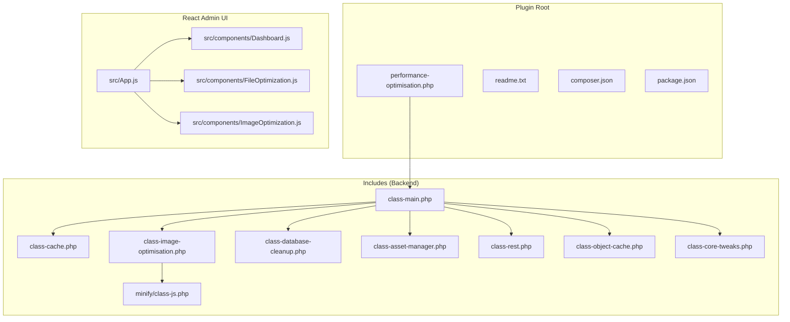
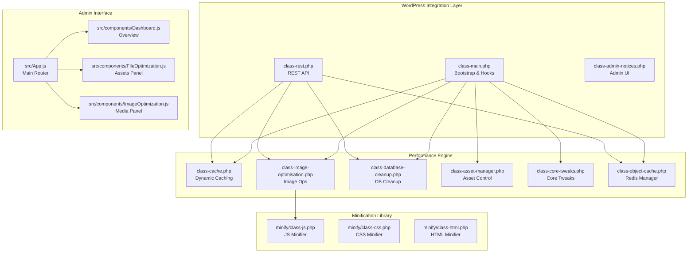
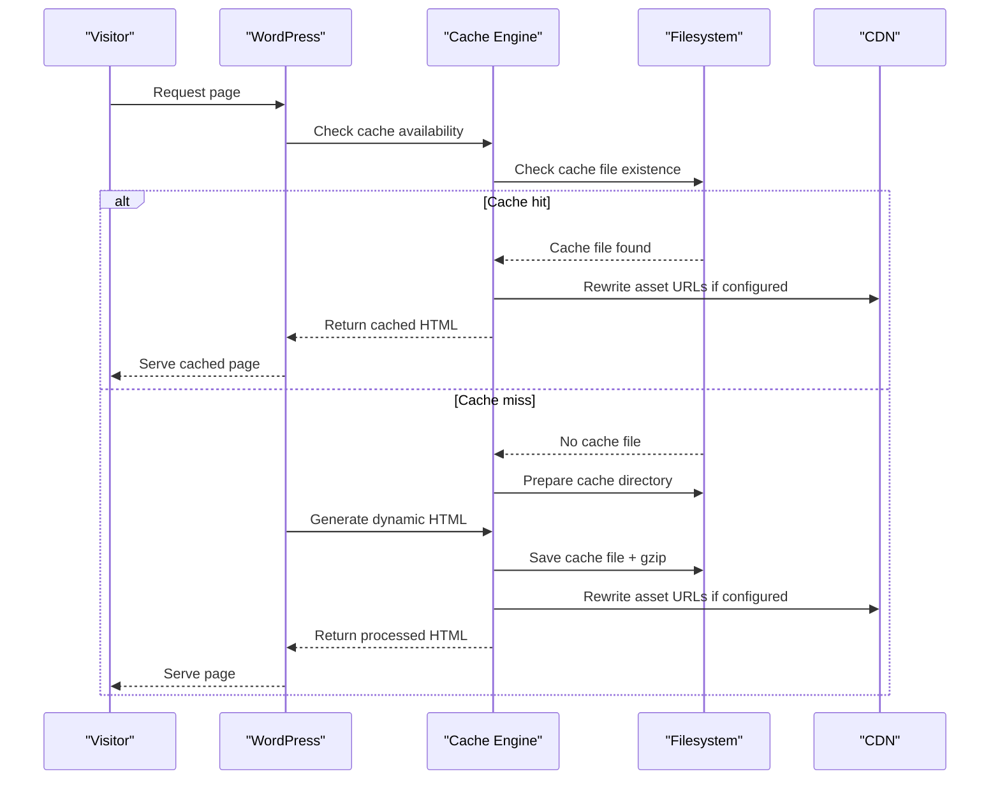
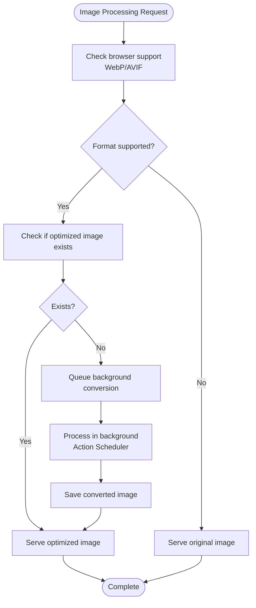
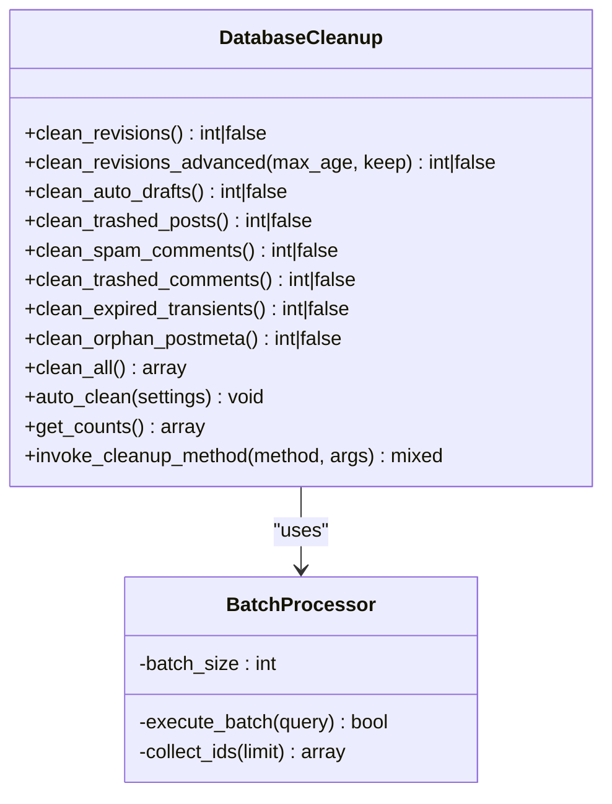
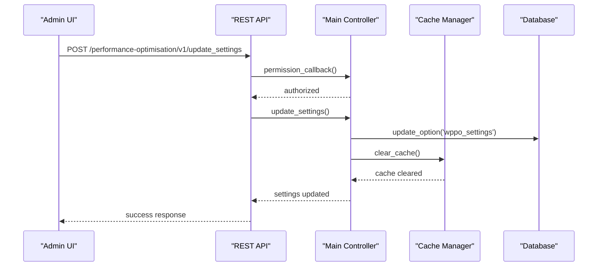
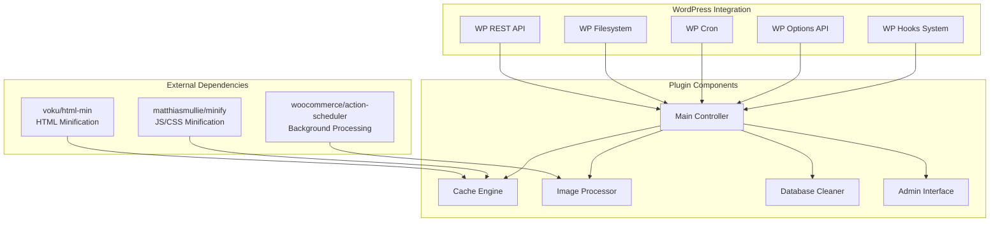

# Project Overview

<cite>
**Referenced Files in This Document**
- [performance-optimisation.php](file://performance-optimisation.php)
- [readme.txt](file://readme.txt)
- [composer.json](file://composer.json)
- [package.json](file://package.json)
- [class-main.php](file://includes/class-main.php)
- [class-cache.php](file://includes/class-cache.php)
- [class-image-optimisation.php](file://includes/class-image-optimisation.php)
- [class-database-cleanup.php](file://includes/class-database-cleanup.php)
- [class-asset-manager.php](file://includes/class-asset-manager.php)
- [class-rest.php](file://includes/class-rest.php)
- [class-object-cache.php](file://includes/class-object-cache.php)
- [class-core-tweaks.php](file://includes/class-core-tweaks.php)
- [class-js.php](file://includes/minify/class-js.php)
- [App.js](file://src/App.js)
- [Dashboard.js](file://src/components/Dashboard.js)
- [FileOptimization.js](file://src/components/FileOptimization.js)
- [ImageOptimization.js](file://src/components/ImageOptimization.js)
</cite>

## Table of Contents
1. [Introduction](#introduction)
2. [Project Structure](#project-structure)
3. [Core Components](#core-components)
4. [Architecture Overview](#architecture-overview)
5. [Detailed Component Analysis](#detailed-component-analysis)
6. [Dependency Analysis](#dependency-analysis)
7. [Performance Considerations](#performance-considerations)
8. [Troubleshooting Guide](#troubleshooting-guide)
9. [Conclusion](#conclusion)

## Introduction
Performance Optimisation is a comprehensive WordPress plugin designed to accelerate websites through a cohesive suite of performance tools. It emphasizes safety-first UX, with features that can be enabled incrementally for controlled testing. The plugin targets real-world performance outcomes by focusing on cache management, asset optimization, image optimization, and database cleanup, while maintaining a modern admin interface and robust backend architecture.

Key capabilities include:
- Dynamic caching with intelligent invalidation and CDN rewriting
- JavaScript, CSS, and HTML minification with exclusion controls
- Next-generation image format conversion (WebP/AVIF) and advanced lazy loading
- Preload hints for critical resources
- Database cleanup with automated scheduling
- Core WordPress bloat reduction (emojis, embeds, dashicons, XML-RPC, heartbeat)
- Enterprise-grade Redis object cache support with high availability modes
- Import/export of plugin settings

System requirements:
- WordPress 6.2+
- PHP 7.4+

Installation and basic configuration are straightforward, with the plugin exposing a dedicated admin menu and comprehensive settings panels for each feature area.

## Project Structure
The plugin follows a modular architecture with a clear separation between the PHP backend and the React-based admin interface. The backend is organized into feature-focused classes under the `includes/` directory, while the frontend admin UI is built with React components located in `src/components/`.

**Diagram sources**
- [performance-optimisation.php:1-68](file://performance-optimisation.php#L1-L68)
- [class-main.php:1-1131](file://includes/class-main.php#L1-L1131)
- [App.js:1-279](file://src/App.js#L1-L279)

**Section sources**
- [performance-optimisation.php:1-68](file://performance-optimisation.php#L1-L68)
- [readme.txt:1-261](file://readme.txt#L1-L261)
- [composer.json:1-40](file://composer.json#L1-L40)
- [package.json:1-31](file://package.json#L1-L31)

## Core Components
This section outlines the primary components that deliver the plugin's performance capabilities.

- Dynamic caching engine
  - Implements filesystem-based cache storage with gzip compression
  - Integrates with WordPress hooks for template rendering and asset combination
  - Supports CDN rewriting for wp-content and wp-includes resources
  - Provides cache invalidation on content changes and structural updates

- Asset optimization pipeline
  - Minification for JavaScript, CSS, and HTML using industry-standard libraries
  - Exclusion lists for handles and URLs to preserve compatibility
  - Combine CSS functionality with font-display optimization
  - Defer/delay JavaScript loading with safety controls

- Image optimization suite
  - Next-generation format conversion (WebP/AVIF) with background processing
  - Advanced lazy loading with SVG placeholders and responsive srcset handling
  - Preload hints for critical images on front page and post types
  - Exclude lists for URLs and sizes to maintain design fidelity

- Database cleanup framework
  - Batched operations for revisions, auto-drafts, trashed posts/comments
  - Advanced revision cleanup with retention policies
  - Expired transients and orphaned postmeta removal
  - Automated scheduling via WP-Cron

- Core tweaks manager
  - Disables emojis, embeds, dashicons, XML-RPC, and heartbeat
  - Configurable heartbeat intervals and scopes
  - Non-destructive removal of frontend-only assets

- REST API layer
  - Secure endpoints for settings management, cache operations, and diagnostics
  - AJAX-based nonce refresh for session resilience
  - Background job orchestration via Action Scheduler

- Object cache manager
  - Redis drop-in installation with high availability support
  - Connection testing and telemetry collection
  - Multi-mode support (standalone, sentinel, cluster, TLS)

**Section sources**
- [class-cache.php:1-755](file://includes/class-cache.php#L1-L755)
- [class-image-optimisation.php:1-1373](file://includes/class-image-optimisation.php#L1-L1373)
- [class-database-cleanup.php:1-652](file://includes/class-database-cleanup.php#L1-L652)
- [class-core-tweaks.php:1-194](file://includes/class-core-tweaks.php#L1-L194)
- [class-rest.php:1-843](file://includes/class-rest.php#L1-L843)
- [class-object-cache.php:1-290](file://includes/class-object-cache.php#L1-L290)

## Architecture Overview
The plugin employs a modular, layered architecture that separates concerns between the WordPress integration layer, the performance optimization engine, and the administrative interface.

**Diagram sources**
- [class-main.php:1-1131](file://includes/class-main.php#L1-L1131)
- [class-rest.php:1-843](file://includes/class-rest.php#L1-L843)
- [class-cache.php:1-755](file://includes/class-cache.php#L1-L755)
- [class-image-optimisation.php:1-1373](file://includes/class-image-optimisation.php#L1-L1373)
- [class-database-cleanup.php:1-652](file://includes/class-database-cleanup.php#L1-L652)
- [class-asset-manager.php:1-224](file://includes/class-asset-manager.php#L1-L224)
- [class-core-tweaks.php:1-194](file://includes/class-core-tweaks.php#L1-L194)
- [class-object-cache.php:1-290](file://includes/class-object-cache.php#L1-L290)
- [class-js.php:1-131](file://includes/minify/class-js.php#L1-L131)
- [App.js:1-279](file://src/App.js#L1-L279)
- [Dashboard.js:1-356](file://src/components/Dashboard.js#L1-L356)
- [FileOptimization.js:1-620](file://src/components/FileOptimization.js#L1-L620)
- [ImageOptimization.js:1-497](file://src/components/ImageOptimization.js#L1-L497)

## Detailed Component Analysis

### Dynamic Caching Engine
The caching system provides filesystem-based cache storage with intelligent invalidation and CDN integration.

**Diagram sources**
- [class-cache.php:252-310](file://includes/class-cache.php#L252-L310)
- [class-cache.php:460-483](file://includes/class-cache.php#L460-L483)

Key features:
- Directory-based cache organization by domain and URL path
- Gzip compression for reduced storage and bandwidth
- CDN URL rewriting for wp-content and wp-includes assets
- Intelligent invalidation on content changes, permalinks, and theme switches
- Preload cache functionality with exclusion rules

**Section sources**
- [class-cache.php:1-755](file://includes/class-cache.php#L1-L755)

### Image Optimization Pipeline
The image optimization system combines next-generation format conversion with advanced lazy loading and preload strategies.

**Diagram sources**
- [class-image-optimisation.php:95-208](file://includes/class-image-optimisation.php#L95-L208)
- [class-rest.php:253-353](file://includes/class-rest.php#L253-L353)

Implementation highlights:
- Browser capability detection via HTTP_ACCEPT headers
- Background processing using Action Scheduler for large-scale conversions
- SVG placeholder generation for improved perceived performance
- Responsive srcset handling with width-based preload hints
- Exclusion lists for URLs and sizes to maintain design integrity

**Section sources**
- [class-image-optimisation.php:1-1373](file://includes/class-image-optimisation.php#L1-L1373)
- [class-rest.php:244-353](file://includes/class-rest.php#L244-L353)

### Database Cleanup Framework
The database cleanup system provides comprehensive maintenance operations with safety controls and batch processing.

**Diagram sources**
- [class-database-cleanup.php:30-652](file://includes/class-database-cleanup.php#L30-L652)

Safety and performance features:
- Strict batching to prevent memory exhaustion
- Transaction-safe operations with rollback on errors
- Advanced revision cleanup with configurable retention policies
- Automated scheduling via WP-Cron with atomic operations
- Comprehensive error logging and reporting

**Section sources**
- [class-database-cleanup.php:1-652](file://includes/class-database-cleanup.php#L1-L652)

### REST API and Admin Interface
The plugin exposes a comprehensive REST API for programmatic control and integrates with a modern React-based admin interface.

**Diagram sources**
- [class-rest.php:178-200](file://includes/class-rest.php#L178-L200)
- [class-main.php:250-277](file://includes/class-main.php#L250-L277)

Admin interface architecture:
- Modular React components with shared UI primitives
- Real-time status reporting and progress indicators
- Confirmation dialogs for destructive operations
- Theme-aware styling with WordPress admin color schemes
- Keyboard navigation and accessibility support

**Section sources**
- [class-rest.php:1-843](file://includes/class-rest.php#L1-L843)
- [App.js:1-279](file://src/App.js#L1-L279)
- [Dashboard.js:1-356](file://src/components/Dashboard.js#L1-L356)
- [FileOptimization.js:1-620](file://src/components/FileOptimization.js#L1-L620)
- [ImageOptimization.js:1-497](file://src/components/ImageOptimization.js#L1-L497)

## Dependency Analysis
The plugin leverages external libraries and WordPress core systems to deliver its functionality.

**Diagram sources**
- [composer.json:11-15](file://composer.json#L11-L15)
- [class-main.php:128-154](file://includes/class-main.php#L128-L154)

Dependency management:
- Composer-managed external libraries with semantic versioning
- WordPress core integration through established APIs
- Modular architecture allowing selective feature activation
- Backward compatibility maintained through careful API design

**Section sources**
- [composer.json:1-40](file://composer.json#L1-L40)
- [package.json:16-30](file://package.json#L16-L30)

## Performance Considerations
The plugin incorporates several performance optimization strategies:

- Memory-efficient batch processing for database operations
- Background job execution for heavy tasks (image conversion, cache generation)
- CDN integration to reduce origin server load
- Gzip compression for cached content and minified assets
- Intelligent cache invalidation to balance freshness and performance
- Lazy loading with SVG placeholders to improve perceived performance
- Exclusion controls to preserve compatibility with third-party scripts
- Atomic operations for settings updates to prevent partial state

## Troubleshooting Guide
Common issues and resolutions:

- Cache not updating after content changes
  - Verify cache invalidation hooks are firing
  - Check filesystem permissions for cache directories
  - Clear all cache via admin interface

- Image conversion failing silently
  - Ensure Action Scheduler is available for background processing
  - Verify GD or Imagick extensions are installed
  - Check file permissions for upload directories

- REST API authentication errors
  - Refresh AJAX nonce via admin interface
  - Verify user has sufficient capabilities
  - Check server-side nonce validation

- Redis connection issues
  - Verify PhpRedis extension is installed
  - Test connection using built-in ping functionality
  - Check firewall and network connectivity

**Section sources**
- [class-rest.php:771-781](file://includes/class-rest.php#L771-L781)
- [class-object-cache.php:165-195](file://includes/class-object-cache.php#L165-L195)
- [class-cache.php:647-702](file://includes/class-cache.php#L647-L702)

## Conclusion
Performance Optimisation delivers a comprehensive, safety-focused approach to WordPress performance enhancement. Its modular architecture, combined with a modern admin interface and robust backend systems, provides website owners with powerful tools to improve loading speeds and user experience. The plugin's emphasis on incremental feature activation, extensive exclusion controls, and enterprise-grade capabilities makes it suitable for both small blogs and large-scale deployments requiring advanced optimization strategies.

The combination of dynamic caching, asset optimization, image processing, database maintenance, and core WordPress cleanup creates a holistic performance solution that addresses multiple optimization vectors simultaneously while maintaining compatibility and safety through thoughtful defaults and explicit warnings for advanced features.