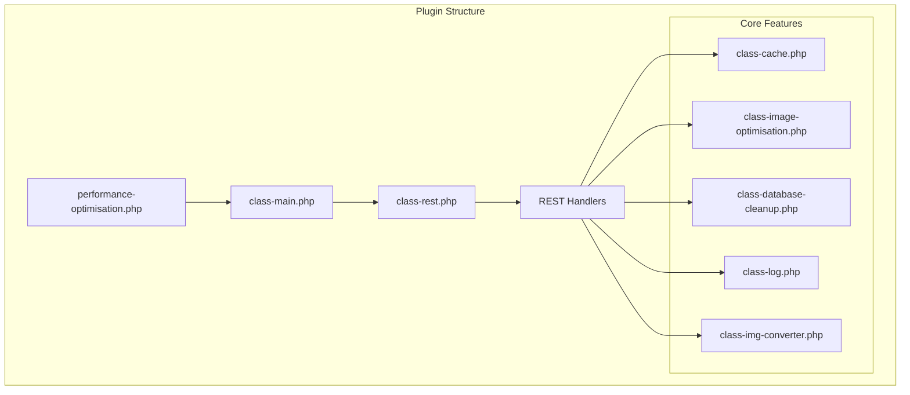
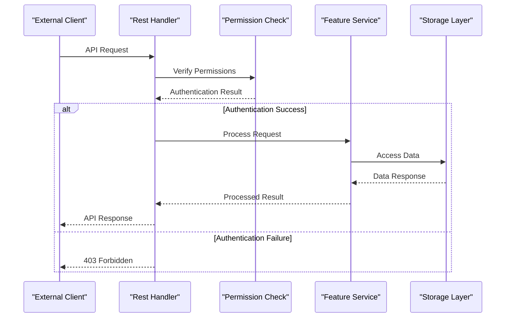
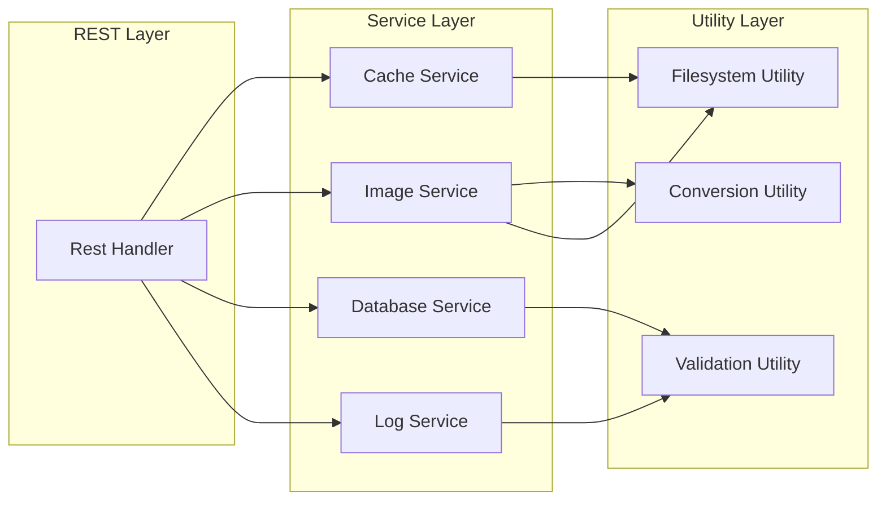

# Core Endpoints

<cite>
**Referenced Files in This Document**
- [class-rest.php](file://includes/class-rest.php)
- [class-cache.php](file://includes/class-cache.php)
- [class-image-optimisation.php](file://includes/class-image-optimisation.php)
- [class-img-converter.php](file://includes/class-img-converter.php)
- [class-database-cleanup.php](file://includes/class-database-cleanup.php)
- [class-log.php](file://includes/class-log.php)
- [class-main.php](file://includes/class-main.php)
- [performance-optimisation.php](file://performance-optimisation.php)
</cite>

## Table of Contents
1. [Introduction](#introduction)
2. [Project Structure](#project-structure)
3. [Core Components](#core-components)
4. [Architecture Overview](#architecture-overview)
5. [Detailed Component Analysis](#detailed-component-analysis)
6. [Dependency Analysis](#dependency-analysis)
7. [Performance Considerations](#performance-considerations)
8. [Troubleshooting Guide](#troubleshooting-guide)
9. [Conclusion](#conclusion)

## Introduction

The Performance Optimisation plugin provides a comprehensive REST API for managing WordPress performance optimization features. This documentation covers the core REST API endpoints that enable programmatic control over cache management, image optimization, database cleanup, and system monitoring capabilities.

The plugin follows WordPress REST API standards and provides secure, authenticated endpoints for administrators to manage performance optimization features through external integrations and automation tools.

## Project Structure

The REST API implementation is organized within the plugin's modular architecture:



**Diagram sources**
- [performance-optimisation.php:1-71](file://performance-optimisation.php#L1-L71)
- [class-main.php:128-186](file://includes/class-main.php#L128-L186)
- [class-rest.php:30-123](file://includes/class-rest.php#L30-L123)

**Section sources**
- [performance-optimisation.php:1-71](file://performance-optimisation.php#L1-L71)
- [class-main.php:128-186](file://includes/class-main.php#L128-L186)

## Core Components

The REST API is built around several key components that handle different aspects of performance optimization:

### REST Endpoint Registration
The plugin registers all REST endpoints through the `Rest` class, which defines the namespace and route configurations. The namespace follows WordPress standards with versioning for future compatibility.

### Authentication System
All endpoints require WordPress administrator privileges combined with a valid REST nonce for security. The permission callback validates both user capabilities and nonce authenticity.

### Data Processing Layer
Each endpoint handler processes request parameters, sanitizes input data, and interacts with specialized classes for cache management, image optimization, and database operations.

**Section sources**
- [class-rest.php:30-136](file://includes/class-rest.php#L30-L136)
- [class-main.php:185-186](file://includes/class-main.php#L185-L186)

## Architecture Overview

The REST API architecture follows a layered approach with clear separation of concerns:



**Diagram sources**
- [class-rest.php:131-136](file://includes/class-rest.php#L131-L136)
- [class-rest.php:853-862](file://includes/class-rest.php#L853-L862)

The architecture ensures that:
- All requests are properly authenticated
- Input data is sanitized and validated
- Business logic is encapsulated in dedicated service classes
- Responses follow consistent JSON schema

## Detailed Component Analysis

### Authentication and Permission System

All endpoints require two-factor authentication:
1. WordPress administrator capability (`manage_options`)
2. Valid WordPress REST nonce (`X-WP-Nonce` header)

The permission system provides robust security while maintaining flexibility for automated systems.

**Section sources**
- [class-rest.php:131-136](file://includes/class-rest.php#L131-L136)

### Endpoint 1: clear_cache

**HTTP Method:** POST  
**URL Pattern:** `/wp-json/performance-optimisation/v1/clear_cache`

**Request Parameters:**
- `action` (string, optional): `clear_single_page_cache` or empty for full cache clear
- `path` (string, optional): URL path for single page cache clearing

**Response Schema:**
```json
{
  "data": true,
  "success": true,
  "message": "Cache cleared successfully"
}
```

**Security Considerations:**
- Validates path parameter to prevent directory traversal
- Requires administrator privileges
- Logs cache clearing actions in activity log

**Example Usage:**
```bash
curl -X POST https://example.com/wp-json/performance-optimisation/v1/clear_cache \
  -H "X-WP-Nonce: YOUR_NONCE" \
  -H "Content-Type: application/json" \
  -d '{"action": "clear_single_page_cache", "path": "/about-us/"}'
```

**Section sources**
- [class-rest.php:145-175](file://includes/class-rest.php#L145-L175)
- [class-cache.php:647-677](file://includes/class-cache.php#L647-L677)

### Endpoint 2: update_settings

**HTTP Method:** POST  
**URL Pattern:** `/wp-json/performance-optimisation/v1/update_settings`

**Request Parameters:**
- `tab` (string): Settings tab identifier
- `settings` (object): Settings object to update

**Response Schema:**
```json
{
  "data": {
    "file_optimisation": {},
    "image_optimisation": {},
    "preload_settings": {}
  },
  "success": true,
  "message": "Settings updated successfully"
}
```

**Security Considerations:**
- Recursively sanitizes all settings data
- Validates settings structure
- Clears cache after successful update

**Example Usage:**
```bash
curl -X POST https://example.com/wp-json/performance-optimisation/v1/update_settings \
  -H "X-WP-Nonce: YOUR_NONCE" \
  -H "Content-Type: application/json" \
  -d '{"tab": "file_optimisation", "settings": {"combineCSS": true}}'
```

**Section sources**
- [class-rest.php:184-200](file://includes/class-rest.php#L184-L200)

### Endpoint 3: optimise_image

**HTTP Method:** POST  
**URL Pattern:** `/wp-json/performance-optimisation/v1/optimise_image`

**Request Parameters:**
- `webp` (array, optional): Array of WebP image paths
- `avif` (array, optional): Array of AVIF image paths

**Response Schema (Background Processing):**
```json
{
  "data": {
    "background": true,
    "jobs_queued": 5,
    "message": "5 images queued for background optimization."
  },
  "success": true,
  "message": "Images queued for background optimization"
}
```

**Response Schema (Synchronous Processing):**
```json
{
  "data": {
    "pending": {
      "webp": [],
      "avif": []
    },
    "completed": {
      "webp": ["/wp-content/uploads/image1.webp"],
      "avif": []
    },
    "failed": {
      "webp": [],
      "avif": []
    }
  },
  "success": true,
  "message": "Images optimized successfully"
}
```

**Security Considerations:**
- Validates image paths to prevent directory traversal
- Supports both synchronous and asynchronous processing
- Uses Action Scheduler for background processing when available

**Example Usage:**
```bash
curl -X POST https://example.com/wp-json/performance-optimisation/v1/optimise_image \
  -H "X-WP-Nonce: YOUR_NONCE" \
  -H "Content-Type: application/json" \
  -d '{"webp": ["/wp-content/uploads/image1.jpg", "/wp-content/uploads/image2.jpg"]}'
```

**Section sources**
- [class-rest.php:253-353](file://includes/class-rest.php#L253-L353)
- [class-img-converter.php:104-310](file://includes/class-img-converter.php#L104-L310)

### Endpoint 4: delete_optimised_image

**HTTP Method:** POST  
**URL Pattern:** `/wp-json/performance-optimisation/v1/delete_optimised_image`

**Request Parameters:** None required

**Response Schema:**
```json
{
  "data": {
    "success": true,
    "message": "Optimized images folder deleted successfully."
  },
  "success": true,
  "message": "Optimized images folder deleted successfully"
}
```

**Security Considerations:**
- Validates filesystem access
- Uses WordPress filesystem abstraction
- Clears completed format tracking after deletion

**Example Usage:**
```bash
curl -X POST https://example.com/wp-json/performance-optimisation/v1/delete_optimised_image \
  -H "X-WP-Nonce: YOUR_NONCE"
```

**Section sources**
- [class-rest.php:361-400](file://includes/class-rest.php#L361-L400)
- [class-img-converter.php:692-703](file://includes/class-img-converter.php#L692-L703)

### Endpoint 5: recent_activities

**HTTP Method:** GET  
**URL Pattern:** `/wp-json/performance-optimisation/v1/recent_activities`

**Request Parameters:**
- `page` (integer, optional): Page number (default: 1)

**Response Schema:**
```json
{
  "data": {
    "activities": [
      {
        "id": 1,
        "activity": "Cache cleared for <a href=\"https://example.com/about-us/\">https://example.com/about-us/</a>",
        "created_at": "2024-01-15 10:30:00"
      }
    ],
    "total_items": 25,
    "current_page": 1,
    "total_pages": 3,
    "per_page": 10
  },
  "success": true,
  "message": "Activities retrieved successfully"
}
```

**Security Considerations:**
- Implements caching for performance
- Paginates results for large datasets
- Sanitizes HTML content in activity logs

**Example Usage:**
```bash
curl -X GET https://example.com/wp-json/performance-optimisation/v1/recent_activities?page=1 \
  -H "X-WP-Nonce: YOUR_NONCE"
```

**Section sources**
- [class-rest.php:232-241](file://includes/class-rest.php#L232-L241)
- [class-log.php:73-130](file://includes/class-log.php#L73-L130)

### Endpoint 6: import_settings

**HTTP Method:** POST  
**URL Pattern:** `/wp-json/performance-optimisation/v1/import_settings`

**Request Parameters:**
- `action` (string): Must be `import_settings`
- `settings` (object): Settings object to import

**Response Schema:**
```json
{
  "data": {
    "file_optimisation": {},
    "image_optimisation": {},
    "preload_settings": {}
  },
  "success": true,
  "message": "Settings updated successfully"
}
```

**Security Considerations:**
- Validates action parameter
- Recursively sanitizes settings data
- Compares with existing settings to detect changes
- Updates database only when changes are detected

**Example Usage:**
```bash
curl -X POST https://example.com/wp-json/performance-optimisation/v1/import_settings \
  -H "X-WP-Nonce: YOUR_NONCE" \
  -H "Content-Type: application/json" \
  -d '{"action": "import_settings", "settings": {"file_optimisation": {"combineCSS": true}}}'
```

**Section sources**
- [class-rest.php:409-432](file://includes/class-rest.php#L409-L432)

### Endpoint 7: database_cleanup

**HTTP Method:** POST  
**URL Pattern:** `/wp-json/performance-optimisation/v1/database_cleanup`

**Request Parameters:**
- `type` (string): Cleanup type (one of: `revisions`, `auto_drafts`, `trashed_posts`, `spam_comments`, `trashed_comments`, `expired_transients`, `orphan_postmeta`, `all`)

**Response Schema (Single Type):**
```json
{
  "data": {
    "type": "revisions",
    "deleted": 150
  },
  "success": true,
  "message": "Database cleanup completed"
}
```

**Response Schema (All Types):**
```json
{
  "data": {
    "results": {
      "revisions": 150,
      "auto_drafts": 5,
      "trashed_posts": 2,
      "spam_comments": 10,
      "trashed_comments": 3,
      "expired_transients": 25,
      "orphan_postmeta": 8
    },
    "deleted": 203
  },
  "success": true,
  "message": "All cleanup complete"
}
```

**Error Response Schema:**
```json
{
  "data": null,
  "success": false,
  "message": "Invalid cleanup type."
}
```

**Security Considerations:**
- Validates cleanup type parameter
- Uses WordPress database abstraction
- Implements batch processing for large datasets
- Handles partial failures gracefully

**Example Usage:**
```bash
curl -X POST https://example.com/wp-json/performance-optimisation/v1/database_cleanup \
  -H "X-WP-Nonce: YOUR_NONCE" \
  -H "Content-Type: application/json" \
  -d '{"type": "all"}'
```

**Section sources**
- [class-rest.php:451-539](file://includes/class-rest.php#L451-L539)
- [class-database-cleanup.php:529-546](file://includes/class-database-cleanup.php#L529-L546)

### Endpoint 8: database_cleanup_counts

**HTTP Method:** GET  
**URL Pattern:** `/wp-json/performance-optimisation/v1/database_cleanup_counts`

**Request Parameters:** None required

**Response Schema:**
```json
{
  "data": {
    "revisions": 150,
    "auto_drafts": 5,
    "trashed_posts": 2,
    "spam_comments": 10,
    "trashed_comments": 3,
    "expired_transients": 25,
    "orphan_postmeta": 8
  },
  "success": true,
  "message": "Counts retrieved successfully"
}
```

**Security Considerations:**
- No parameters to validate
- Uses WordPress database abstraction
- Provides real-time counts for cleanup operations

**Example Usage:**
```bash
curl -X GET https://example.com/wp-json/performance-optimisation/v1/database_cleanup_counts \
  -H "X-WP-Nonce: YOUR_NONCE"
```

**Section sources**
- [class-rest.php:548-551](file://includes/class-rest.php#L548-L551)
- [class-database-cleanup.php:598-634](file://includes/class-database-cleanup.php#L598-L634)

## Dependency Analysis

The REST API endpoints depend on several specialized classes that handle different aspects of performance optimization:



**Diagram sources**
- [class-rest.php:37-43](file://includes/class-rest.php#L37-L43)
- [class-cache.php:14-25](file://includes/class-cache.php#L14-L25)
- [class-image-optimisation.php:18-28](file://includes/class-image-optimisation.php#L18-L28)
- [class-database-cleanup.php:30-31](file://includes/class-database-cleanup.php#L30-L31)

**Section sources**
- [class-rest.php:37-43](file://includes/class-rest.php#L37-L43)

## Performance Considerations

### Caching Strategy
The plugin implements intelligent caching for frequently accessed data:
- Activity logs are cached with 1-hour expiration
- Cache size and statistics are cached with 15-minute intervals
- Database cleanup counts are cached for performance

### Background Processing
Image optimization supports both synchronous and asynchronous processing:
- Uses WordPress Action Scheduler for background jobs
- Falls back to synchronous processing when scheduler is unavailable
- Maintains job queues for processing multiple images

### Resource Management
- Implements file size and dimension limits to prevent memory exhaustion
- Uses batch processing for database cleanup operations
- Validates all file paths to prevent directory traversal attacks

## Troubleshooting Guide

### Common Authentication Issues
**Problem:** 403 Forbidden responses
**Solution:** Ensure the `X-WP-Nonce` header contains a valid nonce generated by the WordPress REST API

**Problem:** Permission denied errors
**Solution:** Verify the requesting user has `manage_options` capability

### Image Optimization Issues
**Problem:** Images not converting to WebP/AVIF
**Solution:** Check that GD or Imagick extensions are available and properly configured

**Problem:** Memory exhaustion during optimization
**Solution:** Verify file size limits and image dimensions are within acceptable ranges

### Database Cleanup Issues
**Problem:** Cleanup operations failing silently
**Solution:** Check database permissions and ensure sufficient privileges for cleanup operations

**Section sources**
- [class-rest.php:131-136](file://includes/class-rest.php#L131-L136)
- [class-img-converter.php:121-152](file://includes/class-img-converter.php#L121-L152)

## Conclusion

The Performance Optimisation plugin provides a comprehensive REST API for managing WordPress performance optimization features. The API follows WordPress standards with robust security measures, including administrator-only access and nonce validation. The eight core endpoints cover essential functionality for cache management, image optimization, database cleanup, and system monitoring.

The architecture supports both synchronous and asynchronous processing modes, implements intelligent caching strategies, and provides comprehensive error handling. The plugin's modular design ensures maintainability and extensibility for future enhancements.