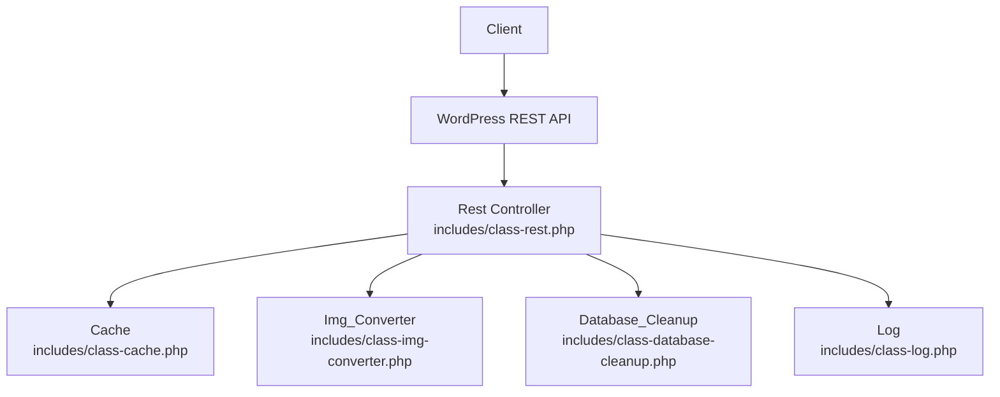
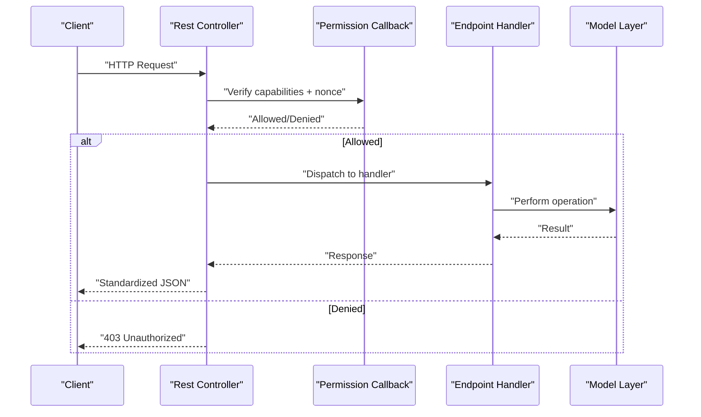
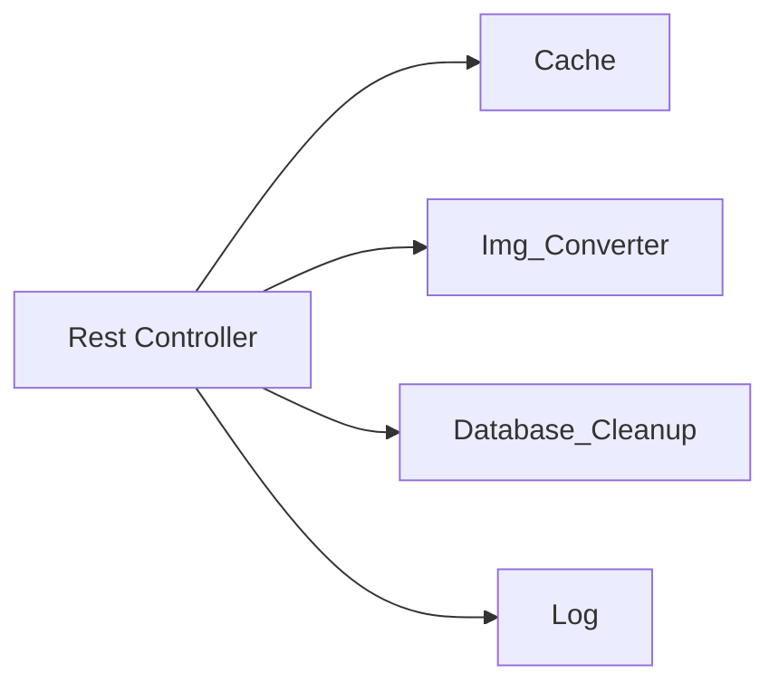

# Core Endpoints

<cite>
**Referenced Files in This Document**
- [class-rest.php](file://includes/class-rest.php)
- [class-cache.php](file://includes/class-cache.php)
- [class-image-optimisation.php](file://includes/class-image-optimisation.php)
- [class-img-converter.php](file://includes/class-img-converter.php)
- [class-database-cleanup.php](file://includes/class-database-cleanup.php)
- [class-log.php](file://includes/class-log.php)
- [class-main.php](file://includes/class-main.php)
- [performance-optimisation.php](file://performance-optimisation.php)
</cite>

## Table of Contents
1. [Introduction](#introduction)
2. [Project Structure](#project-structure)
3. [Core Components](#core-components)
4. [Architecture Overview](#architecture-overview)
5. [Detailed Component Analysis](#detailed-component-analysis)
6. [Dependency Analysis](#dependency-analysis)
7. [Performance Considerations](#performance-considerations)
8. [Troubleshooting Guide](#troubleshooting-guide)
9. [Conclusion](#conclusion)

## Introduction
This document provides comprehensive API documentation for the core REST API endpoints of the Performance Optimisation plugin. It covers the essential endpoints for cache management, settings updates, image optimization, database cleanup, and recent activities. For each endpoint, you will find HTTP methods, URL patterns, request/response schemas, parameter descriptions, authentication requirements, practical examples, expected responses, error handling scenarios, and permission/security considerations.

## Project Structure
The plugin exposes REST endpoints via a dedicated REST controller class. The endpoints are registered under the namespace “performance-optimisation/v1” and require a valid WordPress REST nonce and administrative privileges.

**Diagram sources**
- [class-rest.php:30-123](file://includes/class-rest.php#L30-L123)
- [class-cache.php:32-755](file://includes/class-cache.php#L32-L755)
- [class-img-converter.php:22-762](file://includes/class-img-converter.php#L22-L762)
- [class-database-cleanup.php:30-652](file://includes/class-database-cleanup.php#L30-L652)
- [class-log.php:22-132](file://includes/class-log.php#L22-L132)

**Section sources**
- [class-rest.php:30-123](file://includes/class-rest.php#L30-L123)
- [class-main.php:182-183](file://includes/class-main.php#L182-L183)

## Core Components
- REST Controller: Registers and validates endpoints, orchestrates business logic, and returns standardized responses.
- Cache: Manages cache generation, invalidation, and statistics.
- Image Converter: Converts images to WebP/AVIF formats and tracks conversion status.
- Database Cleanup: Performs targeted cleanup operations on WordPress database tables.
- Log: Records activities and retrieves recent activity logs.

**Section sources**
- [class-rest.php:26-136](file://includes/class-rest.php#L26-L136)
- [class-cache.php:32-755](file://includes/class-cache.php#L32-L755)
- [class-img-converter.php:22-762](file://includes/class-img-converter.php#L22-L762)
- [class-database-cleanup.php:30-652](file://includes/class-database-cleanup.php#L30-L652)
- [class-log.php:22-132](file://includes/class-log.php#L22-L132)

## Architecture Overview
The REST endpoints are registered during the REST API initialization hook and validated using a permission callback that checks for administrative capability and a valid nonce. Responses follow a consistent structure with data, success flag, and message.

**Diagram sources**
- [class-rest.php:37-43](file://includes/class-rest.php#L37-L43)
- [class-rest.php:131-136](file://includes/class-rest.php#L131-L136)
- [class-rest.php:831-840](file://includes/class-rest.php#L831-L840)

## Detailed Component Analysis

### Authentication and Permission Model
- Nonce: Requests must include the WordPress REST nonce via the “X-WP-Nonce” header.
- Capability: Requires “manage_options” capability.
- Validation: The permission callback verifies both the nonce and user capability.

**Section sources**
- [class-rest.php:131-136](file://includes/class-rest.php#L131-L136)

### Endpoint: clear_cache
- Method: POST
- URL: /wp-json/performance-optimisation/v1/clear_cache
- Purpose: Clear the cache for a specific page or globally.
- Request Parameters:
  - action (string): “clear_single_page_cache” to clear a single page; otherwise clears all.
  - path (string): URL path for the page to clear (sanitized and validated).
- Response Schema:
  - data: boolean (always true on success)
  - success: boolean
  - message: string
- Example Request:
  - Headers: X-WP-Nonce: <valid_nonce>
  - Body: { "action": "clear_single_page_cache", "path": "/about/" }
- Example Success Response:
  - Status: 200
  - Body: { "data": true, "success": true, "message": null }
- Error Handling:
  - 400: Invalid path provided (contains directory traversal).
  - 403: Unauthorized (nonce invalid or insufficient capability).
- Permissions and Security:
  - Requires manage_options and valid nonce.

**Section sources**
- [class-rest.php:55-175](file://includes/class-rest.php#L55-L175)
- [class-cache.php:647-677](file://includes/class-cache.php#L647-L677)

### Endpoint: update_settings
- Method: POST
- URL: /wp-json/performance-optimisation/v1/update_settings
- Purpose: Update plugin settings by tab.
- Request Parameters:
  - tab (string): Target settings tab.
  - settings (object): Nested settings to update.
- Response Schema:
  - data: object (updated settings)
  - success: boolean
  - message: string
- Example Request:
  - Headers: X-WP-Nonce: <valid_nonce>
  - Body: { "tab": "file_optimisation", "settings": { "combineCSS": true } }
- Example Success Response:
  - Status: 200
  - Body: { "data": { "file_optimisation": { "combineCSS": true }, ... }, "success": true, "message": null }
- Error Handling:
  - 400: Malformed request payload.
  - 500: Failed to update settings.
  - 403: Unauthorized.
- Permissions and Security:
  - Requires manage_options and valid nonce.

**Section sources**
- [class-rest.php:60-200](file://includes/class-rest.php#L60-L200)

### Endpoint: optimise_image
- Method: POST
- URL: /wp-json/performance-optimisation/v1/optimise_image
- Purpose: Convert images to WebP/AVIF formats; supports background processing via Action Scheduler.
- Request Parameters:
  - webp (array of strings): Paths to images to convert to WebP.
  - avif (array of strings): Paths to images to convert to AVIF.
- Behavior:
  - Validates paths (no directory traversal).
  - If Action Scheduler is available, schedules background jobs; otherwise processes synchronously.
- Response Schema:
  - Background mode:
    - data.background: boolean (true)
    - data.jobs_queued: number
    - data.message: string
  - Synchronous mode:
    - data: object (image info)
- Example Request:
  - Headers: X-WP-Nonce: <valid_nonce>
  - Body: { "webp": ["/wp-content/uploads/2024/image1.jpg"], "avif": [] }
- Example Success Response (Background):
  - Status: 200
  - Body: { "data": { "background": true, "jobs_queued": 1, "message": "1 images queued for background optimization." }, "success": true, "message": null }
- Example Success Response (Synchronous):
  - Status: 200
  - Body: { "data": { "pending": {...}, "completed": {...}, "failed": {...} }, "success": true, "message": null }
- Error Handling:
  - 400: Invalid image path provided.
  - 500: Internal processing errors.
  - 403: Unauthorized.
- Permissions and Security:
  - Requires manage_options and valid nonce.

**Section sources**
- [class-rest.php:65-353](file://includes/class-rest.php#L65-L353)
- [class-img-converter.php:104-310](file://includes/class-img-converter.php#L104-L310)

### Endpoint: delete_optimised_image
- Method: POST
- URL: /wp-json/performance-optimisation/v1/delete_optimised_image
- Purpose: Delete the optimized images directory (WebP/AVIF copies).
- Response Schema:
  - data.success: boolean
  - data.message: string
- Example Request:
  - Headers: X-WP-Nonce: <valid_nonce>
- Example Success Response:
  - Status: 200
  - Body: { "data": { "success": true, "message": "Optimized images folder deleted successfully." }, "success": true, "message": null }
- Error Handling:
  - 404: Optimized images folder does not exist.
  - 500: Failed to delete the folder.
  - 403: Unauthorized.
- Permissions and Security:
  - Requires manage_options and valid nonce.

**Section sources**
- [class-rest.php:70-400](file://includes/class-rest.php#L70-L400)
- [class-img-converter.php:692-703](file://includes/class-img-converter.php#L692-L703)

### Endpoint: recent_activities
- Method: GET
- URL: /wp-json/performance-optimisation/v1/recent_activities
- Purpose: Retrieve recent activities with pagination.
- Query Parameters:
  - page (integer): Page number (default 1).
- Response Schema:
  - data.activities: array of activity entries
  - data.total_items: number
  - data.current_page: number
  - data.total_pages: number
  - data.per_page: number
- Example Request:
  - Headers: X-WP-Nonce: <valid_nonce>
  - Query: page=1
- Example Success Response:
  - Status: 200
  - Body: { "data": { "activities": [...], "total_items": 120, "current_page": 1, "total_pages": 12, "per_page": 10 }, "success": true, "message": null }
- Error Handling:
  - 403: Unauthorized.
- Permissions and Security:
  - Requires manage_options and valid nonce.

**Section sources**
- [class-rest.php:75-241](file://includes/class-rest.php#L75-L241)
- [class-log.php:73-130](file://includes/class-log.php#L73-L130)

### Endpoint: import_settings
- Method: POST
- URL: /wp-json/performance-optimisation/v1/import_settings
- Purpose: Import settings from a JSON payload.
- Request Body:
  - action (string): Must be “import_settings”.
  - settings (object): Settings to import.
- Response Schema:
  - data: object (imported settings)
  - success: boolean
  - message: string
- Example Request:
  - Headers: X-WP-Nonce: <valid_nonce>
  - Body: { "action": "import_settings", "settings": { "file_optimisation": { "combineCSS": true } } }
- Example Success Response:
  - Status: 200
  - Body: { "data": { "file_optimisation": { "combineCSS": true } }, "success": true, "message": "Settings updated successfully" }
- Error Handling:
  - 400: Invalid action or missing settings.
  - 500: Failed to update settings.
  - 403: Unauthorized.
- Permissions and Security:
  - Requires manage_options and valid nonce.

**Section sources**
- [class-rest.php:80-432](file://includes/class-rest.php#L80-L432)

### Endpoint: database_cleanup
- Method: POST
- URL: /wp-json/performance-optimisation/v1/database_cleanup
- Purpose: Perform database cleanup for a specified type or all types.
- Query Parameters:
  - type (string): One of “revisions”, “auto_drafts”, “trashed_posts”, “spam_comments”, “trashed_comments”, “expired_transients”, “orphan_postmeta”, “all”.
- Response Schema:
  - Single type:
    - data.type: string
    - data.deleted: number
  - All types:
    - data.results: object (per-type counts)
    - data.deleted: number (total)
- Example Request:
  - Headers: X-WP-Nonce: <valid_nonce>
  - Query: type=all
- Example Success Response:
  - Status: 200
  - Body: { "data": { "results": { "revisions": 100, "auto_drafts": 5 }, "deleted": 105 }, "success": true, "message": null }
- Error Handling:
  - 400: Invalid cleanup type.
  - 500: Partial or total failure during cleanup.
  - 403: Unauthorized.
- Permissions and Security:
  - Requires manage_options and valid nonce.

**Section sources**
- [class-rest.php:85-539](file://includes/class-rest.php#L85-L539)
- [class-database-cleanup.php:529-650](file://includes/class-database-cleanup.php#L529-L650)

### Endpoint: database_cleanup_counts
- Method: GET
- URL: /wp-json/performance-optimisation/v1/database_cleanup_counts
- Purpose: Retrieve counts for each cleanup category.
- Response Schema:
  - data: object (counts per category)
- Example Request:
  - Headers: X-WP-Nonce: <valid_nonce>
- Example Success Response:
  - Status: 200
  - Body: { "data": { "revisions": 1200, "auto_drafts": 5, "trashed_posts": 10, "spam_comments": 200, "trashed_comments": 30, "expired_transients": 150, "orphan_postmeta": 40 }, "success": true, "message": null }
- Error Handling:
  - 403: Unauthorized.
- Permissions and Security:
  - Requires manage_options and valid nonce.

**Section sources**
- [class-rest.php:90-551](file://includes/class-rest.php#L90-L551)
- [class-database-cleanup.php:598-634](file://includes/class-database-cleanup.php#L598-L634)

### Endpoint: get_page_assets
- Method: GET
- URL: /wp-json/performance-optimisation/v1/get_page_assets
- Purpose: Retrieve captured assets for a specific post.
- Query Parameters:
  - post_id (integer): Post ID.
- Response Schema:
  - data.scripts: array
  - data.styles: array
  - success: boolean
  - message: string
- Example Request:
  - Headers: X-WP-Nonce: <valid_nonce>
  - Query: post_id=123
- Example Success Response:
  - Status: 200
  - Body: { "data": { "scripts": [...], "styles": [...] }, "success": true, "message": null }
- Error Handling:
  - 400: Post ID is required.
  - 403: Unauthorized.
- Permissions and Security:
  - Requires manage_options and valid nonce.

**Section sources**
- [class-rest.php:95-583](file://includes/class-rest.php#L95-L583)
- [class-asset-manager.php:200-202](file://includes/class-asset-manager.php#L200-L202)

### Endpoint: image_job_status
- Method: GET
- URL: /wp-json/performance-optimisation/v1/image_job_status
- Purpose: Get status of background image optimization jobs and counts.
- Response Schema:
  - data.pending.webp: number
  - data.pending.avif: number
  - data.completed.webp: number
  - data.completed.avif: number
  - data.failed.webp: number
  - data.failed.avif: number
  - data.queued_jobs: number (only if Action Scheduler is active)
- Example Request:
  - Headers: X-WP-Nonce: <valid_nonce>
- Example Success Response:
  - Status: 200
  - Body: { "data": { "pending": { "webp": 2, "avif": 1 }, "completed": { "webp": 10, "avif": 8 }, "failed": { "webp": 0, "avif": 0 }, "queued_jobs": 3 }, "success": true, "message": null }
- Error Handling:
  - 403: Unauthorized.
- Permissions and Security:
  - Requires manage_options and valid nonce.

**Section sources**
- [class-rest.php:100-627](file://includes/class-rest.php#L100-L627)
- [class-img-converter.php:667-760](file://includes/class-img-converter.php#L667-L760)

## Dependency Analysis
- REST Controller depends on:
  - Cache for cache operations
  - Img_Converter for image conversion and status
  - Database_Cleanup for database operations
  - Log for activity logging
- Endpoints are registered during REST API initialization and validated by a shared permission callback.

**Diagram sources**
- [class-rest.php:37-43](file://includes/class-rest.php#L37-L43)
- [class-rest.php:131-136](file://includes/class-rest.php#L131-L136)

**Section sources**
- [class-rest.php:37-136](file://includes/class-rest.php#L37-L136)

## Performance Considerations
- Background Processing: Image optimization can be offloaded to Action Scheduler when available, preventing long-running requests.
- Batch Operations: Database cleanup uses batched queries to avoid timeouts and excessive memory usage.
- Caching: Activity logs and counts are cached to reduce database load.
- Filesystem Safety: All file operations are validated and sanitized to prevent directory traversal and unauthorized access.

[No sources needed since this section provides general guidance]

## Troubleshooting Guide
- Authentication Failures:
  - Ensure the “X-WP-Nonce” header is present and valid.
  - Verify the requesting user has “manage_options” capability.
- Path Validation Errors:
  - For cache and image endpoints, paths must not contain directory traversal sequences.
- Database Cleanup Failures:
  - Some cleanup types may fail individually while others succeed; check the “failures” field for details.
- Image Conversion Issues:
  - Large or unsupported images may fail conversion; verify image type and size limits.
- Filesystem Access:
  - Ensure the plugin has write access to the optimized images directory.

**Section sources**
- [class-rest.php:152-155](file://includes/class-rest.php#L152-L155)
- [class-rest.php:260-264](file://includes/class-rest.php#L260-L264)
- [class-database-cleanup.php:644-650](file://includes/class-database-cleanup.php#L644-L650)
- [class-img-converter.php:122-128](file://includes/class-img-converter.php#L122-L128)

## Conclusion
The Performance Optimisation plugin’s REST API provides robust, secure, and efficient endpoints for cache management, settings updates, image optimization, database cleanup, and activity monitoring. All endpoints enforce administrative privileges and nonce validation, and responses follow a consistent structure. Use the provided examples and error handling guidance to integrate these endpoints safely and effectively.