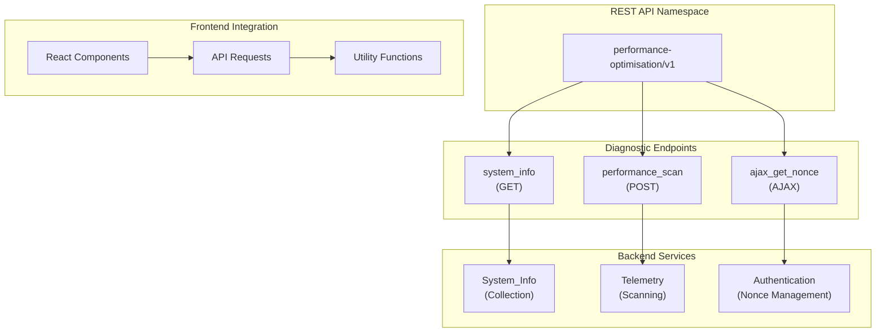
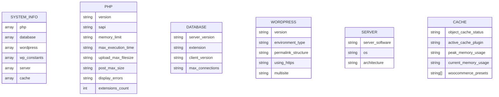
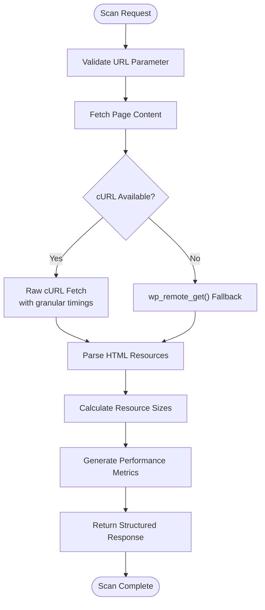
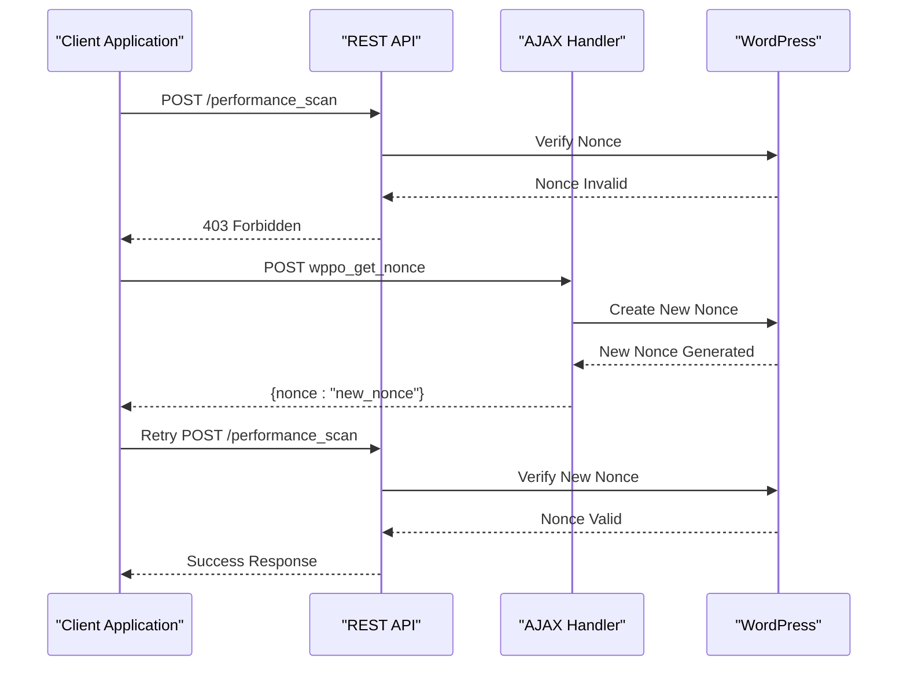
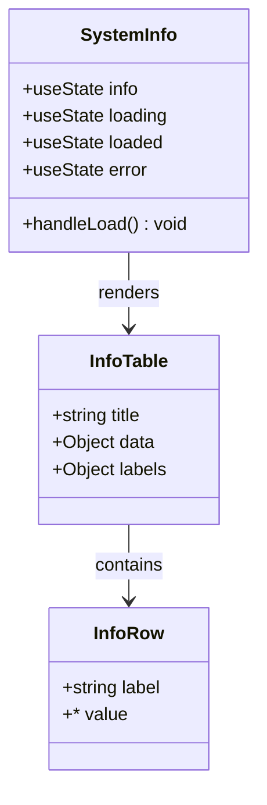

# Diagnostics & System Info Endpoints

<cite>
**Referenced Files in This Document**
- [class-rest.php](file://includes/class-rest.php)
- [class-system-info.php](file://includes/class-system-info.php)
- [class-telemetry.php](file://includes/class-telemetry.php)
- [class-main.php](file://includes/class-main.php)
- [SystemInfo.js](file://src/components/SystemInfo.js)
- [apiRequest.js](file://src/lib/apiRequest.js)
- [main.js](file://src/main.js)
- [performance-optimisation.php](file://performance-optimisation.php)
</cite>

## Table of Contents
1. [Introduction](#introduction)
2. [Endpoint Architecture](#endpoint-architecture)
3. [System Information Endpoint](#system-information-endpoint)
4. [Performance Scan Endpoint](#performance-scan-endpoint)
5. [Nonce Management](#nonce-management)
6. [API Implementation Details](#api-implementation-details)
7. [Frontend Integration](#frontend-integration)
8. [Usage Examples](#usage-examples)
9. [Troubleshooting Guide](#troubleshooting-guide)
10. [Conclusion](#conclusion)

## Introduction

The Performance Optimisation plugin provides comprehensive diagnostic and system information endpoints designed to help developers and administrators collect detailed system information, perform local performance scans, and manage authentication nonces for automated integrations. These endpoints are built on WordPress REST API infrastructure and provide structured data for monitoring and optimization purposes.

The diagnostic endpoints focus on three core areas:
- **System Information Collection**: Comprehensive system environment details
- **Local Performance Scanning**: URL-based performance analysis with detailed metrics
- **Authentication Management**: Dynamic nonce refresh for secure API communication

## Endpoint Architecture

The plugin implements a REST API namespace structure that organizes diagnostic functionality within the `performance-optimisation/v1` namespace. The architecture follows WordPress REST API conventions with proper authentication, authorization, and response formatting.



**Diagram sources**
- [class-rest.php:30-123](file://includes/class-rest.php#L30-L123)
- [class-system-info.php:29-71](file://includes/class-system-info.php#L29-L71)
- [class-telemetry.php:31-44](file://includes/class-telemetry.php#L31-L44)

## System Information Endpoint

The `system_info` endpoint provides comprehensive system diagnostics by collecting information across multiple environmental categories. This endpoint serves as a centralized diagnostic tool for understanding the complete system environment.

### Endpoint Definition

**Method**: GET  
**Route**: `/wp-json/performance-optimisation/v1/system_info`  
**Authentication**: Required (manage_options capability + valid WP REST nonce)

### Response Structure

The system information endpoint returns a structured array containing six primary categories:



**Diagram sources**
- [class-system-info.php:62-71](file://includes/class-system-info.php#L62-L71)
- [class-system-info.php:88-99](file://includes/class-system-info.php#L88-L99)
- [class-system-info.php:113-122](file://includes/class-system-info.php#L113-L122)
- [class-system-info.php:136-144](file://includes/class-system-info.php#L136-L144)
- [class-system-info.php:180-188](file://includes/class-system-info.php#L180-L188)
- [class-system-info.php:202-212](file://includes/class-system-info.php#L202-L212)

### PHP Environment Information

Collects detailed PHP runtime information including version, SAPI, memory limits, and loaded extensions. This provides insight into the PHP runtime environment and capabilities.

### Database Environment Information

Gathers MySQL/MariaDB server details, including version information, client library versions, and connection limits. This helps diagnose database performance and capacity issues.

### WordPress Environment Information

Captures WordPress installation specifics including version, environment type, permalink structure, HTTPS status, and multisite configuration. This information is crucial for compatibility and optimization decisions.

### Server Environment Information

Provides operating system details, CPU architecture, and server software information. This helps identify platform-specific optimization opportunities.

### Cache Environment Information

Reports object cache status, active cache plugin detection, memory usage statistics, and WooCommerce-specific URL presets. This enables cache-related performance analysis and optimization.

**Section sources**
- [class-rest.php:112-122](file://includes/class-rest.php#L112-L122)
- [class-rest.php:790-792](file://includes/class-rest.php#L790-L792)
- [class-system-info.php:62-298](file://includes/class-system-info.php#L62-L298)

## Performance Scan Endpoint

The `performance_scan` endpoint performs comprehensive local telemetry scanning on specified URLs, providing detailed performance metrics and analysis. This endpoint is designed for automated performance monitoring and testing scenarios.

### Endpoint Definition

**Method**: POST  
**Route**: `/wp-json/performance-optimisation/v1/performance_scan`  
**Authentication**: Required (manage_options capability + valid WP REST nonce)

### Request Parameters

| Parameter | Type | Required | Description |
|-----------|------|----------|-------------|
| url | string | Yes | The URL to scan for performance metrics |

### Response Metrics

The performance scan endpoint returns 16 detailed performance metrics:



**Diagram sources**
- [class-telemetry.php:45-192](file://includes/class-telemetry.php#L45-L192)

### Performance Metrics Collected

| Metric | Description | Measurement |
|--------|-------------|-------------|
| load_time | Total page load time | Seconds (float) |
| ttfb | Time to First Byte | Milliseconds (float) |
| dns_lookup_time | DNS resolution time | Milliseconds (float) |
| connect_time | TCP connection time | Milliseconds (float) |
| ssl_time | SSL handshake time | Milliseconds (float) |
| css_count | Number of CSS files | Integer |
| js_count | Number of JavaScript files | Integer |
| media_count | Total image count | Integer |
| lazy_image_count | Lazy-loaded images | Integer |
| eager_image_count | Eagerly-loaded images | Integer |
| css_total_size | Total CSS size | Bytes (integer) |
| js_total_size | Total JavaScript size | Bytes (integer) |
| media_total_size | Total image size | Bytes (integer) |
| total_size | Combined asset size | Bytes (integer) |
| uses_https | HTTPS implementation status | Boolean string |
| uses_modern_image_formats | Modern format usage | Boolean string |
| image_alt_attributes | Alt text coverage | Boolean string |
| robots_txt_exists | robots.txt availability | Boolean string |
| gzip_brotli_compression | Compression status | Boolean string |
| cache_control_headers | Cache policy status | Boolean string |

### Advanced Features

The performance scanner includes several sophisticated features:

- **Dual Fetch Strategy**: Uses cURL for granular network timing data when available, with wp_remote_get() fallback
- **Automatic Compression Detection**: Supports gzip, Brotli, and deflate compression
- **Resource Parsing**: Advanced HTML parsing with WordPress 6.2+ compatibility
- **Transient Caching**: Results cached for performance optimization
- **Error Handling**: Comprehensive error reporting and WP_Error integration

**Section sources**
- [class-rest.php:117-121](file://includes/class-rest.php#L117-L121)
- [class-rest.php:804-819](file://includes/class-rest.php#L804-L819)
- [class-telemetry.php:45-542](file://includes/class-telemetry.php#L45-L542)

## Nonce Management

The plugin implements a robust nonce management system to handle authentication challenges in automated environments. The `ajax_get_nonce` endpoint provides dynamic nonce refresh capabilities.

### Nonce Refresh Endpoint

**Method**: POST  
**Route**: `/wp-admin/admin-ajax.php?action=wppo_get_nonce`  
**Authentication**: User must be logged in and have manage_options capability

### Automatic Nonce Handling

The frontend implementation includes intelligent nonce management that automatically handles authentication failures:



**Diagram sources**
- [main.js:10-79](file://src/main.js#L10-L79)
- [class-rest.php:771-781](file://includes/class-rest.php#L771-L781)

### Frontend Implementation

The frontend includes automatic nonce refresh logic that intercepts 403 errors and initiates nonce renewal:

- **Error Detection**: Automatic 403 Forbidden response handling
- **Nonce Refresh**: Dynamic nonce generation via AJAX endpoint
- **Request Retry**: Automatic retry of failed requests with new nonce
- **Error Recovery**: Graceful handling of nonce refresh failures

**Section sources**
- [class-rest.php:765-781](file://includes/class-rest.php#L765-L781)
- [main.js:10-79](file://src/main.js#L10-L79)
- [apiRequest.js:1-54](file://src/lib/apiRequest.js#L1-L54)

## API Implementation Details

The REST API implementation follows WordPress best practices with comprehensive error handling, input validation, and response formatting.

### Authentication and Authorization

The plugin implements a two-layer authentication system:

1. **Capability Check**: `current_user_can('manage_options')` ensures administrative access
2. **Nonce Verification**: `wp_verify_nonce($nonce, 'wp_rest')` validates request authenticity

### Response Formatting

All endpoints use a consistent response format:

```javascript
{
  "data": {},           // Endpoint-specific data
  "success": true,      // Operation status
  "message": null       // Optional status message
}
```

### Error Handling

The implementation includes comprehensive error handling:

- **Validation Errors**: Proper 400 responses for invalid parameters
- **Authorization Errors**: 403 responses for unauthorized access
- **Internal Errors**: 500 responses for unexpected failures
- **WP_Error Integration**: Native WordPress error object support

**Section sources**
- [class-rest.php:131-136](file://includes/class-rest.php#L131-L136)
- [class-rest.php:831-840](file://includes/class-rest.php#L831-L840)

## Frontend Integration

The plugin provides comprehensive frontend integration through React components and utility functions.

### System Information Component

The `SystemInfo` component provides an interactive interface for displaying system information:



**Diagram sources**
- [SystemInfo.js:66-205](file://src/components/SystemInfo.js#L66-L205)

### API Request Utilities

The frontend includes specialized API request utilities:

- **fetchSystemInfo()**: System information retrieval
- **runPerformanceScan(url)**: Performance scanning functionality
- **fetchRecentActivities(page)**: Activity log retrieval

### Integration Patterns

The frontend follows React best practices:

- **State Management**: Proper React state handling with useState
- **Error Boundaries**: Comprehensive error handling and display
- **Loading States**: User feedback during asynchronous operations
- **Accessibility**: Proper ARIA labels and screen reader support

**Section sources**
- [SystemInfo.js:1-208](file://src/components/SystemInfo.js#L1-L208)
- [apiRequest.js:1-54](file://src/lib/apiRequest.js#L1-L54)

## Usage Examples

### Collecting System Diagnostics

To collect comprehensive system information:

```javascript
// Using the frontend API
import { fetchSystemInfo } from '../lib/apiRequest';

try {
  const response = await fetchSystemInfo();
  if (response.success && response.data) {
    console.log('PHP Version:', response.data.php.version);
    console.log('WordPress Version:', response.data.wordpress.version);
    console.log('Database Version:', response.data.database.server_version);
    console.log('Server Software:', response.data.server.server_software);
  }
} catch (error) {
  console.error('Failed to fetch system info:', error);
}
```

### Interpreting Performance Scan Results

Performance scan results provide actionable insights:

```javascript
// Example performance metrics interpretation
const scanResults = await runPerformanceScan('https://example.com');

console.log(`Page Load Time: ${scanResults.load_time}s`);
console.log(`TTFB: ${scanResults.ttfb}ms`);
console.log(`CSS Count: ${scanResults.css_count}`);
console.log(`JS Count: ${scanResults.js_count}`);
console.log(`Total Assets: ${scanResults.total_size} bytes`);

// Performance indicators
if (scanResults.load_time > 5) {
  console.warn('Slow page load detected');
}

if (scanResults.ttfb > 200) {
  console.warn('Slow server response detected');
}

if (scanResults.total_size > 1000000) {
  console.warn('Large page size detected');
}
```

### Handling Nonce Refresh Scenarios

For automated integrations requiring continuous operation:

```javascript
// Automated performance monitoring
async function monitorSite(url) {
  try {
    const result = await runPerformanceScan(url);
    return result;
  } catch (error) {
    if (error.response && error.response.status === 403) {
      // Refresh nonce and retry
      await refreshNonce();
      const result = await runPerformanceScan(url);
      return result;
    }
    throw error;
  }
}

// Batch processing with error handling
async function batchMonitor(urls) {
  const results = [];
  
  for (const url of urls) {
    try {
      const result = await monitorSite(url);
      results.push({ url, result, success: true });
    } catch (error) {
      results.push({ url, error: error.message, success: false });
    }
  }
  
  return results;
}
```

## Troubleshooting Guide

### Common Authentication Issues

**Issue**: 403 Forbidden responses from diagnostic endpoints

**Solution**: Implement automatic nonce refresh using the provided AJAX endpoint

**Issue**: Permission denied errors

**Solution**: Ensure the requesting user has `manage_options` capability

### Performance Scan Failures

**Issue**: Scan timeout or incomplete results

**Solution**: Check server connectivity and increase timeout settings if needed

**Issue**: Missing performance metrics

**Solution**: Verify cURL availability and HTML parsing compatibility

### System Information Collection Problems

**Issue**: Incomplete system information

**Solution**: Check PHP configuration and server environment variables

**Issue**: Memory limitations during collection

**Solution**: Monitor memory usage and consider system optimization

### Frontend Integration Issues

**Issue**: Nonce refresh not working

**Solution**: Verify AJAX endpoint accessibility and user authentication

**Issue**: Component rendering issues

**Solution**: Check React dependencies and proper state management

**Section sources**
- [class-rest.php:808-816](file://includes/class-rest.php#L808-L816)
- [main.js:19-35](file://src/main.js#L19-L35)

## Conclusion

The Performance Optimisation plugin provides a comprehensive suite of diagnostic and system information endpoints that enable thorough system monitoring and performance analysis. The implementation demonstrates best practices in WordPress REST API development, including proper authentication, error handling, and responsive design patterns.

Key benefits of the diagnostic endpoints include:

- **Comprehensive System Visibility**: Complete system environment analysis across multiple categories
- **Performance Monitoring**: Detailed performance metrics for automated monitoring scenarios
- **Robust Authentication**: Secure nonce management for automated integrations
- **Developer-Friendly**: Consistent API design and comprehensive documentation
- **Production Ready**: Error handling, caching, and performance optimization

The endpoints serve as a foundation for building advanced monitoring systems, automated optimization tools, and comprehensive diagnostic dashboards for WordPress environments.