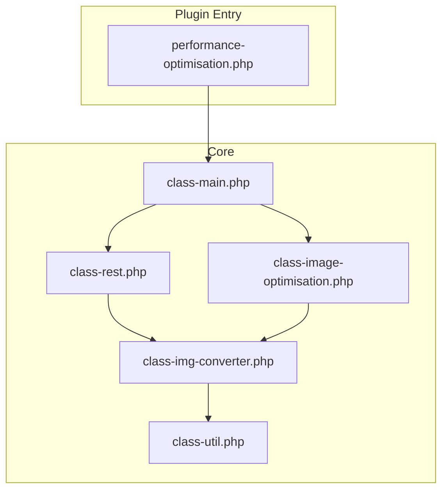
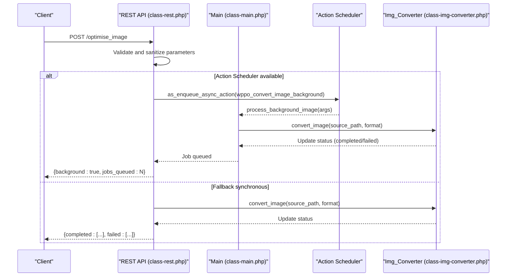
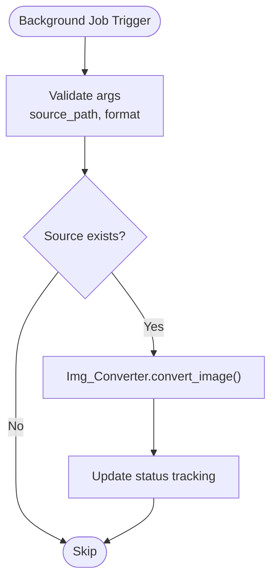
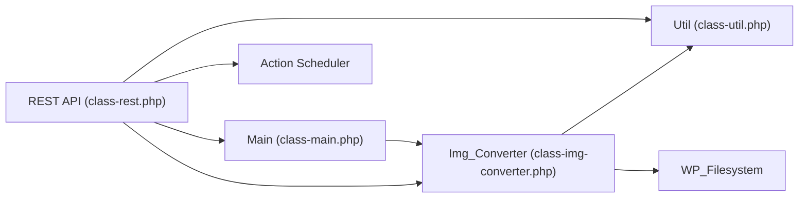

# Image Optimization Endpoints

<cite>
**Referenced Files in This Document**
- [performance-optimisation.php](file://performance-optimisation.php)
- [class-main.php](file://includes/class-main.php)
- [class-rest.php](file://includes/class-rest.php)
- [class-image-optimisation.php](file://includes/class-image-optimisation.php)
- [class-img-converter.php](file://includes/class-img-converter.php)
- [class-util.php](file://includes/class-util.php)
</cite>

## Table of Contents
1. [Introduction](#introduction)
2. [Project Structure](#project-structure)
3. [Core Components](#core-components)
4. [Architecture Overview](#architecture-overview)
5. [Detailed Component Analysis](#detailed-component-analysis)
6. [Dependency Analysis](#dependency-analysis)
7. [Performance Considerations](#performance-considerations)
8. [Troubleshooting Guide](#troubleshooting-guide)
9. [Conclusion](#conclusion)

## Introduction
This document provides comprehensive API documentation for image optimization endpoints exposed by the Performance Optimisation plugin. It focuses on three primary endpoints:
- Optimizing images to WebP and AVIF formats
- Deleting converted optimized images from the filesystem
- Monitoring background optimization job status

The endpoints leverage WordPress REST API infrastructure and integrate with Action Scheduler for background processing, with a synchronous fallback when Action Scheduler is unavailable. The documentation includes request/response specifications, background processing behavior, and practical examples for batch optimization and monitoring.

## Project Structure
The plugin follows a modular architecture with dedicated classes for REST API routing, image optimization logic, and background job processing. Key components include:
- REST API registration and handlers
- Image conversion engine
- Background job scheduling and processing
- Utility functions for filesystem and URL handling

**Diagram sources**
- [performance-optimisation.php:1-68](file://performance-optimisation.php#L1-L68)
- [class-main.php:182-241](file://includes/class-main.php#L182-L241)
- [class-rest.php:37-123](file://includes/class-rest.php#L37-L123)
- [class-image-optimisation.php:27-71](file://includes/class-image-optimisation.php#L27-L71)
- [class-img-converter.php:22-91](file://includes/class-img-converter.php#L22-L91)
- [class-util.php:29-80](file://includes/class-util.php#L29-L80)

**Section sources**
- [performance-optimisation.php:17-43](file://performance-optimisation.php#L17-L43)
- [class-main.php:128-154](file://includes/class-main.php#L128-L154)

## Core Components
- REST API Layer: Registers and handles REST endpoints for image optimization operations.
- Image Conversion Engine: Converts images to WebP and AVIF formats with safety checks and status tracking.
- Background Processing: Uses Action Scheduler to queue and process conversions asynchronously.
- Utility Functions: Provide filesystem operations, URL normalization, and MIME type detection.

Key responsibilities:
- REST endpoints accept image paths and delegate to the conversion engine.
- Background jobs trigger conversion callbacks and update status.
- Status monitoring endpoints expose conversion progress and completion metrics.

**Section sources**
- [class-rest.php:37-123](file://includes/class-rest.php#L37-L123)
- [class-img-converter.php:104-310](file://includes/class-img-converter.php#L104-L310)
- [class-main.php:230-311](file://includes/class-main.php#L230-L311)

## Architecture Overview
The image optimization workflow integrates REST API requests with background processing and filesystem operations.

**Diagram sources**
- [class-rest.php:253-353](file://includes/class-rest.php#L253-L353)
- [class-main.php:297-311](file://includes/class-main.php#L297-L311)
- [class-img-converter.php:104-310](file://includes/class-img-converter.php#L104-L310)

## Detailed Component Analysis

### REST API Endpoints

#### optimise_image
Purpose: Convert images to WebP and/or AVIF formats. Supports background processing via Action Scheduler with a synchronous fallback.

Request
- Method: POST
- Endpoint: `/wp-json/performance-optimisation/v1/optimise_image`
- Authentication: Requires manage_options capability and valid X-WP-Nonce header
- Body parameters:
  - webp: array of image paths (relative to WordPress root)
  - avif: array of image paths (relative to WordPress root)

Response
- Success (background mode):
  - background: boolean (true)
  - jobs_queued: integer (count of scheduled jobs)
  - message: string (human-readable status)
- Success (synchronous mode):
  - Response includes conversion status arrays for completed and failed images
- Error:
  - 400 Bad Request for invalid paths
  - 403 Forbidden for insufficient permissions

Behavior
- Validates input paths to prevent directory traversal
- If Action Scheduler is available, schedules background jobs for each image/format combination
- If not available, performs synchronous conversion and returns status

Examples
- Batch optimization of multiple images:
  - Send arrays for both webp and avif parameters
  - Monitor progress via get_image_job_status endpoint
- Large image sets:
  - Prefer background processing to avoid timeouts
  - Use get_image_job_status to track completion

**Section sources**
- [class-rest.php:65-69](file://includes/class-rest.php#L65-L69)
- [class-rest.php:253-353](file://includes/class-rest.php#L253-L353)

#### delete_optimised_image
Purpose: Remove converted WebP and AVIF images from the filesystem.

Request
- Method: POST
- Endpoint: `/wp-json/performance-optimisation/v1/delete_optimised_image`
- Authentication: Requires manage_options capability and valid X-WP-Nonce header

Response
- Success:
  - success: boolean (true)
  - message: string (confirmation)
- Error:
  - 404 Not Found if optimized images directory does not exist
  - 500 Internal Server Error if deletion fails

Behavior
- Removes the entire wppo directory under wp-content
- Clears completed format entries from internal status tracking
- Clears plugin cache after deletion

**Section sources**
- [class-rest.php:70-74](file://includes/class-rest.php#L70-L74)
- [class-rest.php:361-400](file://includes/class-rest.php#L361-L400)

#### get_image_job_status
Purpose: Monitor background optimization progress and completion status.

Request
- Method: GET
- Endpoint: `/wp-json/performance-optimisation/v1/image_job_status`
- Authentication: Requires manage_options capability and valid X-WP-Nonce header

Response
- pending: object with counts for webp and avif
- completed: object with counts for webp and avif
- failed: object with counts for webp and avif
- queued_jobs: integer (Action Scheduler pending jobs count)

Behavior
- Aggregates conversion status from internal tracking
- If Action Scheduler is active, includes pending job count
- Provides real-time visibility into background processing

**Section sources**
- [class-rest.php:100-104](file://includes/class-rest.php#L100-L104)
- [class-rest.php:592-627](file://includes/class-rest.php#L592-L627)

### Background Processing and Conversion Engine

#### Action Scheduler Integration
- Hook registration: wppo_convert_image_background
- Job arguments: source_path, format
- Processing callback: process_background_image in Main class
- Safety checks: validates existence of source path before conversion

**Diagram sources**
- [class-main.php:297-311](file://includes/class-main.php#L297-L311)
- [class-img-converter.php:104-310](file://includes/class-img-converter.php#L104-L310)

#### Image Conversion Engine
Capabilities
- Converts JPEG, PNG, GIF, and WebP images to WebP and/or AVIF
- Applies safety limits for file size and dimensions
- Tracks conversion status in an atomic manner
- Supports both synchronous and asynchronous modes

Safety and Validation
- File size limit enforced via filter
- Dimension limits configurable via filter
- Animated WebP detection prevents unsupported conversions
- Imagick fallback for GIF to WebP conversion when available

Status Tracking
- Pending, completed, and failed lists maintained per format
- Atomic updates to prevent race conditions
- Commit on shutdown merges concurrent updates

**Section sources**
- [class-img-converter.php:104-310](file://includes/class-img-converter.php#L104-L310)
- [class-img-converter.php:576-623](file://includes/class-img-converter.php#L576-L623)
- [class-img-converter.php:711-760](file://includes/class-img-converter.php#L711-L760)

### Permission and Security
- All image optimization endpoints require manage_options capability
- Nonce verification via X-WP-Nonce header
- Input sanitization and validation for image paths
- Directory traversal prevention in path handling

**Section sources**
- [class-rest.php:131-136](file://includes/class-rest.php#L131-L136)
- [class-rest.php:259-264](file://includes/class-rest.php#L259-L264)

## Dependency Analysis
The image optimization endpoints depend on several core components:

**Diagram sources**
- [class-rest.php:253-353](file://includes/class-rest.php#L253-L353)
- [class-main.php:297-311](file://includes/class-main.php#L297-L311)
- [class-img-converter.php:104-310](file://includes/class-img-converter.php#L104-L310)
- [class-util.php:67-80](file://includes/class-util.php#L67-L80)

**Section sources**
- [class-main.php:182-241](file://includes/class-main.php#L182-L241)
- [class-rest.php:37-123](file://includes/class-rest.php#L37-L123)

## Performance Considerations
- Background processing: Use Action Scheduler for large batches to avoid request timeouts
- Synchronous fallback: Only suitable for small image sets
- File size and dimension limits: Prevent excessive memory usage during conversion
- Status polling: Use get_image_job_status to avoid busy-waiting
- Cache invalidation: Automatic cache clearing after synchronous operations

## Troubleshooting Guide
Common issues and resolutions:
- Invalid image paths: Ensure paths are relative to WordPress root and do not contain directory traversal sequences
- Action Scheduler not available: The endpoint will fall back to synchronous processing
- Permission errors: Verify manage_options capability and valid nonce header
- Deletion failures: Check filesystem permissions for wp-content/wppo directory
- Conversion failures: Review file size/dimension limits and supported formats

Monitoring
- Use get_image_job_status to track progress and identify failed conversions
- Check plugin logs for detailed error messages

**Section sources**
- [class-rest.php:259-264](file://includes/class-rest.php#L259-L264)
- [class-rest.php:370-378](file://includes/class-rest.php#L370-L378)
- [class-img-converter.php:121-128](file://includes/class-img-converter.php#L121-L128)

## Conclusion
The Performance Optimisation plugin provides robust REST endpoints for image optimization with flexible processing modes and comprehensive status monitoring. By leveraging Action Scheduler for background processing and implementing strict safety checks, the endpoints support efficient optimization of large image sets while maintaining system stability. The included monitoring endpoint enables reliable progress tracking and troubleshooting.