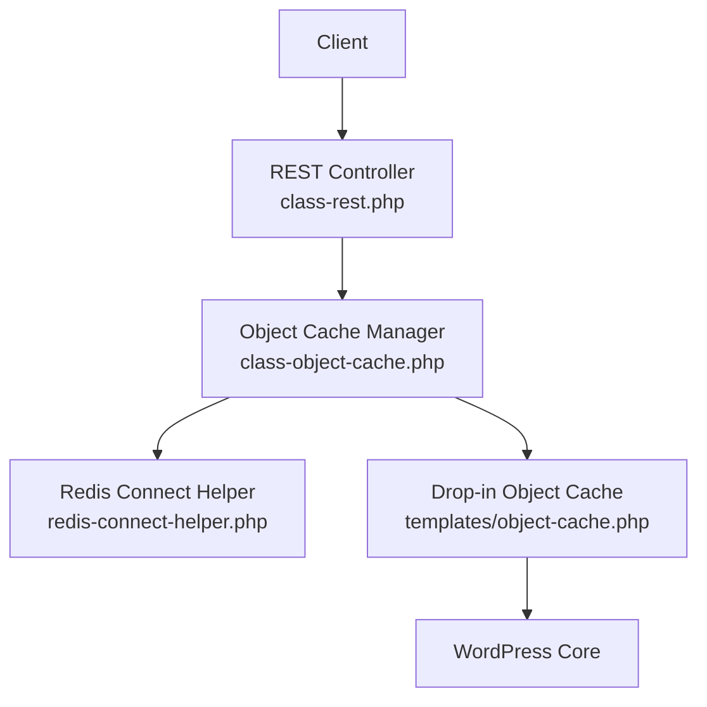
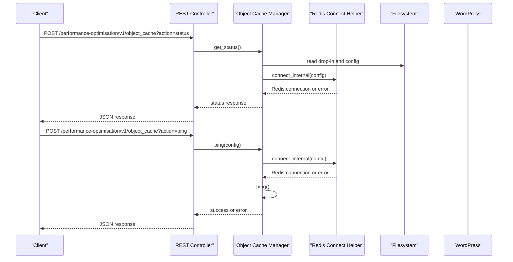
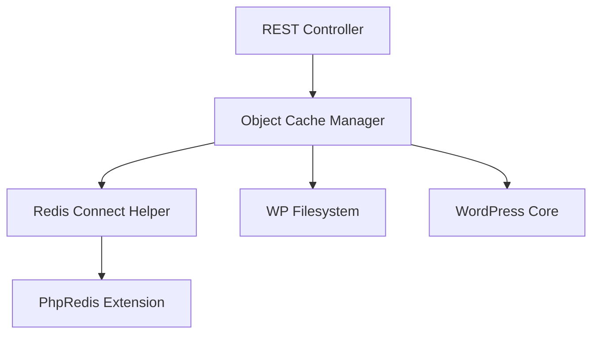

# Object Cache Endpoints

<cite>
**Referenced Files in This Document**
- [class-rest.php](file://includes/class-rest.php)
- [class-object-cache.php](file://includes/class-object-cache.php)
- [redis-connect-helper.php](file://includes/redis-connect-helper.php)
- [object-cache.php](file://templates/object-cache.php)
- [class-main.php](file://includes/class-main.php)
</cite>

## Table of Contents
1. [Introduction](#introduction)
2. [Project Structure](#project-structure)
3. [Core Components](#core-components)
4. [Architecture Overview](#architecture-overview)
5. [Detailed Component Analysis](#detailed-component-analysis)
6. [Dependency Analysis](#dependency-analysis)
7. [Performance Considerations](#performance-considerations)
8. [Troubleshooting Guide](#troubleshooting-guide)
9. [Conclusion](#conclusion)

## Introduction
This document provides comprehensive API documentation for the object cache management endpoints exposed by the plugin. It focuses on the object_cache endpoint and its actions: status, ping, enable, disable, and flush. For each action, it specifies required parameters, expected responses, and error conditions. It also details Redis configuration parameters including host, port, password, database selection, TLS support, persistence options, and compression settings, along with practical examples for configuring Redis connections, testing connectivity, enabling/disabling object caching, and flushing cache data.

## Project Structure
The object cache functionality is implemented across several key files:
- REST API controller that registers and handles the object_cache endpoint
- Object cache manager that performs status checks, connectivity tests, enables/disables caching, and flushes cache
- Redis connection helper that establishes connections for standalone, sentinel, and cluster modes
- Drop-in object cache that integrates with WordPress object cache infrastructure
- Main plugin bootstrap that wires the REST API initialization

**Diagram sources**
- [class-rest.php:105-109](file://includes/class-rest.php#L105-L109)
- [class-rest.php:636-695](file://includes/class-rest.php#L636-L695)
- [class-object-cache.php:22-62](file://includes/class-object-cache.php#L22-L62)
- [redis-connect-helper.php:34-188](file://includes/redis-connect-helper.php#L34-L188)
- [object-cache.php:78-149](file://templates/object-cache.php#L78-L149)

**Section sources**
- [class-rest.php:37-43](file://includes/class-rest.php#L37-L43)
- [class-rest.php:105-109](file://includes/class-rest.php#L105-L109)
- [class-main.php:182-183](file://includes/class-main.php#L182-L183)

## Core Components
- REST Controller: Registers the object_cache endpoint and delegates actions to the Object Cache Manager. It validates permissions and builds Redis configurations from request parameters.
- Object Cache Manager: Implements status checks, connectivity testing, enabling/disabling object cache, and cache flushing. It manages the drop-in file and configuration file for Redis.
- Redis Connect Helper: Provides unified connection logic for standalone, sentinel, and cluster modes, including TLS, authentication, database selection, and compression options.
- Drop-in Object Cache: Integrates with WordPress object cache infrastructure, establishing Redis connections and applying serializers/compression options.

**Section sources**
- [class-rest.php:636-695](file://includes/class-rest.php#L636-L695)
- [class-object-cache.php:78-144](file://includes/class-object-cache.php#L78-L144)
- [redis-connect-helper.php:34-220](file://includes/redis-connect-helper.php#L34-L220)
- [object-cache.php:78-149](file://templates/object-cache.php#L78-L149)

## Architecture Overview
The object cache endpoint follows a layered architecture:
- REST API layer validates permissions and parses parameters
- Object cache manager orchestrates operations and interacts with filesystem and Redis
- Redis connection helper encapsulates connection logic and configuration
- Drop-in object cache integrates with WordPress object cache

**Diagram sources**
- [class-rest.php:636-695](file://includes/class-rest.php#L636-L695)
- [class-object-cache.php:78-144](file://includes/class-object-cache.php#L78-L144)
- [redis-connect-helper.php:34-188](file://includes/redis-connect-helper.php#L34-L188)

## Detailed Component Analysis

### Endpoint Definition
- Method: POST
- Route: /performance-optimisation/v1/object_cache
- Permission: Requires manage_options capability and valid X-WP-Nonce header

**Section sources**
- [class-rest.php:105-109](file://includes/class-rest.php#L105-L109)
- [class-rest.php:131-136](file://includes/class-rest.php#L131-L136)

### Action: status
Purpose: Retrieve current status of object cache and Redis connectivity.

Parameters:
- action: status (required)
- Additional parameters are ignored for this action

Response:
- enabled: boolean indicating if plugin's drop-in is installed
- redis_missing: boolean indicating if PhpRedis extension is missing
- redis_reachable: boolean indicating if Redis connection can be established
- foreign_dropin: boolean indicating if a foreign drop-in exists
- telemetry: optional array with Redis info (redis_version, uptime_in_seconds, uptime_in_days, connected_clients, used_memory_human, used_memory_peak_human, total_connections_received, keyspace_hits, keyspace_misses, keys)
- telemetry_error: optional error message when telemetry collection failed
- supported_compressors: array indicating availability of compression algorithms (lzf, lz4, zstd)

Error Conditions:
- None for this action; returns status regardless of connectivity

Example Request:
- POST /performance-optimisation/v1/object_cache?action=status

Example Response:
- {
  "enabled": true,
  "redis_missing": false,
  "redis_reachable": true,
  "foreign_dropin": false,
  "telemetry": {
    "redis_version": "7.0.10",
    "uptime_in_seconds": 123456,
    "uptime_in_days": 1,
    "connected_clients": 10,
    "used_memory_human": "100M",
    "used_memory_peak_human": "120M",
    "total_connections_received": 1000,
    "keyspace_hits": 5000,
    "keyspace_misses": 100,
    "keys": 1000
  },
  "supported_compressors": {
    "lzf": true,
    "lz4": true,
    "zstd": false
  }
}

**Section sources**
- [class-rest.php:642-649](file://includes/class-rest.php#L642-L649)
- [class-object-cache.php:78-144](file://includes/class-object-cache.php#L78-L144)

### Action: ping
Purpose: Test Redis connectivity with provided configuration.

Parameters:
- action: ping (required)
- mode: standalone | sentinel | cluster (default: standalone)
- host: Redis host for standalone mode (default: 127.0.0.1)
- port: Redis port for standalone mode (default: 6379)
- password: authentication password (optional)
- database: database index to select (default: 0)
- nodes: nodes for cluster/sentinel (string or array; default: empty)
- master_name: master name for sentinel mode (default: mymaster)
- use_tls: boolean to use TLS (default: false)
- persistent: boolean to use persistent connections (default: false)
- compression: compression algorithm (none | lzf | lz4 | zstd; default: none)

Response:
- success: boolean true on successful ping

Error Conditions:
- missing_extension: PhpRedis extension not installed
- no_ping_method: connection does not support ping
- ping_fail: ping returned false
- ping_exception: exception during ping operation
- Other connection errors from Redis connect helper

Example Request:
- POST /performance-optimisation/v1/object_cache?action=ping
- Body: {
  "mode": "standalone",
  "host": "127.0.0.1",
  "port": 6379,
  "password": "",
  "database": 0,
  "use_tls": false,
  "persistent": false,
  "compression": "none"
}

Example Response:
- {
  "success": true
}

**Section sources**
- [class-rest.php:652-660](file://includes/class-rest.php#L652-L660)
- [class-rest.php:704-745](file://includes/class-rest.php#L704-L745)
- [class-object-cache.php:165-195](file://includes/class-object-cache.php#L165-L195)
- [redis-connect-helper.php:34-188](file://includes/redis-connect-helper.php#L34-L188)

### Action: enable
Purpose: Install Redis object cache drop-in and configuration.

Parameters:
- action: enable (required)
- Same parameters as ping action (see above)

Response:
- success: boolean true on successful enable

Error Conditions:
- missing_extension: PhpRedis extension not installed
- foreign_dropin: foreign drop-in exists; will not overwrite
- write_error: cannot write configuration file or copy drop-in
- Other connection errors from Redis connect helper

Example Request:
- POST /performance-optimisation/v1/object_cache?action=enable
- Body: {
  "mode": "standalone",
  "host": "127.0.0.1",
  "port": 6379,
  "password": "",
  "database": 0,
  "use_tls": false,
  "persistent": false,
  "compression": "none"
}

Example Response:
- {
  "success": true
}

Notes:
- On success, writes configuration file to wp-content/wppo-redis-config.php
- Copies object-cache.php drop-in to wp-content/object-cache.php
- Optionally flushes cache after enabling

**Section sources**
- [class-rest.php:662-672](file://includes/class-rest.php#L662-L672)
- [class-object-cache.php:208-247](file://includes/class-object-cache.php#L208-L247)

### Action: disable
Purpose: Remove Redis object cache drop-in and configuration.

Parameters:
- action: disable (required)

Response:
- success: boolean true on successful disable

Error Conditions:
- foreign_dropin: foreign drop-in exists; will not delete for safety
- delete_error: cannot delete object-cache.php from wp-content

Example Request:
- POST /performance-optimisation/v1/object_cache?action=disable

Example Response:
- {
  "success": true
}

Notes:
- Removes wp-content/object-cache.php if present
- Removes wp-content/wppo-redis-config.php if present

**Section sources**
- [class-rest.php:674-683](file://includes/class-rest.php#L674-L683)
- [class-object-cache.php:256-275](file://includes/class-object-cache.php#L256-L275)

### Action: flush
Purpose: Flush the complete object cache.

Parameters:
- action: flush (required)

Response:
- success: boolean true on successful flush

Error Conditions:
- None for this action; returns success if wp_cache_flush exists, otherwise false

Example Request:
- POST /performance-optimisation/v1/object_cache?action=flush

Example Response:
- {
  "success": true
}

Notes:
- Delegates to WordPress wp_cache_flush() function

**Section sources**
- [class-rest.php:685-692](file://includes/class-rest.php#L685-L692)
- [class-object-cache.php:283-288](file://includes/class-object-cache.php#L283-L288)

### Redis Configuration Parameters
Supported parameters for Redis connections:
- mode: Connection mode (standalone | sentinel | cluster)
- host: Redis host for standalone mode (default: 127.0.0.1)
- port: Redis port for standalone mode (default: 6379)
- password: Authentication password (optional)
- database: Database index to select (default: 0)
- nodes: Nodes for cluster/sentinel (string or array)
- master_name: Master name for sentinel mode (default: mymaster)
- use_tls: Boolean to use TLS (default: false)
- persistent: Boolean to use persistent connections (default: false)
- compression: Compression algorithm (none | lzf | lz4 | zstd; default: none)

Validation and defaults:
- Allowed keys are sanitized and validated
- Missing keys receive sensible defaults
- Nodes are normalized from string or array input

**Section sources**
- [class-rest.php:704-745](file://includes/class-rest.php#L704-L745)
- [redis-connect-helper.php:34-244](file://includes/redis-connect-helper.php#L34-L244)

### Connection Modes and Behavior
- Standalone mode: Connects to a single Redis instance with optional TLS and authentication
- Sentinel mode: Uses Redis Sentinel to discover master and establishes connection
- Cluster mode: Connects to Redis Cluster with multiple nodes

TLS Support:
- When use_tls is true, host is prefixed with tls:// for standalone
- For cluster mode, nodes are prefixed with tls:// if TLS is enabled

Authentication and Database Selection:
- Supports AUTH with provided password
- Selects database index after connection

Compression:
- Applies serializer (igbinary or PHP) and optional compression (lzf, lz4, zstd)

**Section sources**
- [redis-connect-helper.php:34-188](file://includes/redis-connect-helper.php#L34-L188)
- [object-cache.php:157-318](file://templates/object-cache.php#L157-L318)

### Examples

#### Example 1: Configure Redis Standalone Connection
- Action: enable
- Parameters:
  - mode: standalone
  - host: 127.0.0.1
  - port: 6379
  - password: ""
  - database: 0
  - use_tls: false
  - persistent: false
  - compression: none

#### Example 2: Configure Redis with TLS
- Action: enable
- Parameters:
  - mode: standalone
  - host: 127.0.0.1
  - port: 6379
  - password: ""
  - database: 0
  - use_tls: true
  - persistent: false
  - compression: none

#### Example 3: Test Connectivity
- Action: ping
- Parameters:
  - mode: standalone
  - host: 127.0.0.1
  - port: 6379
  - password: ""
  - database: 0
  - use_tls: false
  - persistent: false
  - compression: none

#### Example 4: Enable Sentinel Mode
- Action: enable
- Parameters:
  - mode: sentinel
  - nodes: "127.0.0.1:26379"
  - master_name: mymaster
  - password: ""
  - database: 0
  - use_tls: false
  - persistent: false
  - compression: none

#### Example 5: Enable Cluster Mode
- Action: enable
- Parameters:
  - mode: cluster
  - nodes: ["127.0.0.1:7000","127.0.0.1:7001","127.0.0.1:7002"]
  - password: ""
  - database: 0
  - use_tls: false
  - persistent: false
  - compression: none

#### Example 6: Flush Cache
- Action: flush

## Dependency Analysis
The object cache endpoint depends on:
- WordPress REST API framework
- WordPress filesystem API for file operations
- PhpRedis extension for Redis connectivity
- WordPress object cache infrastructure for drop-in integration

**Diagram sources**
- [class-rest.php:182-183](file://includes/class-rest.php#L182-L183)
- [class-object-cache.php:231-241](file://includes/class-object-cache.php#L231-L241)
- [redis-connect-helper.php:34-188](file://includes/redis-connect-helper.php#L34-L188)

**Section sources**
- [class-rest.php:182-183](file://includes/class-rest.php#L182-L183)
- [class-object-cache.php:231-241](file://includes/class-object-cache.php#L231-L241)

## Performance Considerations
- Connection timeouts are set to 0.5 seconds for quick responsiveness
- Persistent connections can reduce connection overhead for high-traffic sites
- Compression reduces payload sizes but may increase CPU usage
- Telemetry collection is optional and only performed when enabled
- Flush operations should be used judiciously as they clear all cache data

## Troubleshooting Guide
Common issues and resolutions:
- PhpRedis extension missing: Install and enable the PhpRedis extension
- Foreign drop-in present: Remove conflicting drop-in before enabling
- Connection failures: Verify Redis server accessibility, credentials, and TLS settings
- Permission errors: Ensure WordPress can write to wp-content directory
- Telemetry errors: Check Redis INFO command accessibility and permissions

**Section sources**
- [class-object-cache.php:209-216](file://includes/class-object-cache.php#L209-L216)
- [class-object-cache.php:264-267](file://includes/class-object-cache.php#L264-L267)
- [redis-connect-helper.php:156-187](file://includes/redis-connect-helper.php#L156-L187)

## Conclusion
The object cache endpoints provide a comprehensive interface for managing Redis-backed object caching in WordPress. They support multiple connection modes, robust configuration options, and essential operations for monitoring and controlling cache behavior. Proper configuration and validation ensure reliable object caching integration with WordPress infrastructure.