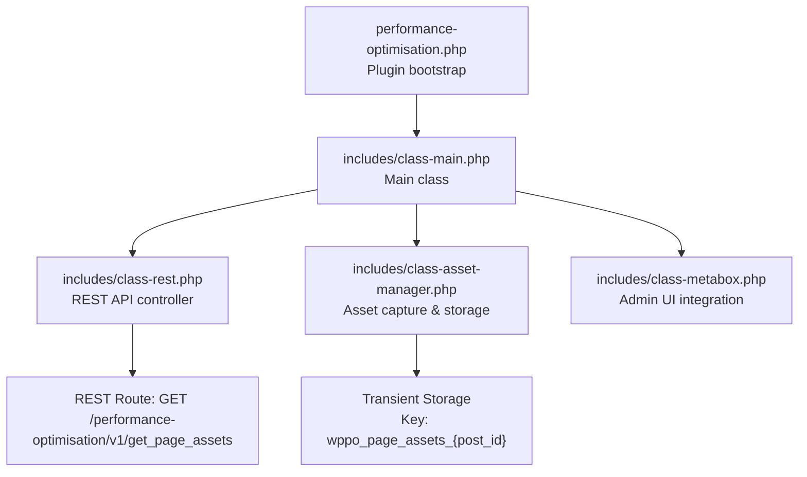
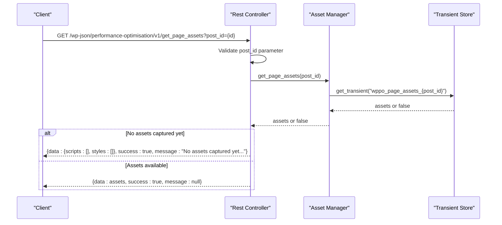
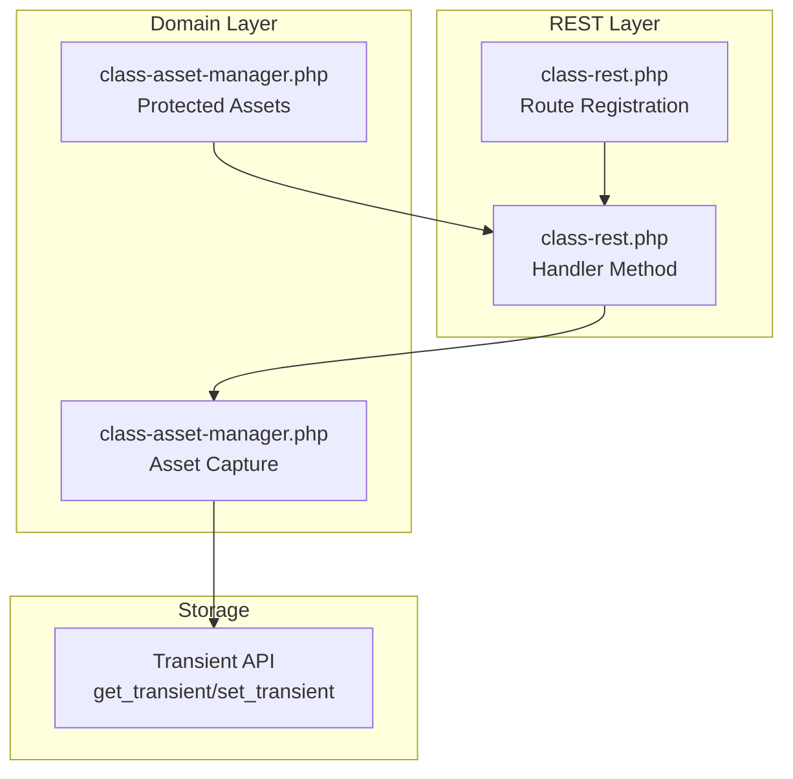

# Page Assets Endpoints

<cite>
**Referenced Files in This Document**
- [performance-optimisation.php](file://performance-optimisation.php)
- [class-main.php](file://includes/class-main.php)
- [class-rest.php](file://includes/class-rest.php)
- [class-asset-manager.php](file://includes/class-asset-manager.php)
- [class-metabox.php](file://includes/class-metabox.php)
</cite>

## Table of Contents
1. [Introduction](#introduction)
2. [Project Structure](#project-structure)
3. [Core Components](#core-components)
4. [Architecture Overview](#architecture-overview)
5. [Detailed Component Analysis](#detailed-component-analysis)
6. [Dependency Analysis](#dependency-analysis)
7. [Performance Considerations](#performance-considerations)
8. [Troubleshooting Guide](#troubleshooting-guide)
9. [Conclusion](#conclusion)

## Introduction
This document provides detailed API documentation for the page assets management endpoints, focusing on the get_page_assets endpoint. This endpoint retrieves cached assets for specific posts/pages, enabling inspection of which scripts and styles are being captured and managed for performance optimization. The documentation covers endpoint usage, parameter requirements, response format, and practical examples for different post types.

## Project Structure
The plugin organizes its functionality around a central main class that initializes the REST API and registers routes. The REST controller exposes the get_page_assets endpoint, while the Asset Manager captures and stores per-page asset information in transients.

**Diagram sources**
- [performance-optimisation.php:40-43](file://performance-optimisation.php#L40-L43)
- [class-main.php:182-183](file://includes/class-main.php#L182-L183)
- [class-rest.php:95-99](file://includes/class-rest.php#L95-L99)
- [class-asset-manager.php:34](file://includes/class-asset-manager.php#L34)

**Section sources**
- [performance-optimisation.php:40-43](file://performance-optimisation.php#L40-L43)
- [class-main.php:182-183](file://includes/class-main.php#L182-L183)

## Core Components
- REST API Controller: Registers and handles the get_page_assets endpoint, validates permissions, and formats responses.
- Asset Manager: Captures enqueued scripts and styles on the frontend, stores them in transients, and provides protected asset lists.
- Admin Integration: Displays captured assets in the post editor meta box and provides guidance for first-time capture.

Key implementation references:
- Endpoint registration and handler: [class-rest.php:95-99](file://includes/class-rest.php#L95-L99), [class-rest.php:560-583](file://includes/class-rest.php#L560-L583)
- Asset capture and storage: [class-asset-manager.php:131-191](file://includes/class-asset-manager.php#L131-L191)
- Protected assets: [class-asset-manager.php:44-67](file://includes/class-asset-manager.php#L44-L67)
- Admin UI integration: [class-metabox.php:118-150](file://includes/class-metabox.php#L118-L150)

**Section sources**
- [class-rest.php:95-99](file://includes/class-rest.php#L95-L99)
- [class-rest.php:560-583](file://includes/class-rest.php#L560-L583)
- [class-asset-manager.php:131-191](file://includes/class-asset-manager.php#L131-L191)
- [class-asset-manager.php:44-67](file://includes/class-asset-manager.php#L44-L67)
- [class-metabox.php:118-150](file://includes/class-metabox.php#L118-L150)

## Architecture Overview
The get_page_assets endpoint follows a straightforward flow: the client sends a GET request with a post_id parameter, the REST controller validates the request and permissions, queries the Asset Manager for cached assets, and returns a standardized response.

**Diagram sources**
- [class-rest.php:560-583](file://includes/class-rest.php#L560-L583)
- [class-asset-manager.php:200-202](file://includes/class-asset-manager.php#L200-L202)

## Detailed Component Analysis

### get_page_assets Endpoint
Purpose: Retrieve cached assets for a specific post/page to inspect which scripts and styles are captured.

Endpoint definition:
- Method: GET
- Route: /wp-json/performance-optimisation/v1/get_page_assets
- Permission: Requires manage_options capability and valid X-WP-Nonce header

Parameters:
- post_id (required): Integer representing the WordPress post/page ID. Must be a positive integer.

Response format:
- Standardized wrapper with fields:
  - data: Array containing assets or empty arrays
  - success: Boolean indicating request outcome
  - message: String with contextual message or null

Response payload structure:
- data.scripts: Array of script entries
  - Each entry includes handle, src, deps
- data.styles: Array of style entries
  - Each entry includes handle, src, deps
- data.timestamp: Unix timestamp when assets were captured (when available)

Behavioral notes:
- If post_id is missing or zero, returns 400 with an error message
- If no assets are captured yet, returns empty arrays with a success flag and informational message
- If assets are present, returns the captured assets

Example usage scenarios:
- Request assets for a published post: GET /wp-json/performance-optimisation/v1/get_page_assets?post_id=123
- Request assets for a page: GET /wp-json/performance-optimisation/v1/get_page_assets?post_id=456
- Request assets for a custom post type: GET /wp-json/performance-optimisation/v1/get_page_assets?post_id=789

Interpretation guidelines:
- Empty scripts and styles arrays indicate no assets have been captured yet
- Non-empty arrays show the handles, sources, and dependencies of enqueued assets
- The presence of a timestamp indicates when the capture occurred

**Section sources**
- [class-rest.php:95-99](file://includes/class-rest.php#L95-L99)
- [class-rest.php:560-583](file://includes/class-rest.php#L560-L583)
- [class-asset-manager.php:172-176](file://includes/class-asset-manager.php#L172-L176)

### Asset Capture and Storage
The Asset Manager captures assets during frontend page rendering and stores them in transients keyed by post ID.

Key behaviors:
- Capture occurs on wp_footer hook with high priority
- Collects all enqueued scripts and styles from global WP_Scripts and WP_Styles
- Stores an array with scripts, styles, and timestamp
- Only updates transient if asset lists have changed
- Uses a 24-hour expiration for stored assets

Protected assets:
- Scripts: jquery, jquery-core, jquery-migrate, wp-i18n, wp-hooks, wp-api-fetch, wp-url, wp-polyfill, admin-bar, heartbeat
- Styles: admin-bar, dashicons, wp-block-library

Integration with admin UI:
- The meta box displays captured assets and prompts for first-time capture
- Shows time elapsed since last capture and guidance to visit the page to refresh

**Section sources**
- [class-asset-manager.php:131-191](file://includes/class-asset-manager.php#L131-L191)
- [class-asset-manager.php:44-67](file://includes/class-asset-manager.php#L44-L67)
- [class-metabox.php:118-150](file://includes/class-metabox.php#L118-L150)

### REST Response Formatting
The REST controller uses a consistent response wrapper across endpoints. The get_page_assets endpoint returns:
- data: The asset payload or empty arrays
- success: Boolean success indicator
- message: Optional message string

This wrapper ensures predictable client-side handling regardless of the underlying asset availability.

**Section sources**
- [class-rest.php:831-840](file://includes/class-rest.php#L831-L840)

## Dependency Analysis
The get_page_assets endpoint depends on several internal components working together:

**Diagram sources**
- [class-rest.php:95-99](file://includes/class-rest.php#L95-L99)
- [class-rest.php:560-583](file://includes/class-rest.php#L560-L583)
- [class-asset-manager.php:200-202](file://includes/class-asset-manager.php#L200-L202)

**Section sources**
- [class-rest.php:95-99](file://includes/class-rest.php#L95-L99)
- [class-rest.php:560-583](file://includes/class-rest.php#L560-L583)
- [class-asset-manager.php:200-202](file://includes/class-asset-manager.php#L200-L202)

## Performance Considerations
- Transient caching: Assets are cached for 24 hours per post, reducing repeated capture overhead
- Conditional updates: Transient is only updated when asset lists change
- Minimal runtime cost: Asset capture happens late in the page lifecycle and only affects frontend rendering
- Frontend-only capture: Assets are captured during frontend rendering, avoiding admin overhead

## Troubleshooting Guide
Common scenarios and resolutions:

No assets captured yet:
- Cause: First-time page visit or no assets enqueued
- Resolution: Visit the page on the frontend while logged out, then call the endpoint again
- Expected response: Empty arrays with success=true and informational message

Invalid post_id:
- Cause: Missing or non-positive post_id parameter
- Resolution: Provide a valid post/page ID
- Expected response: 400 status with error message

Permission denied:
- Cause: Missing manage_options capability or invalid X-WP-Nonce
- Resolution: Authenticate with sufficient privileges and include a valid nonce
- Expected response: 403/401 status depending on validation

Protected assets:
- Behavior: Certain core WordPress assets are protected and cannot be disabled
- Impact: These assets will appear in captured lists but cannot be removed via the plugin

Timestamp interpretation:
- Presence indicates when the asset capture occurred
- Absence suggests either no capture yet or older cache state

**Section sources**
- [class-rest.php:564-566](file://includes/class-rest.php#L564-L566)
- [class-rest.php:570-580](file://includes/class-rest.php#L570-L580)
- [class-metabox.php:118-150](file://includes/class-metabox.php#L118-L150)

## Conclusion
The get_page_assets endpoint provides a reliable way to inspect cached assets for any post or page. By understanding the endpoint's parameters, response format, and the underlying asset capture mechanism, developers and administrators can effectively monitor and manage page assets for performance optimization. The endpoint's design ensures consistent responses and minimal overhead while providing valuable insights into the assets being loaded on specific pages.