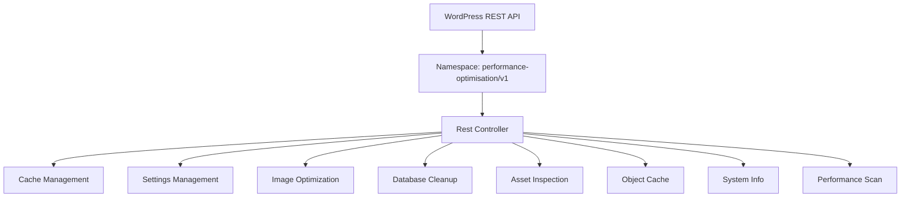
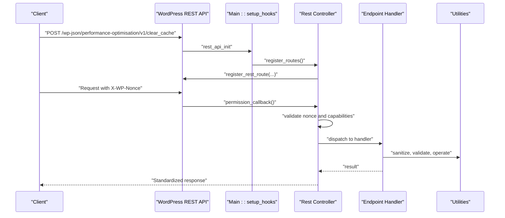
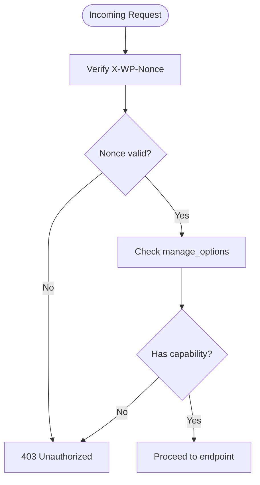
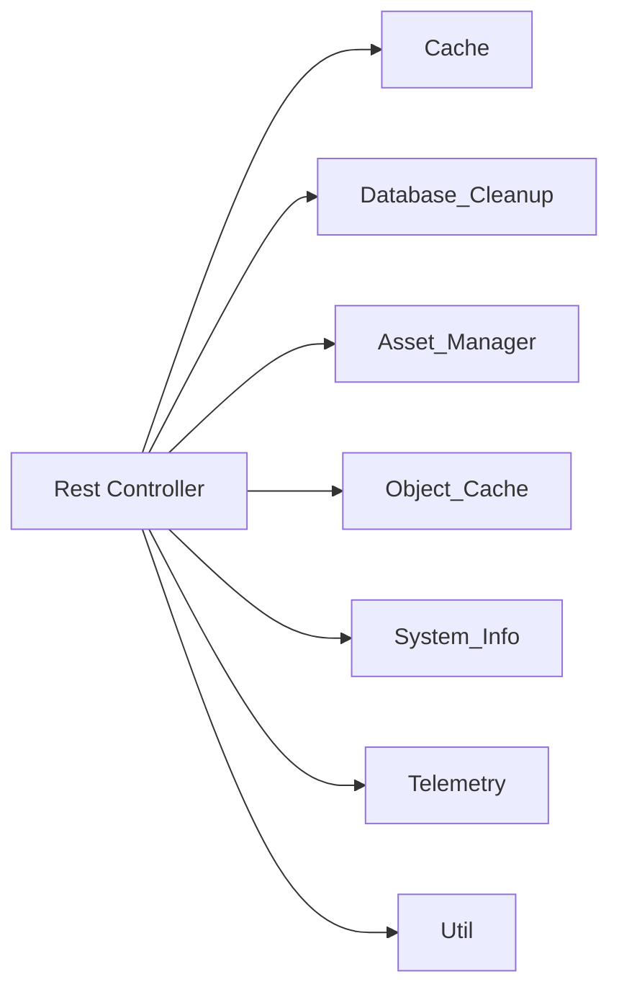

# REST API Reference

<cite>
**Referenced Files in This Document**
- [performance-optimisation.php](file://performance-optimisation.php)
- [class-main.php](file://includes/class-main.php)
- [class-rest.php](file://includes/class-rest.php)
- [class-system-info.php](file://includes/class-system-info.php)
- [class-telemetry.php](file://includes/class-telemetry.php)
- [class-cache.php](file://includes/class-cache.php)
- [class-database-cleanup.php](file://includes/class-database-cleanup.php)
- [class-asset-manager.php](file://includes/class-asset-manager.php)
- [class-object-cache.php](file://includes/class-object-cache.php)
- [apiRequest.js](file://src/lib/apiRequest.js)
</cite>

## Table of Contents
1. [Introduction](#introduction)
2. [Project Structure](#project-structure)
3. [Core Components](#core-components)
4. [Architecture Overview](#architecture-overview)
5. [Detailed Component Analysis](#detailed-component-analysis)
6. [Dependency Analysis](#dependency-analysis)
7. [Performance Considerations](#performance-considerations)
8. [Troubleshooting Guide](#troubleshooting-guide)
9. [Conclusion](#conclusion)
10. [Appendices](#appendices)

## Introduction
This document provides comprehensive REST API documentation for the Performance Optimisation plugin. It covers all available endpoints, including HTTP methods, URL patterns, request/response schemas, authentication requirements, error handling, rate limiting considerations, and security best practices. It also includes practical examples, client implementation guidelines, and integration patterns with external tools.

## Project Structure
The plugin exposes a REST namespace under WordPress’s REST API. The main entry point initializes the plugin and registers the REST routes. The REST controller defines endpoints for cache management, settings updates, image optimization, database cleanup, asset inspection, object cache control, diagnostics, and performance telemetry.

**Diagram sources**
- [class-main.php:182](file://includes/class-main.php#L182)
- [class-rest.php:30](file://includes/class-rest.php#L30)

**Section sources**
- [performance-optimisation.php:40-43](file://performance-optimisation.php#L40-L43)
- [class-main.php:182](file://includes/class-main.php#L182)

## Core Components
- REST Namespace: performance-optimisation/v1
- Authentication: WordPress REST API standard with X-WP-Nonce header and manage_options capability
- Response Wrapper: All endpoints return a standardized envelope with data, success, and message fields
- Permission Model: Requires manage_options capability and a valid nonce

Key capabilities exposed via REST:
- Cache operations (clear single or all cache)
- Settings management (update and import)
- Image optimization (convert to WebP/AVIF, delete optimized images)
- Database cleanup (selective or bulk)
- Asset inspection (per-page script/style lists)
- Object cache control (status, ping, enable, disable, flush)
- System information (PHP, DB, WordPress, server, cache)
- Performance telemetry (local page scan)

**Section sources**
- [class-rest.php:30](file://includes/class-rest.php#L30)
- [class-rest.php:131](file://includes/class-rest.php#L131)
- [class-rest.php:831](file://includes/class-rest.php#L831)

## Architecture Overview
The plugin integrates with WordPress’s REST API infrastructure. The Main class registers the REST routes during rest_api_init. The Rest controller implements handlers for each endpoint, performing validation, sanitization, and business logic before returning a standardized response.

**Diagram sources**
- [class-main.php:182](file://includes/class-main.php#L182)
- [class-rest.php:37](file://includes/class-rest.php#L37)
- [class-rest.php:131](file://includes/class-rest.php#L131)

## Detailed Component Analysis

### Authentication and Authorization
- Header: X-WP-Nonce
- Capability: manage_options
- Nonce refresh: wp_create_nonce('wp_rest') via AJAX endpoint

**Diagram sources**
- [class-rest.php:131](file://includes/class-rest.php#L131)

**Section sources**
- [class-rest.php:131](file://includes/class-rest.php#L131)
- [class-main.php:240](file://includes/class-main.php#L240)

### Endpoint Catalog

#### Cache Management
- Base URL: /wp-json/performance-optimisation/v1/clear_cache
- Method: POST
- Purpose: Clear cache for a specific path or all cache
- Request Parameters:
  - action: clear_single_page_cache or other (defaults to clear all)
  - path: optional, normalized URL path (sanitized)
- Validation:
  - Rejects paths containing directory traversal sequences
- Response:
  - success: boolean
  - message: human-readable status
  - data: true on success

Notes:
- Directory traversal detection prevents arbitrary path deletion
- Logs activity for audit trails

**Section sources**
- [class-rest.php:145](file://includes/class-rest.php#L145)
- [class-rest.php:157](file://includes/class-rest.php#L157)

#### Settings Management
- Update Settings
  - Base URL: /wp-json/performance-optimisation/v1/update_settings
  - Method: POST
  - Request Body: { tab: string, settings: object }
  - Behavior: Recursively sanitize settings, update option, clear cache
  - Response: Updated settings object

- Import Settings
  - Base URL: /wp-json/performance-optimisation/v1/import_settings
  - Method: POST
  - Request Body: JSON with action and settings
  - Behavior: Validate payload, sanitize, compare with existing, update if changed, clear cache
  - Response: Success/failure with message

Validation and Sanitization:
- Keys sanitized to alphanumeric, underscore, hyphen
- Boolean values preserved
- Strings sanitized via textarea field sanitizer
- Prevents directory traversal in paths

**Section sources**
- [class-rest.php:184](file://includes/class-rest.php#L184)
- [class-rest.php:209](file://includes/class-rest.php#L209)
- [class-rest.php:409](file://includes/class-rest.php#L409)
- [class-rest.php:416](file://includes/class-rest.php#L416)

#### Image Optimization
- Optimize Images
  - Base URL: /wp-json/performance-optimisation/v1/optimise_image
  - Method: POST
  - Request Parameters:
    - webp: array of image paths
    - avif: array of image paths
  - Behavior:
    - Validates paths (no directory traversal)
    - Uses Action Scheduler for background processing if available
    - Falls back to synchronous processing
    - Clears cache after synchronous processing
  - Response:
    - Background mode: { background: true, jobs_queued: number, message: string }
    - Synchronous mode: Image info object

- Delete Optimized Images
  - Base URL: /wp-json/performance-optimisation/v1/delete_optimised_image
  - Method: POST
  - Behavior: Deletes optimized images directory, clears completed formats, clears cache
  - Response:
    - Success: { success: true, message: string }
    - Not Found: { success: false, message: string }, 404
    - Error: { success: false, message: string }, 500

- Image Job Status
  - Base URL: /wp-json/performance-optimisation/v1/image_job_status
  - Method: GET
  - Response: Pending/completed/failed counts per format, queued_jobs count (Action Scheduler)

Validation and Sanitization:
- Paths sanitized and normalized
- Directory traversal blocked
- Uses filesystem abstraction for safe operations

**Section sources**
- [class-rest.php:253](file://includes/class-rest.php#L253)
- [class-rest.php:361](file://includes/class-rest.php#L361)
- [class-rest.php:592](file://includes/class-rest.php#L592)

#### Database Cleanup
- Base URL: /wp-json/performance-optimisation/v1/database_cleanup
- Method: POST
- Request Parameter: type (one of: revisions, auto_drafts, trashed_posts, spam_comments, trashed_comments, expired_transients, orphan_postmeta, all)
- Behavior:
  - Validates type against allowed list
  - Executes corresponding cleanup method(s)
  - Aggregates results for 'all' type
- Response:
  - Specific type: { type: string, deleted: number }
  - All types: { results: object, deleted: number } or { failures: object, deleted: number } with 500 on partial failure
  - Error: { success: false, message: string }, 400/500

Counts Endpoint
- Base URL: /wp-json/performance-optimisation/v1/database_cleanup_counts
- Method: GET
- Response: Counts for each cleanup category

Cleanup Methods:
- Revisions (with advanced pruning)
- Auto drafts
- Trashed posts
- Spam comments
- Trashed comments
- Expired transients
- Orphan postmeta

**Section sources**
- [class-rest.php:451](file://includes/class-rest.php#L451)
- [class-rest.php:548](file://includes/class-rest.php#L548)
- [class-database-cleanup.php:38](file://includes/class-database-cleanup.php#L38)
- [class-database-cleanup.php:529](file://includes/class-database-cleanup.php#L529)

#### Asset Inspection
- Base URL: /wp-json/performance-optimisation/v1/get_page_assets
- Method: GET
- Request Parameter: post_id (required)
- Behavior: Returns captured scripts/styles for the page
- Response:
  - Success: { scripts: array, styles: array }
  - No assets captured yet: { scripts: [], styles: [] }, message, 200

Notes:
- Requires visiting the page on the frontend first to capture assets
- Uses transients keyed by post ID

**Section sources**
- [class-rest.php:560](file://includes/class-rest.php#L560)
- [class-asset-manager.php:200](file://includes/class-asset-manager.php#L200)

#### Object Cache Control
- Base URL: /wp-json/performance-optimisation/v1/object_cache
- Method: POST
- Request Parameter: action (status, ping, enable, disable, flush)
- Additional Parameters (enable):
  - mode, host, port, password, database, nodes, master_name, use_tls, persistent, compression
- Behavior:
  - status: returns enabled flag, Redis availability, connectivity, telemetry (if available)
  - ping: validates connection
  - enable: writes config file and drop-in, optionally pings and flushes cache
  - disable: deletes drop-in and config
  - flush: flushes object cache
- Response:
  - status: { enabled, redis_missing, redis_reachable, foreign_dropin, telemetry?, telemetry_error? }
  - ping/enable/disable/flush: { success: true, message: string } or error

Security and Validation:
- Blocks foreign drop-in conflicts
- Validates PHP Redis extension availability
- Sanitizes and normalizes node lists
- Supports standalone, sentinel, and cluster modes

**Section sources**
- [class-rest.php:636](file://includes/class-rest.php#L636)
- [class-rest.php:704](file://includes/class-rest.php#L704)
- [class-object-cache.php:78](file://includes/class-object-cache.php#L78)
- [class-object-cache.php:208](file://includes/class-object-cache.php#L208)

#### System Information
- Base URL: /wp-json/performance-optimisation/v1/system_info
- Method: GET
- Response: Aggregated system information groups (PHP, database, WordPress, constants, server, cache)

System Info Groups:
- PHP: version, SAPI, memory limits, execution time, upload sizes, display errors, extension count
- Database: server version, extension class, client version, max connections
- WordPress: version, environment type, permalink structure, HTTPS, multisite
- Constants: WP_DEBUG, WP_CACHE, WP_MEMORY_LIMIT, WP_DEBUG_LOG, SCRIPT_DEBUG
- Server: server software, OS, architecture
- Cache: object cache status, active cache plugin, memory usage, WooCommerce presets

**Section sources**
- [class-rest.php:790](file://includes/class-rest.php#L790)
- [class-system-info.php:62](file://includes/class-system-info.php#L62)

#### Performance Scan
- Base URL: /wp-json/performance-optimisation/v1/performance_scan
- Method: POST
- Request Parameter: url (required)
- Behavior: Performs local telemetry scan using cURL when available, falls back to wp_remote_get()
- Response: Structured metrics including load time, TTFB, DNS/connect/SSL timings, resource counts, sizes, HTTPS, compression, cache headers, modern image formats, alt attributes, robots.txt presence

Metrics Include:
- Page URL, load time, TTFB, DNS lookup, connect, SSL, CSS/JS/media counts, total sizes, HTTPS status, modern formats, alt attributes, robots.txt, compression, cache control, scan type

**Section sources**
- [class-rest.php:804](file://includes/class-rest.php#L804)
- [class-telemetry.php:45](file://includes/class-telemetry.php#L45)

### Response Schema
All endpoints return a standardized envelope:
- data: endpoint-specific payload or null
- success: boolean indicating operation outcome
- message: human-readable status or error message

Examples:
- Successful update_settings: { data: settings, success: true, message: "..." }
- Failed import_settings: { data: null, success: false, message: "..." }
- Performance scan: { data: metrics, success: true, message: null }

**Section sources**
- [class-rest.php:831](file://includes/class-rest.php#L831)

### Client Implementation Guidelines
Recommended approach for consuming the API:
- Use X-WP-Nonce header for authentication
- Wrap requests in a helper that handles JSON serialization/deserialization
- Handle standardized response envelope (success, data, message)
- For long-running operations (image optimization), poll image_job_status endpoint
- Refresh nonce via AJAX endpoint when needed

Example usage patterns:
- Update settings: POST /wp-json/performance-optimisation/v1/update_settings with { tab, settings }
- Clear cache: POST /wp-json/performance-optimisation/v1/clear_cache with { action, path? }
- Import settings: POST /wp-json/performance-optimisation/v1/import_settings with JSON { action: "import_settings", settings }
- Optimize images: POST /wp-json/performance-optimisation/v1/optimise_image with { webp[], avif[] }
- Delete optimized images: POST /wp-json/performance-optimisation/v1/delete_optimised_image
- Database cleanup: POST /wp-json/performance-optimisation/v1/database_cleanup with { type }
- Get page assets: GET /wp-json/performance-optimisation/v1/get_page_assets?post_id=123
- Object cache: POST /wp-json/performance-optimisation/v1/object_cache with { action, ... }
- System info: GET /wp-json/performance-optimisation/v1/system_info
- Performance scan: POST /wp-json/performance-optimisation/v1/performance_scan with { url }

Integration patterns:
- Use WordPress REST API client libraries or native fetch with X-WP-Nonce
- Implement retry/backoff for transient failures
- Cache responses when appropriate (e.g., system_info, counts)
- Monitor rate limits and throttle requests

**Section sources**
- [apiRequest.js:4](file://src/lib/apiRequest.js#L4)
- [apiRequest.js:20](file://src/lib/apiRequest.js#L20)
- [apiRequest.js:41](file://src/lib/apiRequest.js#L41)
- [apiRequest.js:51](file://src/lib/apiRequest.js#L51)

## Dependency Analysis
The REST controller depends on several internal classes for business logic:
- Cache: cache operations, filesystem management
- Database_Cleanup: database cleanup routines
- Asset_Manager: per-page asset capture and inspection
- Object_Cache: Redis drop-in management and telemetry
- System_Info: system information aggregation
- Telemetry: performance scanning
- Util: filesystem initialization and path utilities

**Diagram sources**
- [class-rest.php:139](file://includes/class-rest.php#L139)
- [class-rest.php:451](file://includes/class-rest.php#L451)
- [class-rest.php:560](file://includes/class-rest.php#L560)
- [class-rest.php:636](file://includes/class-rest.php#L636)
- [class-rest.php:790](file://includes/class-rest.php#L790)
- [class-rest.php:804](file://includes/class-rest.php#L804)

**Section sources**
- [class-rest.php:139](file://includes/class-rest.php#L139)
- [class-rest.php:451](file://includes/class-rest.php#L451)
- [class-rest.php:560](file://includes/class-rest.php#L560)
- [class-rest.php:636](file://includes/class-rest.php#L636)
- [class-rest.php:790](file://includes/class-rest.php#L790)
- [class-rest.php:804](file://includes/class-rest.php#L804)

## Performance Considerations
- Background processing: Image optimization uses Action Scheduler when available to avoid blocking requests
- Caching: Responses are cached via transients for telemetry and counts
- Filesystem operations: All filesystem writes use WordPress filesystem abstraction for security and compatibility
- Rate limiting: No built-in rate limiting; implement client-side throttling and respect WordPress admin constraints
- Memory usage: Large database cleanup operations are batched to minimize memory footprint

[No sources needed since this section provides general guidance]

## Troubleshooting Guide
Common issues and resolutions:
- Authentication failures:
  - Ensure X-WP-Nonce header is present and valid
  - Verify user has manage_options capability
  - Refresh nonce via AJAX endpoint if stale

- Path validation errors:
  - Avoid directory traversal sequences in paths
  - Use normalized paths relative to site root

- Database cleanup failures:
  - Check database permissions and connectivity
  - Review partial failure responses for specific cleanup types

- Object cache configuration:
  - Ensure PHP Redis extension is installed
  - Verify no foreign drop-in conflicts
  - Test connectivity via ping endpoint

- Image optimization timeouts:
  - Use background processing (Action Scheduler) for large batches
  - Monitor image_job_status endpoint for progress

**Section sources**
- [class-rest.php:153](file://includes/class-rest.php#L153)
- [class-rest.php:652](file://includes/class-rest.php#L652)
- [class-rest.php:694](file://includes/class-rest.php#L694)

## Conclusion
The Performance Optimisation plugin exposes a comprehensive REST API for cache management, settings operations, image optimization, database cleanup, asset inspection, object cache control, diagnostics, and performance telemetry. The API follows WordPress REST standards with robust authentication, standardized responses, and careful validation. Clients should implement proper error handling, nonce management, and background job polling for long-running operations.

[No sources needed since this section summarizes without analyzing specific files]

## Appendices

### Endpoint Reference Summary
- Cache: POST /wp-json/performance-optimisation/v1/clear_cache
- Settings: POST /wp-json/performance-optimisation/v1/update_settings
- Settings Import: POST /wp-json/performance-optimisation/v1/import_settings
- Image Optimize: POST /wp-json/performance-optimisation/v1/optimise_image
- Delete Optimized Images: POST /wp-json/performance-optimisation/v1/delete_optimised_image
- Database Cleanup: POST /wp-json/performance-optimisation/v1/database_cleanup
- Database Cleanup Counts: GET /wp-json/performance-optimisation/v1/database_cleanup_counts
- Page Assets: GET /wp-json/performance-optimisation/v1/get_page_assets
- Image Job Status: GET /wp-json/performance-optimisation/v1/image_job_status
- Object Cache: POST /wp-json/performance-optimisation/v1/object_cache
- System Info: GET /wp-json/performance-optimisation/v1/system_info
- Performance Scan: POST /wp-json/performance-optimisation/v1/performance_scan

### Security Best Practices
- Always use X-WP-Nonce header
- Restrict capabilities to manage_options only
- Sanitize all inputs and reject suspicious paths
- Use HTTPS for production deployments
- Limit exposure of administrative endpoints
- Implement client-side rate limiting

[No sources needed since this section provides general guidance]