# Troubleshooting & Support

<cite>
**Referenced Files in This Document**
- [performance-optimisation.php](file://performance-optimisation.php)
- [class-log.php](file://includes/class-log.php)
- [class-system-info.php](file://includes/class-system-Info.php)
- [class-cache.php](file://includes/class-cache.php)
- [class-object-cache.php](file://includes/class-object-cache.php)
- [class-admin-notices.php](file://includes/class-admin-notices.php)
- [class-advanced-cache-handler.php](file://includes/class-advanced-cache-handler.php)
- [class-rest.php](file://includes/class-rest.php)
- [class-telemetry.php](file://includes/class-telemetry.php)
- [class-database-cleanup.php](file://includes/class-database-cleanup.php)
- [class-asset-manager.php](file://includes/class-asset-manager.php)
- [class-img-converter.php](file://includes/class-img-converter.php)
- [class-css.php](file://includes/minify/class-css.php)
- [class-html.php](file://includes/minify/class-html.php)
- [readme.txt](file://readme.txt)
</cite>

## Table of Contents
1. [Introduction](#introduction)
2. [Project Structure](#project-structure)
3. [Core Components](#core-components)
4. [Architecture Overview](#architecture-overview)
5. [Detailed Component Analysis](#detailed-component-analysis)
6. [Dependency Analysis](#dependency-analysis)
7. [Performance Considerations](#performance-considerations)
8. [Troubleshooting Guide](#troubleshooting-guide)
9. [Conclusion](#conclusion)
10. [Appendices](#appendices)

## Introduction
This document provides comprehensive troubleshooting guidance for the Performance Optimisation plugin. It focuses on diagnosing common issues, interpreting logs and telemetry, monitoring performance, resolving configuration and caching conflicts, and understanding optimization side effects. It includes step-by-step resolution procedures, escalation steps, and examples of system information gathering and establishing performance baselines.

## Project Structure
The plugin follows a modular, namespace-based architecture with dedicated classes for caching, minification, telemetry, database cleanup, object cache, and admin integration. The REST API exposes endpoints for diagnostics, cache management, and settings operations. Admin notices surface configuration conflicts and activation issues. Logging and system info utilities support troubleshooting and support workflows.

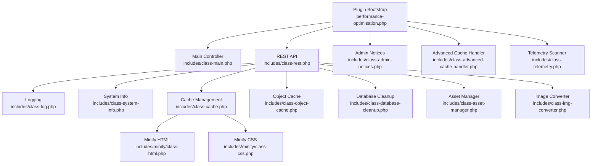

**Diagram sources**
- [performance-optimisation.php:1-68](file://performance-optimisation.php#L1-L68)
- [class-rest.php:1-843](file://includes/class-rest.php#L1-L843)
- [class-log.php:1-132](file://includes/class-log.php#L1-L132)
- [class-system-info.php:1-298](file://includes/class-system-info.php#L1-L298)
- [class-cache.php:1-755](file://includes/class-cache.php#L1-L755)
- [class-object-cache.php:1-290](file://includes/class-object-cache.php#L1-L290)
- [class-database-cleanup.php:1-652](file://includes/class-database-cleanup.php#L1-L652)
- [class-asset-manager.php:1-224](file://includes/class-asset-manager.php#L1-L224)
- [class-img-converter.php:1-762](file://includes/class-img-converter.php#L1-L762)
- [class-html.php:1-372](file://includes/minify/class-html.php#L1-L372)
- [class-css.php:1-192](file://includes/minify/class-css.php#L1-L192)
- [class-admin-notices.php:1-220](file://includes/class-admin-notices.php#L1-L220)
- [class-advanced-cache-handler.php:1-222](file://includes/class-advanced-cache-handler.php#L1-L222)
- [class-telemetry.php:1-542](file://includes/class-telemetry.php#L1-L542)

**Section sources**
- [performance-optimisation.php:1-68](file://performance-optimisation.php#L1-L68)
- [readme.txt:1-261](file://readme.txt#L1-L261)

## Core Components
- Logging: Activity logging with database-backed storage and caching for recent activity retrieval.
- System Info: Centralized collection of PHP, database, WordPress, server, and cache environment details.
- Cache: Dynamic static HTML generation, CSS combination, CDN rewriting, and cache lifecycle management.
- Object Cache: Redis drop-in management, status, ping, and telemetry collection.
- REST API: Endpoints for cache clearing, settings updates, image optimization, database cleanup, system info, and performance scans.
- Telemetry: Local HTTP-based page analysis with granular network timings and asset metrics.
- Database Cleanup: Batched, atomic cleanup of revisions, drafts, trashed posts/comments, spam, expired transients, and orphan postmeta.
- Asset Manager: Per-page control over script/style loading with protected core handles.
- Image Converter: WebP/AVIF conversion with safety limits, queue management, and browser support detection.
- Minification: HTML, inline CSS/JS minification and CSS image path updates.

**Section sources**
- [class-log.php:1-132](file://includes/class-log.php#L1-L132)
- [class-system-info.php:1-298](file://includes/class-system-info.php#L1-L298)
- [class-cache.php:1-755](file://includes/class-cache.php#L1-L755)
- [class-object-cache.php:1-290](file://includes/class-object-cache.php#L1-L290)
- [class-rest.php:1-843](file://includes/class-rest.php#L1-L843)
- [class-telemetry.php:1-542](file://includes/class-telemetry.php#L1-L542)
- [class-database-cleanup.php:1-652](file://includes/class-database-cleanup.php#L1-L652)
- [class-asset-manager.php:1-224](file://includes/class-asset-manager.php#L1-L224)
- [class-img-converter.php:1-762](file://includes/class-img-converter.php#L1-L762)
- [class-html.php:1-372](file://includes/minify/class-html.php#L1-L372)
- [class-css.php:1-192](file://includes/minify/class-css.php#L1-L192)

## Architecture Overview
The plugin integrates with WordPress hooks and REST APIs to provide diagnostics, optimization, and cache management. Admin notices surface configuration conflicts. The REST controller validates permissions and delegates to specialized managers.

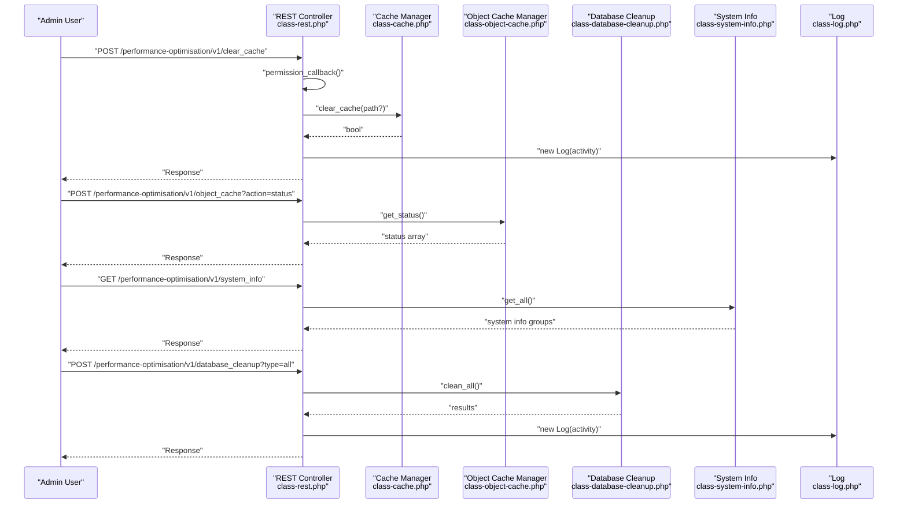

**Diagram sources**
- [class-rest.php:1-843](file://includes/class-rest.php#L1-L843)
- [class-cache.php:1-755](file://includes/class-cache.php#L1-L755)
- [class-object-cache.php:1-290](file://includes/class-object-cache.php#L1-L290)
- [class-database-cleanup.php:1-652](file://includes/class-database-cleanup.php#L1-L652)
- [class-system-info.php:1-298](file://includes/class-system-info.php#L1-L298)
- [class-log.php:1-132](file://includes/class-log.php#L1-L132)

## Detailed Component Analysis

### Logging and Activity Tracking
- Purpose: Insert activity logs and retrieve recent activity with pagination and caching.
- Key behaviors:
  - Sanitized HTML insertion into a custom table.
  - Cache invalidation on insert.
  - Paginated retrieval with transient caching keyed by page/per-page.

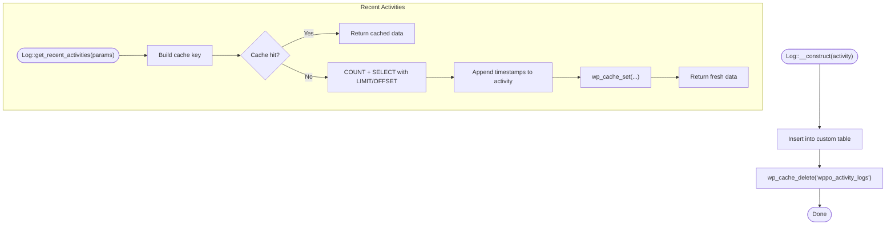

**Diagram sources**
- [class-log.php:1-132](file://includes/class-log.php#L1-L132)

**Section sources**
- [class-log.php:1-132](file://includes/class-log.php#L1-L132)

### System Information Gathering
- Purpose: Collect environment details for diagnostics and support.
- Groups: PHP, database, WordPress, key constants, server, and cache status.
- Cache detection: Scans active plugins for known cache plugin slugs.
- Memory usage: Reports peak/current memory usage.

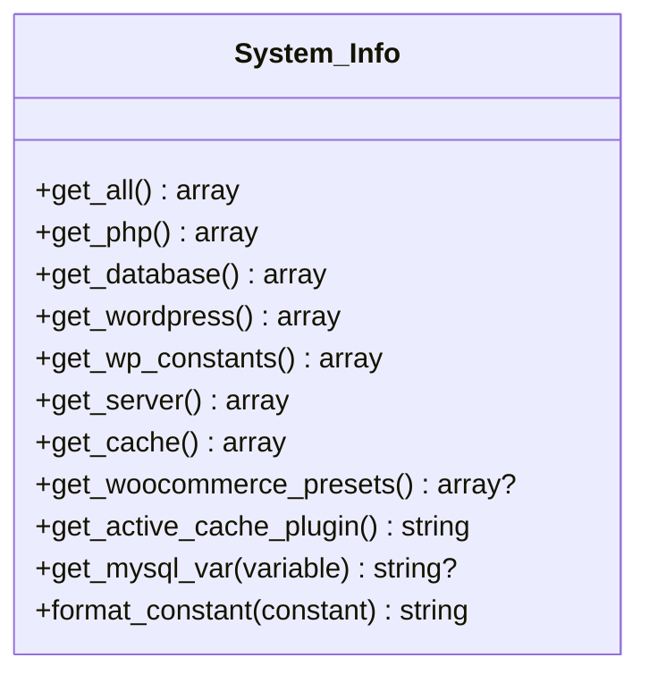

**Diagram sources**
- [class-system-info.php:1-298](file://includes/class-system-info.php#L1-L298)

**Section sources**
- [class-system-info.php:1-298](file://includes/class-system-info.php#L1-L298)

### Cache Management
- Purpose: Generate and serve dynamic static HTML, combine CSS, rewrite CDN URLs, and manage cache lifecycle.
- Key behaviors:
  - Buffer capture and minification pipeline.
  - CDN rewriting for wp-content/wp-includes resources.
  - Cache directory preparation and gzip storage.
  - Exclusion rules for preload cache and query string handling.
  - Smart purge on content edits with taxonomy/archives.

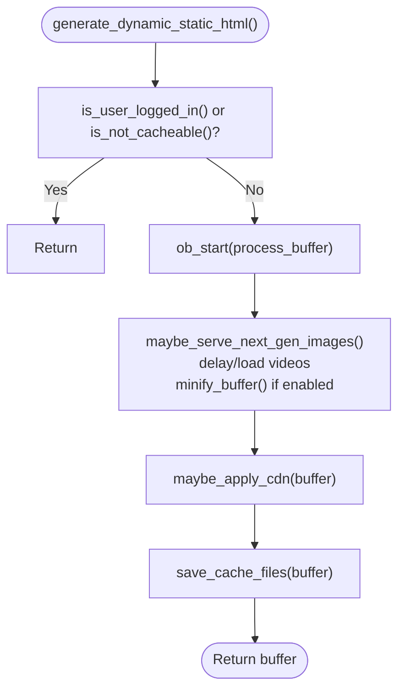

**Diagram sources**
- [class-cache.php:1-755](file://includes/class-cache.php#L1-L755)

**Section sources**
- [class-cache.php:1-755](file://includes/class-cache.php#L1-L755)

### Object Cache (Redis)
- Purpose: Manage Redis object-cache drop-in, status, ping, telemetry, and flush.
- Key behaviors:
  - Detects plugin marker vs foreign drop-in.
  - Connects via helper and collects telemetry (uptime, clients, memory, keyspace hits/misses).
  - Supports cluster/Sentinel/TLS modes via configuration.

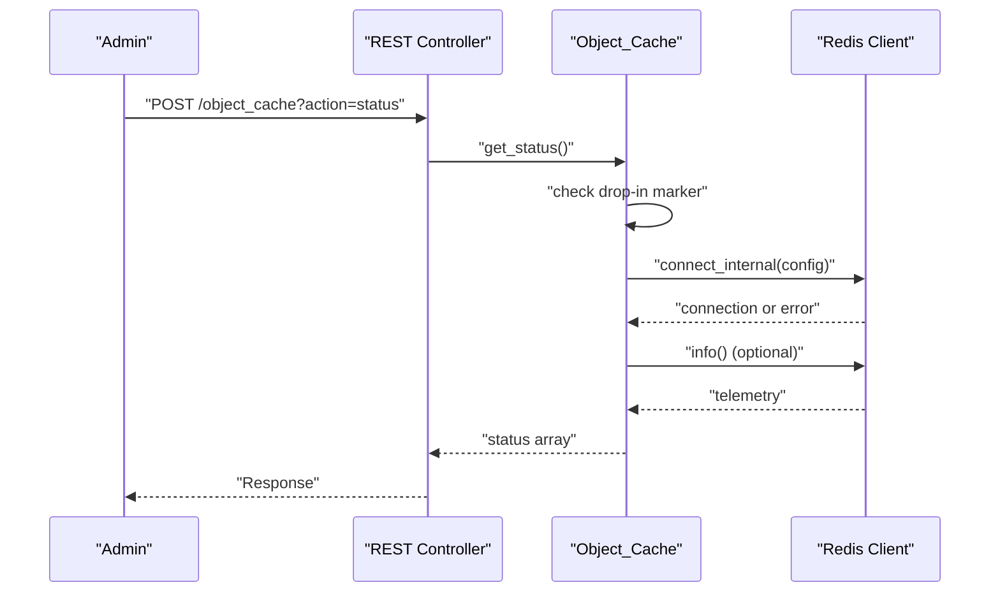

**Diagram sources**
- [class-rest.php:1-843](file://includes/class-rest.php#L1-L843)
- [class-object-cache.php:1-290](file://includes/class-object-cache.php#L1-L290)

**Section sources**
- [class-object-cache.php:1-290](file://includes/class-object-cache.php#L1-L290)
- [class-rest.php:1-843](file://includes/class-rest.php#L1-L843)

### REST API and Diagnostics
- Purpose: Provide programmatic access to cache, settings, image optimization, database cleanup, system info, and performance scans.
- Key endpoints:
  - Cache: clear_cache, update_settings.
  - Images: optimise_image, delete_optimised_image, image_job_status.
  - Database: database_cleanup, database_cleanup_counts.
  - System: system_info, performance_scan.
  - Object Cache: status, ping, enable, disable, flush.

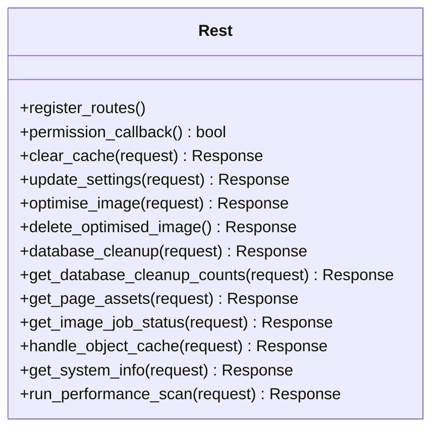

**Diagram sources**
- [class-rest.php:1-843](file://includes/class-rest.php#L1-L843)

**Section sources**
- [class-rest.php:1-843](file://includes/class-rest.php#L1-L843)

### Telemetry Scanner
- Purpose: Local HTTP-based page analysis with granular network timings and asset metrics.
- Key behaviors:
  - cURL for DNS/connect/SSL/TTFB; fallback to wp_remote_get().
  - Parses CSS/JS/images; calculates sizes via filesystem.
  - Compression and cache-control checks; robots.txt probe.
  - Transient caching with master index for safe deletion.

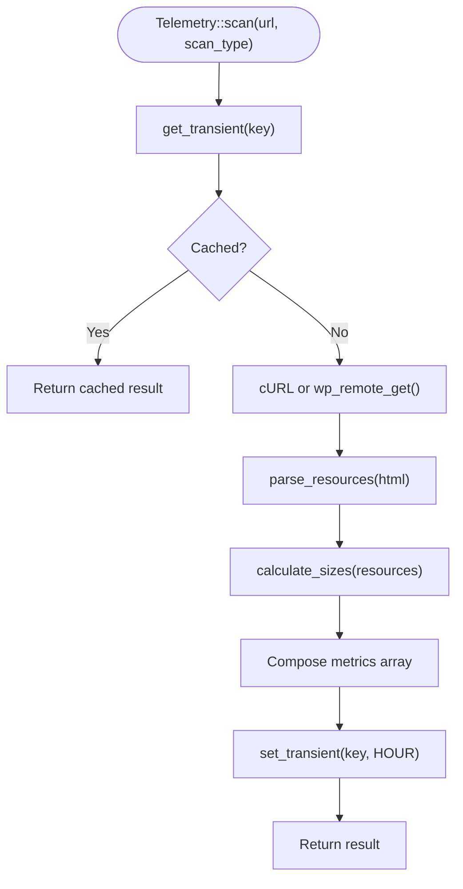

**Diagram sources**
- [class-telemetry.php:1-542](file://includes/class-telemetry.php#L1-L542)

**Section sources**
- [class-telemetry.php:1-542](file://includes/class-telemetry.php#L1-L542)

### Database Cleanup
- Purpose: Batched, atomic cleanup of database bloat.
- Key behaviors:
  - Methods for revisions, auto-drafts, trashed posts/comments, spam, expired transients, orphan postmeta.
  - Advanced revision cleanup with age and retention limits.
  - Counts and error handling via WP_Error.

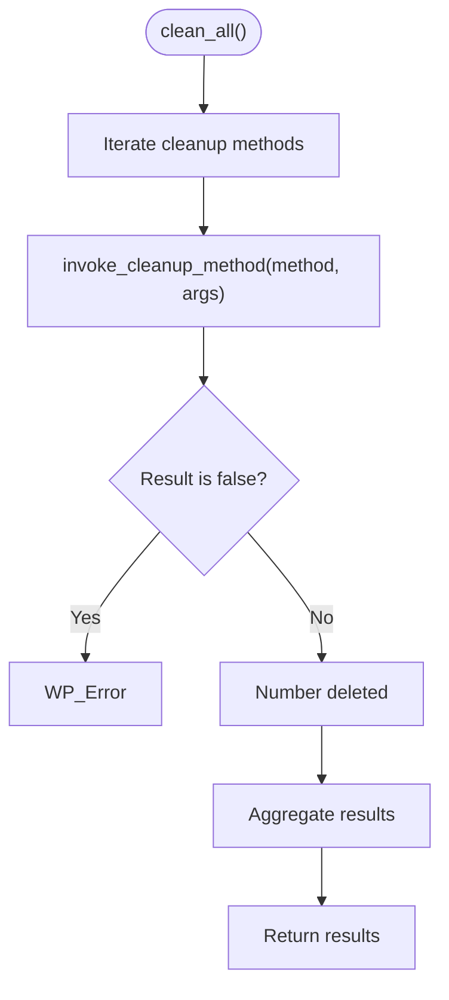

**Diagram sources**
- [class-database-cleanup.php:1-652](file://includes/class-database-cleanup.php#L1-L652)

**Section sources**
- [class-database-cleanup.php:1-652](file://includes/class-database-cleanup.php#L1-L652)

### Asset Manager
- Purpose: Capture and selectively dequeue assets per post/page.
- Key behaviors:
  - Late enqueue priority to dequeue disabled assets.
  - Captures enqueued scripts/styles transiently for admin UI.
  - Protects core handles from deregistration.

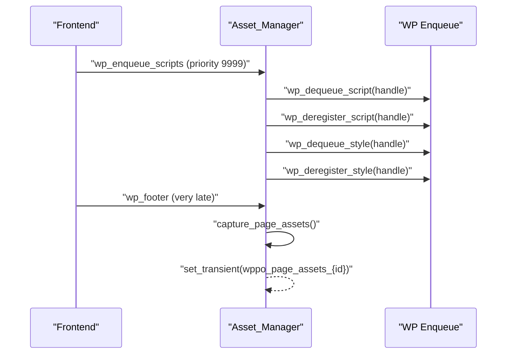

**Diagram sources**
- [class-asset-manager.php:1-224](file://includes/class-asset-manager.php#L1-L224)

**Section sources**
- [class-asset-manager.php:1-224](file://includes/class-asset-manager.php#L1-L224)

### Image Converter
- Purpose: Convert images to WebP/AVIF with safety limits and queue management.
- Key behaviors:
  - Validates file size and dimensions.
  - Supports GD and Imagick; handles transparency and animated WebP.
  - Queues conversions and maintains atomic status tracking.

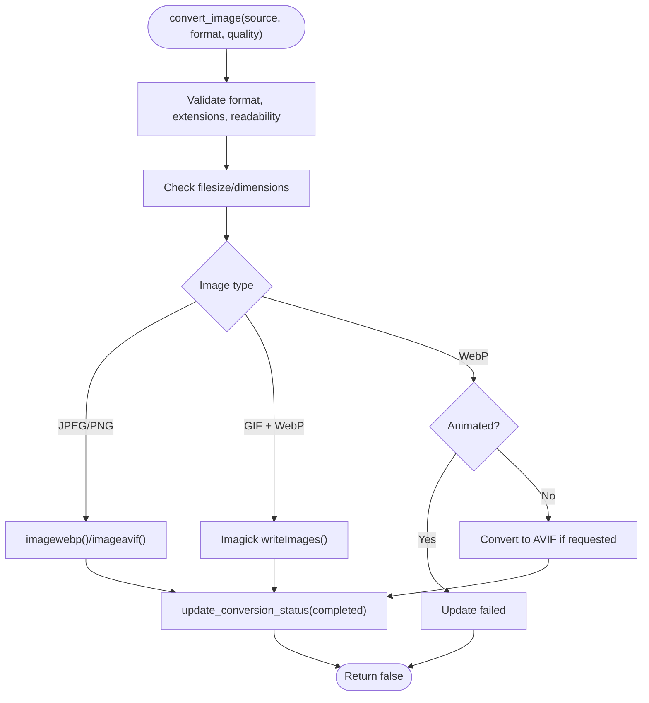

**Diagram sources**
- [class-img-converter.php:1-762](file://includes/class-img-converter.php#L1-L762)

**Section sources**
- [class-img-converter.php:1-762](file://includes/class-img-converter.php#L1-L762)

### Minification Utilities
- HTML Minification: Dom-based minification with preservation of scripts/templates and canonical link handling.
- CSS Minification: Font-display injection, image path updates, and gzip caching.

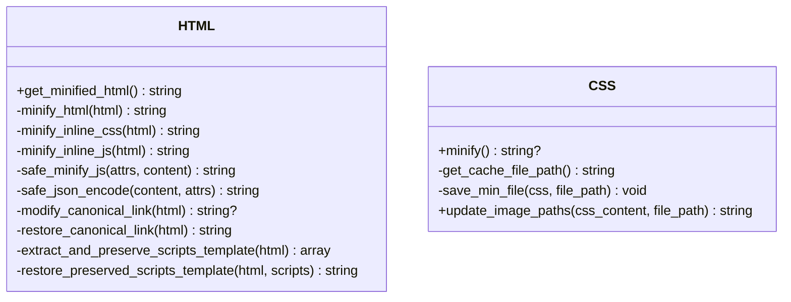

**Diagram sources**
- [class-html.php:1-372](file://includes/minify/class-html.php#L1-L372)
- [class-css.php:1-192](file://includes/minify/class-css.php#L1-L192)

**Section sources**
- [class-html.php:1-372](file://includes/minify/class-html.php#L1-L372)
- [class-css.php:1-192](file://includes/minify/class-css.php#L1-L192)

### Admin Notices and Configuration Conflicts
- Purpose: Surface activation issues, foreign drop-in conflicts, and competing cache plugins.
- Key behaviors:
  - Dismissible notices via nonce.
  - Detects foreign advanced-cache.php and wp-config write issues.
  - Warns about active competing cache plugins.

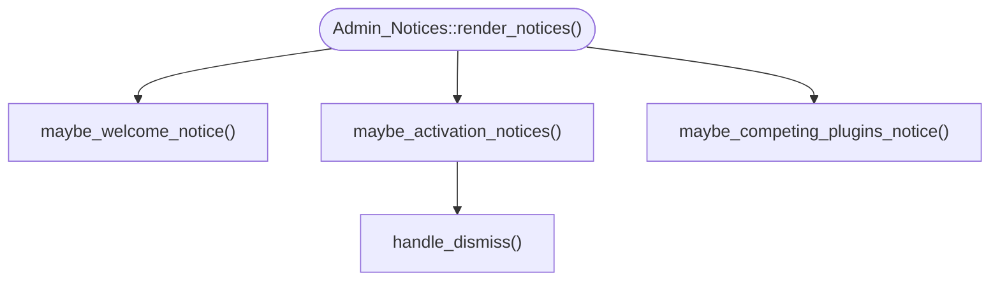

**Diagram sources**
- [class-admin-notices.php:1-220](file://includes/class-admin-notices.php#L1-L220)

**Section sources**
- [class-admin-notices.php:1-220](file://includes/class-admin-notices.php#L1-L220)

### Advanced Cache Handler
- Purpose: Create/remove advanced-cache.php drop-in with plugin marker and security checks.
- Key behaviors:
  - Detects foreign drop-in to prevent overwrites.
  - Writes drop-in with gzip serving logic and 304 handling.

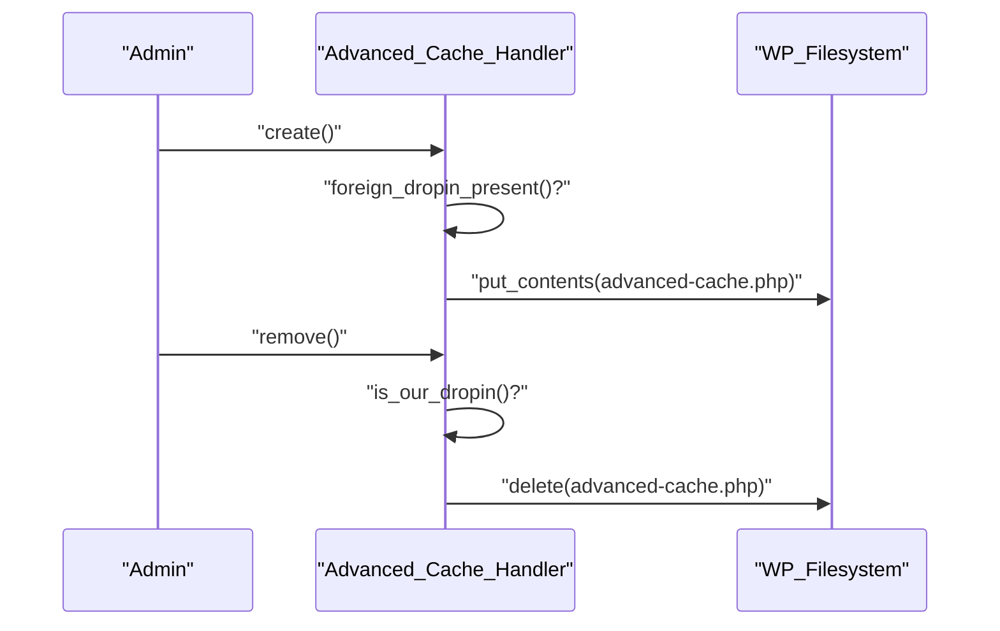

**Diagram sources**
- [class-advanced-cache-handler.php:1-222](file://includes/class-advanced-cache-handler.php#L1-L222)

**Section sources**
- [class-advanced-cache-handler.php:1-222](file://includes/class-advanced-cache-handler.php#L1-L222)

## Dependency Analysis
- Coupling:
  - REST controller depends on cache, object cache, database cleanup, asset manager, image converter, and telemetry.
  - Cache depends on filesystem utilities and image optimization helpers.
  - Object cache depends on Redis connect helper and filesystem.
  - Admin notices depend on advanced cache handler for drop-in detection.
- Cohesion:
  - Each class encapsulates a single responsibility (logging, caching, telemetry, etc.).
- External dependencies:
  - Composer libraries for HTML/CSS/JS minification.
  - WordPress hooks and REST API infrastructure.
  - Redis client and filesystem APIs.

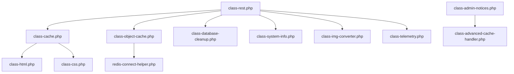

**Diagram sources**
- [class-rest.php:1-843](file://includes/class-rest.php#L1-L843)
- [class-cache.php:1-755](file://includes/class-cache.php#L1-L755)
- [class-object-cache.php:1-290](file://includes/class-object-cache.php#L1-L290)
- [class-database-cleanup.php:1-652](file://includes/class-database-cleanup.php#L1-L652)
- [class-system-info.php:1-298](file://includes/class-system-info.php#L1-L298)
- [class-img-converter.php:1-762](file://includes/class-img-converter.php#L1-L762)
- [class-telemetry.php:1-542](file://includes/class-telemetry.php#L1-L542)
- [class-html.php:1-372](file://includes/minify/class-html.php#L1-L372)
- [class-css.php:1-192](file://includes/minify/class-css.php#L1-L192)
- [class-admin-notices.php:1-220](file://includes/class-admin-notices.php#L1-L220)
- [class-advanced-cache-handler.php:1-222](file://includes/class-advanced-cache-handler.php#L1-L222)

**Section sources**
- [class-rest.php:1-843](file://includes/class-rest.php#L1-L843)
- [class-cache.php:1-755](file://includes/class-cache.php#L1-L755)
- [class-object-cache.php:1-290](file://includes/class-object-cache.php#L1-L290)
- [class-database-cleanup.php:1-652](file://includes/class-database-cleanup.php#L1-L652)
- [class-system-info.php:1-298](file://includes/class-system-info.php#L1-L298)
- [class-img-converter.php:1-762](file://includes/class-img-converter.php#L1-L762)
- [class-telemetry.php:1-542](file://includes/class-telemetry.php#L1-L542)
- [class-html.php:1-372](file://includes/minify/class-html.php#L1-L372)
- [class-css.php:1-192](file://includes/minify/class-css.php#L1-L192)
- [class-admin-notices.php:1-220](file://includes/class-admin-notices.php#L1-L220)
- [class-advanced-cache-handler.php:1-222](file://includes/class-advanced-cache-handler.php#L1-L222)

## Performance Considerations
- Logging and caching:
  - Use transient caching for recent activities and telemetry to reduce DB load.
  - Cache keys are scoped by page/per-page and hashed URL for telemetry.
- Minification:
  - Inline CSS/JS minification adds CPU overhead; enable only when beneficial.
  - Font-display injection improves render performance for webfonts.
- Image optimization:
  - Conversions are CPU-intensive; use background processing via Action Scheduler when available.
  - Safety limits prevent oversized or high-resolution images from causing memory issues.
- Database cleanup:
  - Batched operations minimize lock times; advanced revision cleanup reduces future overhead.
- CDN rewriting:
  - Reduces origin bandwidth; ensure correct attribute rewriting to avoid broken assets.

[No sources needed since this section provides general guidance]

## Troubleshooting Guide

### Diagnostic Procedures
- Gather system information:
  - Use the REST endpoint to retrieve system info for PHP, DB, WordPress, server, and cache status.
  - Example endpoint: GET /performance-optimisation/v1/system_info
- Run a performance scan:
  - Use the REST endpoint to scan a URL and receive metrics including load time, TTFB, DNS/connect/SSL timings, resource counts, and compression status.
  - Example endpoint: POST /performance-optimisation/v1/performance_scan with JSON body containing the URL.
- Review recent activities:
  - Use GET /performance-optimisation/v1/recent_activities with pagination parameters to inspect recent plugin actions.

**Section sources**
- [class-rest.php:1-843](file://includes/class-rest.php#L1-L843)
- [class-telemetry.php:1-542](file://includes/class-telemetry.php#L1-L542)
- [class-log.php:1-132](file://includes/class-log.php#L1-L132)

### Log Analysis Techniques
- Activity logs:
  - Logs are inserted with sanitized HTML and cache is invalidated on insert.
  - Retrieve recent activities with pagination and cache to avoid repeated DB queries.
- Error correlation:
  - After performing operations (e.g., cache clear, database cleanup), check recent activities for timestamps and messages.

**Section sources**
- [class-log.php:1-132](file://includes/class-log.php#L1-L132)
- [class-rest.php:1-843](file://includes/class-rest.php#L1-L843)

### Performance Monitoring Tools
- Built-in telemetry:
  - Use the performance scan endpoint to measure load time, TTFB, DNS/connect/SSL timings, and compression status.
- System info:
  - Verify PHP memory limits, max execution time, and WordPress constants (WP_DEBUG, WP_CACHE, SCRIPT_DEBUG).
- Cache size:
  - Use cache size retrieval to monitor growth and decide purge triggers.

**Section sources**
- [class-telemetry.php:1-542](file://includes/class-telemetry.php#L1-L542)
- [class-system-info.php:1-298](file://includes/class-system-info.php#L1-L298)
- [class-cache.php:1-755](file://includes/class-cache.php#L1-L755)

### Common Configuration Problems
- Foreign advanced-cache.php:
  - Symptom: Plugin does not create or modifies advanced-cache.php.
  - Resolution: Remove or disable the foreign drop-in; the plugin will not overwrite it.
- WP_CACHE constant:
  - Symptom: Full-page cache not taking effect.
  - Resolution: Ensure WP_CACHE is true in wp-config.php; the plugin will not modify it automatically.
- wp-config write issues:
  - Symptom: Activation notices about wp-config permissions.
  - Resolution: Fix filesystem permissions or add WP_CACHE manually.

**Section sources**
- [class-admin-notices.php:1-220](file://includes/class-admin-notices.php#L1-L220)
- [class-advanced-cache-handler.php:1-222](file://includes/class-advanced-cache-handler.php#L1-L222)
- [readme.txt:210-232](file://readme.txt#L210-L232)

### Caching Conflicts
- Multiple full-page cache solutions:
  - Symptom: Inconsistent cache behavior or conflicts.
  - Resolution: Use only one full-page cache solution; the plugin warns when competing plugins are active.
- CDN rewriting issues:
  - Symptom: Assets not served from CDN.
  - Resolution: Verify CDN URL setting and ensure wp-content/wp-includes paths are rewritten.

**Section sources**
- [class-admin-notices.php:1-220](file://includes/class-admin-notices.php#L1-L220)
- [class-cache.php:1-755](file://includes/class-cache.php#L1-L755)

### Optimization Side Effects
- Minification and defer/delay JS:
  - Symptom: Broken functionality or layout shifts.
  - Resolution: Disable minification or adjust defer/delay exclusions; test incrementally.
- Image conversion:
  - Symptom: Missing WebP/AVIF variants or conversion errors.
  - Resolution: Check file size/dimension limits and browser support; verify Imagick/GD availability.
- Asset removal:
  - Symptom: Missing styles/scripts on specific pages.
  - Resolution: Use Asset Manager to selectively disable problematic handles.

**Section sources**
- [class-html.php:1-372](file://includes/minify/class-html.php#L1-L372)
- [class-img-converter.php:1-762](file://includes/class-img-converter.php#L1-L762)
- [class-asset-manager.php:1-224](file://includes/class-asset-manager.php#L1-L224)

### Step-by-Step Resolution Guides

#### Clear Cache for a Specific Page
- Steps:
  1. Authenticate and obtain a valid nonce for the REST API.
  2. Send a POST request to /performance-optimisation/v1/clear_cache with action=clear_single_page_cache and path=/your/page/.
  3. Verify cache files are deleted and transient cache size counters are reset.
- Expected outcome: Target page cache and CSS cache are removed; activity logged.

**Section sources**
- [class-rest.php:1-843](file://includes/class-rest.php#L1-L843)
- [class-cache.php:1-755](file://includes/class-cache.php#L1-L755)
- [class-log.php:1-132](file://includes/class-log.php#L1-L132)

#### Enable Object Cache (Redis)
- Steps:
  1. Ensure PhpRedis extension is installed.
  2. Send a POST request to /performance-optimisation/v1/object_cache with action=enable and configuration parameters.
  3. Verify status via action=status and optionally ping the server.
- Expected outcome: Redis drop-in installed, configuration written, and cache flushed.

**Section sources**
- [class-rest.php:1-843](file://includes/class-rest.php#L1-L843)
- [class-object-cache.php:1-290](file://includes/class-object-cache.php#L1-L290)

#### Run Database Cleanup
- Steps:
  1. Choose cleanup type (revisions, auto_drafts, trashed_posts, spam_comments, trashed_comments, expired_transients, orphan_postmeta, all).
  2. Send a POST request to /performance-optimisation/v1/database_cleanup with type=<type>.
  3. For “all”, review aggregated results and failures.
- Expected outcome: Rows deleted; activity logged.

**Section sources**
- [class-rest.php:1-843](file://includes/class-rest.php#L1-L843)
- [class-database-cleanup.php:1-652](file://includes/class-database-cleanup.php#L1-L652)
- [class-log.php:1-132](file://includes/class-log.php#L1-L132)

#### Optimize Images (Background)
- Steps:
  1. If Action Scheduler is available, send a POST request to /performance-optimisation/v1/optimise_image with webp and/or avif arrays.
  2. Check job status via GET /performance-optimisation/v1/image_job_status.
- Expected outcome: Jobs queued; conversions tracked in image info.

**Section sources**
- [class-rest.php:1-843](file://includes/class-rest.php#L1-L843)
- [class-img-converter.php:1-762](file://includes/class-img-converter.php#L1-L762)

#### Establish Performance Baseline
- Steps:
  1. Run a performance scan for key pages (homepage, product pages, checkout).
  2. Record load time, TTFB, DNS/connect/SSL timings, resource counts, and compression status.
  3. Compare results after applying optimizations (minification, CDN, cache).
- Expected outcome: Quantifiable before/after metrics for ROI assessment.

**Section sources**
- [class-telemetry.php:1-542](file://includes/class-telemetry.php#L1-L542)

### Escalation Procedures for Complex Problems
- Collect comprehensive system info:
  - Use GET /performance-optimisation/v1/system_info and include the response in support tickets.
- Export settings:
  - Use the Tools section to export settings for reproducibility.
- Provide logs:
  - Share recent activities and any error messages from the admin notices.
- Engage support:
  - Include WordPress version, PHP version, server environment, and plugin version.

**Section sources**
- [class-rest.php:1-843](file://includes/class-rest.php#L1-L843)
- [class-system-info.php:1-298](file://includes/class-system-info.php#L1-L298)
- [class-admin-notices.php:1-220](file://includes/class-admin-notices.php#L1-L220)
- [readme.txt:210-232](file://readme.txt#L210-L232)

## Conclusion
This guide consolidates practical troubleshooting workflows for the Performance Optimisation plugin. By leveraging built-in diagnostics, logs, and REST endpoints, you can quickly isolate configuration conflicts, resolve caching issues, and monitor performance impacts. Adopt incremental testing and baseline measurements to ensure reliable optimizations.

[No sources needed since this section summarizes without analyzing specific files]

## Appendices

### Example: System Information Gathering
- Endpoint: GET /performance-optimisation/v1/system_info
- Fields include PHP version, memory limits, WordPress version, environment type, permalink structure, server software, OS, architecture, object cache status, active cache plugin, and memory usage.

**Section sources**
- [class-rest.php:1-843](file://includes/class-rest.php#L1-L843)
- [class-system-info.php:1-298](file://includes/class-system-info.php#L1-L298)

### Example: Performance Scan
- Endpoint: POST /performance-optimisation/v1/performance_scan
- Body: {"url": "https://example.com/page"}
- Response: load_time, ttfb, dns_lookup_time, connect_time, ssl_time, css/js/media counts and sizes, compression, cache-control, robots.txt existence.

**Section sources**
- [class-rest.php:1-843](file://includes/class-rest.php#L1-L843)
- [class-telemetry.php:1-542](file://includes/class-telemetry.php#L1-L542)