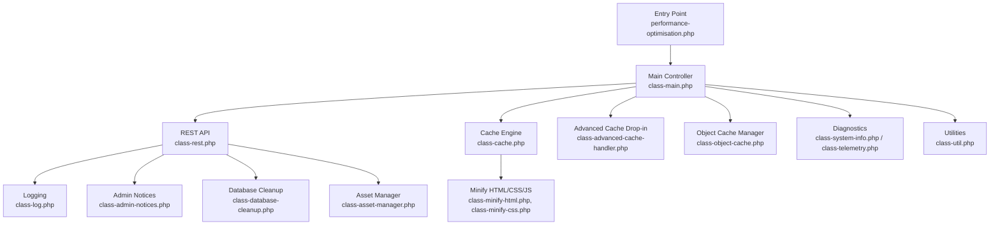
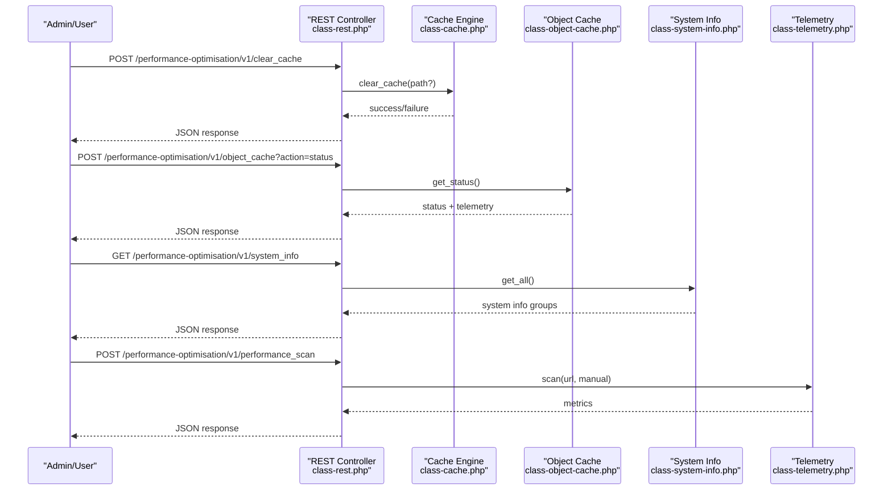
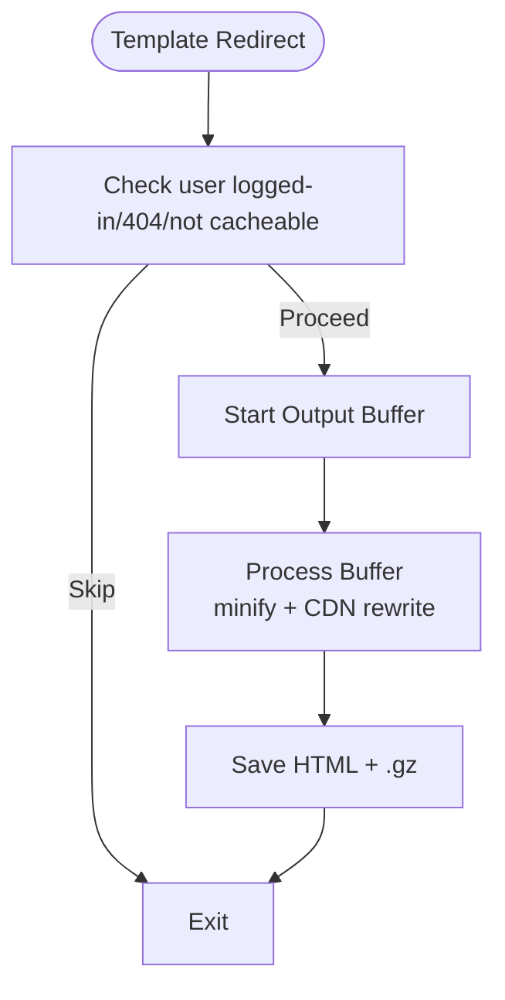
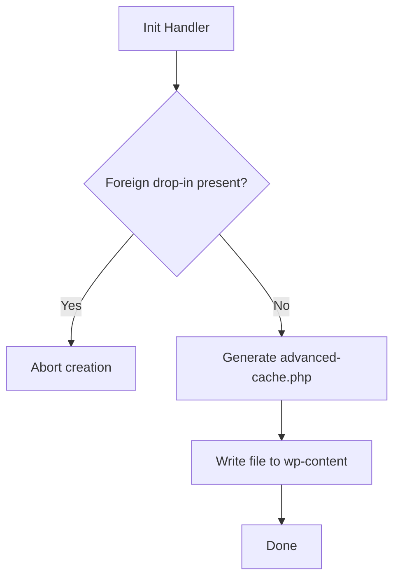
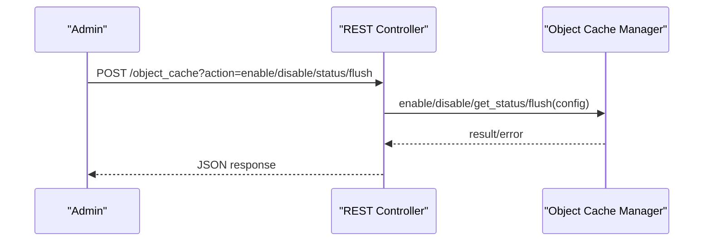
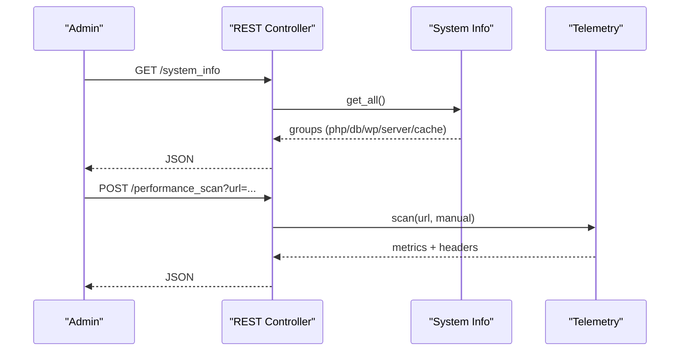
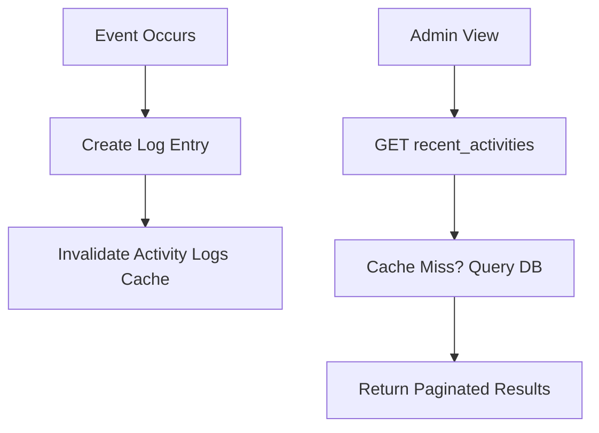
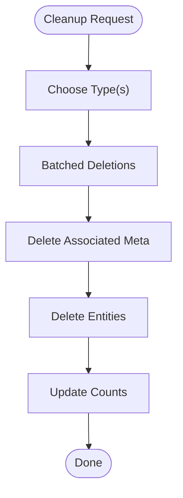
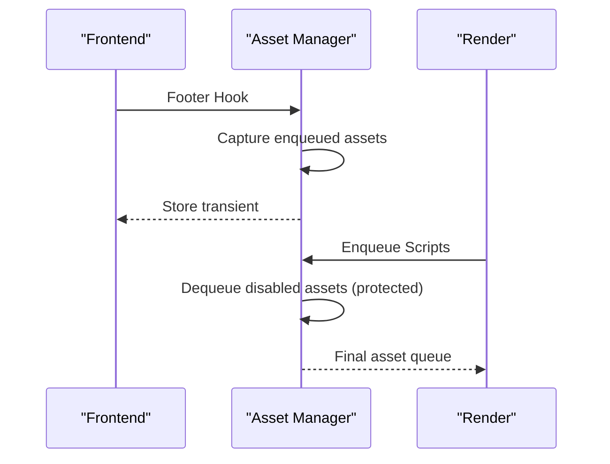
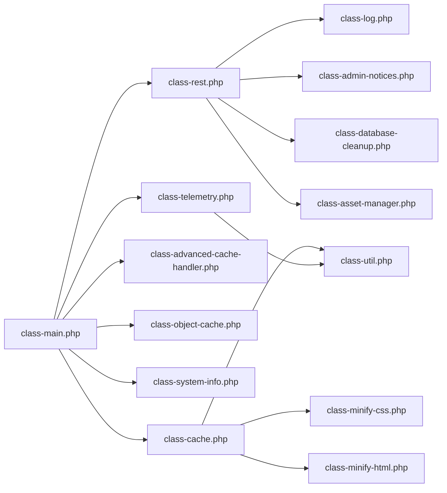

# Troubleshooting & Support

<cite>
**Referenced Files in This Document**
- [performance-optimisation.php](file://performance-optimisation.php)
- [class-main.php](file://includes/class-main.php)
- [class-rest.php](file://includes/class-rest.php)
- [class-cache.php](file://includes/class-cache.php)
- [class-advanced-cache-handler.php](file://includes/class-advanced-cache-handler.php)
- [class-object-cache.php](file://includes/class-object-cache.php)
- [class-system-info.php](file://includes/class-system-info.php)
- [class-telemetry.php](file://includes/class-telemetry.php)
- [class-log.php](file://includes/class-log.php)
- [class-admin-notices.php](file://includes/class-admin-notices.php)
- [class-database-cleanup.php](file://includes/class-database-cleanup.php)
- [class-asset-manager.php](file://includes/class-asset-manager.php)
- [class-util.php](file://includes/class-util.php)
- [class-minify-css.php](file://includes/minify/class-css.php)
- [class-minify-html.php](file://includes/minify/class-html.php)
</cite>

## Table of Contents
1. [Introduction](#introduction)
2. [Project Structure](#project-structure)
3. [Core Components](#core-components)
4. [Architecture Overview](#architecture-overview)
5. [Detailed Component Analysis](#detailed-component-analysis)
6. [Dependency Analysis](#dependency-analysis)
7. [Performance Considerations](#performance-considerations)
8. [Troubleshooting Guide](#troubleshooting-guide)
9. [Conclusion](#conclusion)
10. [Appendices](#appendices)

## Introduction
This document provides comprehensive troubleshooting guidance for the Performance Optimisation plugin. It covers diagnostic procedures, log analysis, performance monitoring, common configuration pitfalls, caching conflicts, and optimization side effects. It includes step-by-step resolution guides, escalation procedures, and examples for system information gathering and establishing performance baselines.

## Project Structure
The plugin follows a modular, layered architecture:
- Entry point initializes the plugin and registers hooks.
- REST API exposes administrative endpoints for cache management, settings updates, diagnostics, and background tasks.
- Core runtime integrates with WordPress hooks to generate dynamic static HTML, combine/minify assets, and manage CDN rewriting.
- Utilities encapsulate filesystem operations, URL normalization, and preload generation.
- Diagnostics include system information, telemetry scans, and admin notices for conflicts.

**Diagram sources**
- [performance-optimisation.php:44](file://performance-optimisation.php#L44)
- [class-main.php:128-157](file://includes/class-main.php#L128-L157)
- [class-rest.php:37-43](file://includes/class-rest.php#L37-L43)
- [class-cache.php:94-120](file://includes/class-cache.php#L94-L120)
- [class-advanced-cache-handler.php:25-73](file://includes/class-advanced-cache-handler.php#L25-L73)
- [class-object-cache.php:22-62](file://includes/class-object-cache.php#L22-L62)
- [class-system-info.php:29-72](file://includes/class-system-info.php#L29-L72)
- [class-telemetry.php:31-46](file://includes/class-telemetry.php#L31-L46)
- [class-util.php:29-80](file://includes/class-util.php#L29-L80)
- [class-log.php:22-62](file://includes/class-log.php#L22-L62)
- [class-admin-notices.php:20-46](file://includes/class-admin-notices.php#L20-L46)
- [class-database-cleanup.php:30-82](file://includes/class-database-cleanup.php#L30-L82)
- [class-asset-manager.php:27-82](file://includes/class-asset-manager.php#L27-L82)
- [class-minify-html.php:32-68](file://includes/minify/class-html.php#L32-L68)
- [class-minify-css.php:23-55](file://includes/minify/class-css.php#L23-L55)

**Section sources**
- [performance-optimisation.php:44-71](file://performance-optimisation.php#L44-L71)
- [class-main.php:128-157](file://includes/class-main.php#L128-L157)

## Core Components
- REST API: Exposes endpoints for cache clearing, settings updates, image optimization, database cleanup, system info, and performance scans.
- Cache Engine: Generates dynamic static HTML, combines CSS, minifies HTML/JS/CSS, applies CDN rewriting, and invalidates cache on content changes.
- Advanced Cache Drop-in: Creates/installs an advanced-cache.php handler to serve cached HTML with gzip support.
- Object Cache Manager: Installs/removes Redis object-cache drop-in, pings Redis, and flushes object cache.
- Diagnostics: System info collector and telemetry scanner for performance metrics and environment checks.
- Logging and Admin Notices: Records operational events and surfaces warnings for conflicting caching solutions and activation issues.
- Utilities: Filesystem preparation, URL normalization, preload link generation, and minified asset counting.
- Asset Manager: Captures and selectively dequeues assets per post/page.
- Database Cleanup: Batched cleanup of revisions, drafts, trashed posts/comments, spam, expired transients, and orphaned postmeta.

**Section sources**
- [class-rest.php:53-123](file://includes/class-rest.php#L53-L123)
- [class-cache.php:32-120](file://includes/class-cache.php#L32-L120)
- [class-advanced-cache-handler.php:25-94](file://includes/class-advanced-cache-handler.php#L25-L94)
- [class-object-cache.php:22-144](file://includes/class-object-cache.php#L22-L144)
- [class-system-info.php:63-72](file://includes/class-system-info.php#L63-L72)
- [class-telemetry.php:46-70](file://includes/class-telemetry.php#L46-L70)
- [class-log.php:22-62](file://includes/class-log.php#L22-L62)
- [class-admin-notices.php:20-46](file://includes/class-admin-notices.php#L20-L46)
- [class-util.php:29-80](file://includes/class-util.php#L29-L80)
- [class-asset-manager.php:27-82](file://includes/class-asset-manager.php#L27-L82)
- [class-database-cleanup.php:30-82](file://includes/class-database-cleanup.php#L30-L82)

## Architecture Overview
The plugin integrates with WordPress hooks and REST API to deliver performance enhancements and diagnostics. Key flows:
- Runtime hooks trigger cache generation and asset optimization during template_redirect and enqueue cycles.
- REST endpoints validate permissions and delegate to internal managers for cache, object cache, telemetry, and cleanup operations.
- Logging and admin notices provide feedback and warnings for configuration and conflicts.

**Diagram sources**
- [class-rest.php:145-175](file://includes/class-rest.php#L145-L175)
- [class-rest.php:636-695](file://includes/class-rest.php#L636-L695)
- [class-rest.php:790-793](file://includes/class-rest.php#L790-L793)
- [class-rest.php:796-800](file://includes/class-rest.php#L796-L800)
- [class-cache.php:647-677](file://includes/class-cache.php#L647-L677)
- [class-object-cache.php:78-144](file://includes/class-object-cache.php#L78-L144)
- [class-system-info.php:63-72](file://includes/class-system-info.php#L63-L72)
- [class-telemetry.php:46-70](file://includes/class-telemetry.php#L46-L70)

## Detailed Component Analysis

### Cache Engine
Responsibilities:
- Dynamic static HTML generation via output buffering.
- CSS combination and minification with image path updates.
- HTML minification and CDN rewriting for wp-content/wp-includes resources.
- Cache invalidation on post saves and smart purging for archives.
- Cache size reporting and filesystem operations.

Key behaviors:
- Skips caching for logged-in users, 404s, and non-cacheable paths.
- Applies CDN rewrite only when configured and supported.
- Supports gzip-compressed cache files.

**Diagram sources**
- [class-cache.php:260-310](file://includes/class-cache.php#L260-L310)
- [class-cache.php:391-396](file://includes/class-cache.php#L391-L396)
- [class-cache.php:325-381](file://includes/class-cache.php#L325-L381)

**Section sources**
- [class-cache.php:127-223](file://includes/class-cache.php#L127-L223)
- [class-cache.php:260-310](file://includes/class-cache.php#L260-L310)
- [class-cache.php:325-381](file://includes/class-cache.php#L325-L381)
- [class-cache.php:470-483](file://includes/class-cache.php#L470-L483)
- [class-cache.php:546-598](file://includes/class-cache.php#L546-L598)
- [class-cache.php:711-726](file://includes/class-cache.php#L711-L726)

### Advanced Cache Drop-in
Responsibilities:
- Detects existing drop-in ownership to avoid conflicts.
- Creates advanced-cache.php to serve cached HTML with gzip and ETag support.
- Removes the drop-in when necessary.

**Diagram sources**
- [class-advanced-cache-handler.php:76-94](file://includes/class-advanced-cache-handler.php#L76-L94)
- [class-advanced-cache-handler.php:104-191](file://includes/class-advanced-cache-handler.php#L104-L191)

**Section sources**
- [class-advanced-cache-handler.php:48-73](file://includes/class-advanced-cache-handler.php#L48-L73)
- [class-advanced-cache-handler.php:104-191](file://includes/class-advanced-cache-handler.php#L104-L191)

### Object Cache Manager
Responsibilities:
- Installs/removes Redis object-cache drop-in with generated config.
- Tests connectivity via ping and collects telemetry.
- Flushes object cache when requested.

**Diagram sources**
- [class-rest.php:636-695](file://includes/class-rest.php#L636-L695)
- [class-object-cache.php:78-144](file://includes/class-object-cache.php#L78-L144)
- [class-object-cache.php:208-247](file://includes/class-object-cache.php#L208-L247)

**Section sources**
- [class-object-cache.php:78-144](file://includes/class-object-cache.php#L78-L144)
- [class-object-cache.php:208-247](file://includes/class-object-cache.php#L208-L247)

### Diagnostics: System Information and Telemetry
- System Info: Gathers PHP, DB, WordPress, server, and cache environment details, including active cache plugin detection.
- Telemetry: Performs local HTTP-based page analysis with cURL or wp_remote_get, parses HTML, calculates sizes, and returns metrics like load time, TTFB, DNS/connect/SSL timings, resource counts, and compression status.

**Diagram sources**
- [class-rest.php:790-793](file://includes/class-rest.php#L790-L793)
- [class-system-info.php:63-72](file://includes/class-system-info.php#L63-L72)
- [class-telemetry.php:46-70](file://includes/class-telemetry.php#L46-L70)

**Section sources**
- [class-system-info.php:63-72](file://includes/class-system-info.php#L63-L72)
- [class-telemetry.php:46-70](file://includes/class-telemetry.php#L46-L70)
- [class-telemetry.php:249-381](file://includes/class-telemetry.php#L249-L381)
- [class-telemetry.php:398-449](file://includes/class-telemetry.php#L398-L449)

### Logging and Admin Notices
- Logging: Inserts activity logs into a custom table and retrieves recent activities with pagination and caching.
- Admin Notices: Surfaces activation issues (foreign drop-in, WP_CACHE flag), configuration warnings, and competing cache plugins.

**Diagram sources**
- [class-log.php:32-62](file://includes/class-log.php#L32-L62)
- [class-log.php:73-130](file://includes/class-log.php#L73-L130)
- [class-admin-notices.php:85-93](file://includes/class-admin-notices.php#L85-L93)
- [class-admin-notices.php:175-201](file://includes/class-admin-notices.php#L175-L201)

**Section sources**
- [class-log.php:32-62](file://includes/class-log.php#L32-L62)
- [class-log.php:73-130](file://includes/class-log.php#L73-L130)
- [class-admin-notices.php:133-168](file://includes/class-admin-notices.php#L133-L168)
- [class-admin-notices.php:175-201](file://includes/class-admin-notices.php#L175-L201)

### Database Cleanup
- Provides batched cleanup for revisions, auto-drafts, trashed posts/comments, spam comments, expired transients, and orphaned postmeta.
- Supports advanced revision cleanup with configurable retention and age thresholds.

**Diagram sources**
- [class-database-cleanup.php:529-546](file://includes/class-database-cleanup.php#L529-L546)
- [class-database-cleanup.php:38-82](file://includes/class-database-cleanup.php#L38-L82)
- [class-database-cleanup.php:408-466](file://includes/class-database-cleanup.php#L408-L466)

**Section sources**
- [class-database-cleanup.php:529-546](file://includes/class-database-cleanup.php#L529-L546)
- [class-database-cleanup.php:38-82](file://includes/class-database-cleanup.php#L38-L82)
- [class-database-cleanup.php:408-466](file://includes/class-database-cleanup.php#L408-L466)

### Asset Manager
- Captures enqueued scripts/styles on frontend and stores them as transients keyed by post ID.
- Dequeues/disables assets on frontend based on per-post meta, with protected handles for core assets.

**Diagram sources**
- [class-asset-manager.php:131-191](file://includes/class-asset-manager.php#L131-L191)
- [class-asset-manager.php:91-121](file://includes/class-asset-manager.php#L91-L121)

**Section sources**
- [class-asset-manager.php:131-191](file://includes/class-asset-manager.php#L131-L191)
- [class-asset-manager.php:91-121](file://includes/class-asset-manager.php#L91-L121)

## Dependency Analysis
- Main controller orchestrates hooks and loads classes, including REST, cache, diagnostics, and utilities.
- REST controller depends on cache, object cache, telemetry, system info, logging, admin notices, database cleanup, and asset manager.
- Cache engine depends on utilities for filesystem operations and URL normalization.
- Telemetry depends on WordPress HTTP API and DOM parsing helpers.

**Diagram sources**
- [class-main.php:128-157](file://includes/class-main.php#L128-L157)
- [class-rest.php:37-43](file://includes/class-rest.php#L37-L43)
- [class-cache.php:94-120](file://includes/class-cache.php#L94-L120)
- [class-advanced-cache-handler.php:25-73](file://includes/class-advanced-cache-handler.php#L25-L73)
- [class-object-cache.php:22-62](file://includes/class-object-cache.php#L22-L62)
- [class-system-info.php:29-72](file://includes/class-system-info.php#L29-L72)
- [class-telemetry.php:31-46](file://includes/class-telemetry.php#L31-L46)
- [class-log.php:22-62](file://includes/class-log.php#L22-L62)
- [class-admin-notices.php:20-46](file://includes/class-admin-notices.php#L20-L46)
- [class-database-cleanup.php:30-82](file://includes/class-database-cleanup.php#L30-L82)
- [class-asset-manager.php:27-82](file://includes/class-asset-manager.php#L27-L82)
- [class-util.php:29-80](file://includes/class-util.php#L29-L80)
- [class-minify-css.php:23-55](file://includes/minify/class-css.php#L23-L55)
- [class-minify-html.php:32-68](file://includes/minify/class-html.php#L32-L68)

**Section sources**
- [class-main.php:128-157](file://includes/class-main.php#L128-L157)
- [class-rest.php:37-43](file://includes/class-rest.php#L37-L43)

## Performance Considerations
- Use telemetry to establish performance baselines before and after applying optimizations.
- Enable server-side rules cautiously; ensure backups and verify .htaccess permissions.
- Monitor cache size and minified asset counts via REST endpoints.
- Prefer background processing for heavy tasks (image optimization) to avoid blocking requests.
- Validate CDN rewriting only for wp-content/wp-includes resources to prevent breaking external assets.

[No sources needed since this section provides general guidance]

## Troubleshooting Guide

### Diagnostic Procedures
- Gather system information:
  - Endpoint: GET /performance-optimisation/v1/system_info
  - Purpose: Retrieve PHP, DB, WordPress, server, and cache environment details.
  - Use case: Verify PHP version, memory limits, DB client/library, WordPress environment type, HTTPS usage, multisite, and active cache plugin.
  - Reference: [class-rest.php:790-793](file://includes/class-rest.php#L790-L793), [class-system-info.php:63-72](file://includes/class-system-info.php#L63-L72)

- Run performance scan:
  - Endpoint: POST /performance-optimisation/v1/performance_scan
  - Purpose: Analyze page performance with cURL or wp_remote_get, parse HTML, compute sizes, and return metrics.
  - Use case: Identify slow DNS/connect/SSL/TTFB, resource counts, compression, cache headers, and modern image formats.
  - Reference: [class-rest.php:796-800](file://includes/class-rest.php#L796-L800), [class-telemetry.php:46-70](file://includes/class-telemetry.php#L46-L70)

- Review recent activities:
  - Endpoint: GET /performance-optimisation/v1/recent_activities?page=&per_page=
  - Purpose: Paginated activity log retrieval with caching.
  - Use case: Track cache clears, settings updates, and background job outcomes.
  - Reference: [class-rest.php:232-241](file://includes/class-rest.php#L232-L241), [class-log.php:73-130](file://includes/class-log.php#L73-L130)

### Log Analysis Techniques
- Insertion and retrieval:
  - Constructor inserts activity logs into a custom table and invalidates cache upon insert.
  - Retrieval uses cached results keyed by page/per_page and stores totals and pagination metadata.
- Use cases:
  - Correlate cache clearing actions with performance changes.
  - Track database cleanup results and background image optimization job statuses.
- References:
  - [class-log.php:32-62](file://includes/class-log.php#L32-L62)
  - [class-log.php:73-130](file://includes/class-log.php#L73-L130)

### Performance Monitoring Tools
- Cache size and minified asset counts:
  - Endpoints: GET /performance-optimisation/v1/system_info (includes cache size via transient), GET /performance-optimisation/v1/get_page_assets?post_id=
  - Use case: Monitor cache growth and asset optimization progress.
  - References: [class-rest.php:790-793](file://includes/class-rest.php#L790-L793), [class-asset-manager.php:200-202](file://includes/class-asset-manager.php#L200-L202), [class-util.php:118-149](file://includes/class-util.php#L118-L149)

### Common Configuration Problems
- Conflicting caching solutions:
  - Symptom: Multiple full-page cache drop-ins or active cache plugins.
  - Resolution: Disable other solutions; ensure only one page cache is active.
  - References: [class-admin-notices.php:175-201](file://includes/class-admin-notices.php#L175-L201), [class-advanced-cache-handler.php:76-94](file://includes/class-advanced-cache-handler.php#L76-L94)

- WP_CACHE flag:
  - Symptom: Advanced-cache drop-in not loaded.
  - Resolution: Set WP_CACHE to true in wp-config.php if needed; verify filesystem permissions.
  - Reference: [class-admin-notices.php:133-168](file://includes/class-admin-notices.php#L133-L168)

- .htaccess server rules:
  - Symptom: Changes to server rules fail or site becomes inaccessible.
  - Resolution: Backup .htaccess; verify file permissions; revert if necessary.
  - Reference: [class-main.php:253-280](file://includes/class-main.php#L253-L280)

### Caching Conflicts
- Advanced cache drop-in conflicts:
  - Symptom: Site instability or unexpected behavior after enabling.
  - Resolution: Remove foreign drop-in; ensure only one advanced-cache.php is present.
  - Reference: [class-advanced-cache-handler.php:76-94](file://includes/class-advanced-cache-handler.php#L76-L94)

- Object cache drop-in conflicts:
  - Symptom: Redis connectivity errors or object cache not functioning.
  - Resolution: Verify PhpRedis extension, connection settings, and that no foreign drop-in exists.
  - References: [class-object-cache.php:78-144](file://includes/class-object-cache.php#L78-L144), [class-object-cache.php:208-247](file://includes/class-object-cache.php#L208-L247)

### Optimization Side Effects
- Minification and defer/delay JS:
  - Symptom: Broken functionality or layout shifts.
  - Resolution: Exclude problematic scripts; test thoroughly; adjust exclusions.
  - References: [class-main.php:188-225](file://includes/class-main.php#L188-L225), [class-minify-html.php:264-342](file://includes/minify/class-html.php#L264-L342)

- CSS combination and image path updates:
  - Symptom: Missing or incorrect images in combined CSS.
  - Resolution: Verify image availability; ensure paths resolve to local filesystem.
  - References: [class-cache.php:127-223](file://includes/class-cache.php#L127-L223), [class-minify-css.php:143-190](file://includes/minify/class-css.php#L143-L190)

- CDN rewriting:
  - Symptom: Assets not served via CDN or broken URLs.
  - Resolution: Configure cdnURL; ensure only wp-content/wp-includes resources are rewritten.
  - Reference: [class-cache.php:325-381](file://includes/class-cache.php#L325-L381)

### Step-by-Step Resolution Guides

- Clear cache for a single page:
  - Endpoint: POST /performance-optimisation/v1/clear_cache with action=clear_single_page_cache and path=/relative/path
  - Validation: Ensure path normalization and absence of directory traversal.
  - References: [class-rest.php:145-175](file://includes/class-rest.php#L145-L175), [class-cache.php:647-677](file://includes/class-cache.php#L647-L677)

- Clear all cache:
  - Endpoint: POST /performance-optimisation/v1/clear_cache without path
  - References: [class-rest.php:170-175](file://includes/class-rest.php#L170-L175), [class-cache.php:647-677](file://includes/class-cache.php#L647-L677)

- Enable object cache (Redis):
  - Endpoint: POST /performance-optimisation/v1/object_cache?action=enable with config parameters
  - References: [class-rest.php:662-672](file://includes/class-rest.php#L662-L672), [class-object-cache.php:208-247](file://includes/class-object-cache.php#L208-L247)

- Disable object cache:
  - Endpoint: POST /performance-optimisation/v1/object_cache?action=disable
  - References: [class-rest.php:674-683](file://includes/class-rest.php#L674-L683), [class-object-cache.php:256-275](file://includes/class-object-cache.php#L256-L275)

- Flush object cache:
  - Endpoint: POST /performance-optimisation/v1/object_cache?action=flush
  - References: [class-rest.php:685-692](file://includes/class-rest.php#L685-L692), [class-object-cache.php:283-288](file://includes/class-object-cache.php#L283-L288)

- Run database cleanup:
  - Endpoint: POST /performance-optimisation/v1/database_cleanup?type=revisions|auto_drafts|trashed_posts|spam_comments|trashed_comments|expired_transients|orphan_postmeta|all
  - References: [class-rest.php:451-539](file://includes/class-rest.php#L451-L539), [class-database-cleanup.php:529-546](file://includes/class-database-cleanup.php#L529-L546)

- Establish performance baseline:
  - Steps:
    1) Run performance scan via POST /performance-optimisation/v1/performance_scan for target URLs.
    2) Record load_time, ttfb, dns_lookup_time, connect_time, ssl_time, total_size, compression, cache-control.
    3) After applying optimizations, rerun scans and compare metrics.
  - References: [class-rest.php:796-800](file://includes/class-rest.php#L796-L800), [class-telemetry.php:46-70](file://includes/class-telemetry.php#L46-L70)

### Escalation Procedures
- If telemetry fails:
  - Validate URL scheme (http/https), host match, and SSL verification settings.
  - Fallback to wp_remote_get if cURL is unavailable.
  - References: [class-telemetry.php:56-69](file://includes/class-telemetry.php#L56-L69), [class-telemetry.php:150-185](file://includes/class-telemetry.php#L150-L185)

- If object cache ping fails:
  - Verify PhpRedis extension, host/port/password, TLS settings, and firewall rules.
  - Use status endpoint to inspect telemetry and error messages.
  - References: [class-object-cache.php:165-195](file://includes/class-object-cache.php#L165-L195), [class-object-cache.php:642-649](file://includes/class-object-cache.php#L642-L649)

- If cache invalidation does not take effect:
  - Confirm post save triggers and smart purging logic for archives.
  - Clear cache for specific URLs and verify cache directory permissions.
  - References: [class-cache.php:546-598](file://includes/class-cache.php#L546-L598), [class-cache.php:647-677](file://includes/class-cache.php#L647-L677)

## Conclusion
This guide consolidates practical troubleshooting steps, diagnostic workflows, and escalation paths for the Performance Optimisation plugin. By leveraging REST endpoints, logs, and built-in diagnostics, administrators can reliably isolate configuration issues, resolve caching conflicts, and monitor optimization impacts. Always validate changes against telemetry baselines and maintain backups for critical files like .htaccess and object-cache drop-ins.

[No sources needed since this section summarizes without analyzing specific files]

## Appendices

### Example: System Information Gathering
- Endpoint: GET /performance-optimisation/v1/system_info
- Expected payload includes groups: php, database, wordpress, wp_constants, server, cache.
- Use cases: Confirm PHP version, memory limits, DB client/library, WordPress environment, HTTPS, multisite, and active cache plugin.

**Section sources**
- [class-rest.php:790-793](file://includes/class-rest.php#L790-L793)
- [class-system-info.php:63-72](file://includes/class-system-info.php#L63-L72)

### Example: Performance Baseline Establishment
- Steps:
  1) Run performance scan for homepage and key pages.
  2) Record load_time, ttfb, dns/connect/ssl timings, total size, compression, cache-control.
  3) Apply optimizations (minification, defer/delay JS, CDN rewriting).
  4) Rerun scans and compare metrics.
- Endpoint: POST /performance-optimisation/v1/performance_scan

**Section sources**
- [class-rest.php:796-800](file://includes/class-rest.php#L796-L800)
- [class-telemetry.php:46-70](file://includes/class-telemetry.php#L46-L70)